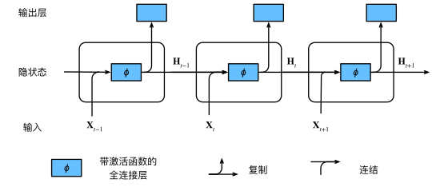

---
jupyter:
  jupytext:
    formats: ipynb,md
    text_representation:
      extension: .md
      format_name: markdown
      format_version: '1.3'
      jupytext_version: 1.19.1
  kernelspec:
    display_name: ml
    language: python
    name: python3
---

<!-- #region -->
# 循环神经网络 (RNN)

**参考**: [动手学深度学习 第8章](https://zh-v2.d2l.ai/chapter_recurrent-neural-networks/index.html)


**主要内容**:
这一部分包含一部分简单的NLP的知识，包括：
- 理解序列模型与自回归模型的基本思想
- 掌握文本预处理：分词、词表构建、数据集生成
- 理解语言模型与 n-gram 统计模型
- 掌握 RNN 的结构与前向传播，理解隐状态的作用
- 理解随时间反向传播（BPTT）与梯度裁剪

<!-- #endregion -->

```python
import torch
import torch.nn as nn
import torch.optim as optim
import torch.nn.functional as F
import numpy as np
import matplotlib
%matplotlib inline
import matplotlib.pyplot as plt
import math
import random
import re
import collections
import time
from typing import List, Tuple

device = torch.device('cuda' if torch.cuda.is_available() else 'cpu')
print(f'设备: {device}')
print(f'PyTorch 版本: {torch.__version__}')
```

---
### 7.1 RNN起源-序列模型 <a id='sequence-model'></a>

现实中大量数据具有**时序依赖性**：文本、语音、股价、视频帧……，对于这种数据传统 MLP/CNN 假设输入之间**独立同分布**，无法捕获时序关系。

于是我们定义了自回归模型（Autoregressive Model），这一部分可以参考[隐马尔可夫模型](../MachineLearning/12_HMM/隐马尔可夫模型%20HMM.md)

给定序列 $x_1, x_2, \ldots, x_T$，利用条件概率分解：

$$P(x_1, \ldots, x_T) = \prod_{t=1}^T P(x_t \mid x_{t-1}, \ldots, x_1)$$

实际中用**马尔可夫假设**截断：只依赖最近 $\tau$ 个时步

$$P(x_t \mid x_{t-1}, \ldots, x_1) \approx P(x_t \mid x_{t-1}, \ldots, x_{t-\tau})$$

RNN 则用**隐状态** $h_t$ 汇总所有历史信息，避免手动截断。

```python
# 演示：用自回归模型拟合正弦波
torch.manual_seed(42)
T = 1000
time_steps = torch.arange(1, T + 1, dtype=torch.float32)
x = torch.sin(0.01 * time_steps) + 0.2 * torch.randn(T)  # 加噪正弦波

tau = 4  # 使用前 tau 步预测当前值
# 构造特征矩阵：每行是连续 tau 个时步的值
features = torch.zeros((T - tau, tau))
for i in range(tau):
    features[:, i] = x[i: T - tau + i]
labels = x[tau:].reshape(-1, 1)  # 预测目标

# 训练集/验证集划分
n_train = 600
X_train, y_train = features[:n_train], labels[:n_train]
X_val,   y_val   = features[n_train:], labels[n_train:]

# 简单线性自回归模型
net = nn.Linear(tau, 1)
optimizer = optim.Adam(net.parameters(), lr=0.01)
criterion = nn.MSELoss()

for epoch in range(5):
    net.train()
    preds = net(X_train)
    loss = criterion(preds, y_train)
    optimizer.zero_grad(); loss.backward(); optimizer.step()

net.eval()
with torch.no_grad():
    val_preds = net(X_val)
    print(f'验证集 MSE: {criterion(val_preds, y_val).item():.6f}')

# 可视化：单步预测 vs 多步预测
# 多步预测：用模型自身的预测结果作为下一步输入
multistep = []
buf = x[n_train: n_train + tau].tolist()
for _ in range(len(X_val)):
    inp = torch.tensor(buf[-tau:], dtype=torch.float32).unsqueeze(0)
    pred = net(inp).item()
    multistep.append(pred)
    buf.append(pred)

t_val = time_steps[n_train + tau:].numpy()
fig, axes = plt.subplots(1, 2, figsize=(14, 4))
axes[0].plot(t_val, y_val.numpy(),    label='true',   alpha=0.7)
axes[0].plot(t_val, val_preds.numpy(), label='step pred', alpha=0.7)
axes[0].set_title('step pred'); axes[0].legend()
axes[1].plot(t_val, y_val.numpy(),   label='true',   alpha=0.7)
axes[1].plot(t_val, multistep,        label='multi-step pred', alpha=0.7, color='red')
axes[1].set_title('multi-step pred'); axes[1].legend()
plt.tight_layout(); plt.show()
print('\n观察：多步预测误差随步数快速累积，这正是 RNN 要解决的挑战之一。')
```

---
### 7.2 文本预处理 <a id='text-preprocessing'></a>

文本信息作为RNN或者语言模型的主要处理对象，在这里简单介绍下NLP领域对训练的基本流程：
```
原始文本 → 读取清洗 → 分词(tokenize) → 构建词表(Vocab) → 转换为数字序列
```

```python
# 使用《时间机器》节选作为语料（内置小文本，无需下载）
TEXT = """
the time machine by h g wells
the time traveller for so it will be convenient to speak of him
was expounding a recondite matter to us his grey eyes shone and
twinkled and his usually pale face was flushed and animated
the fire burned brightly and the soft radiance of the incandescent
lights in the lilies of silver caught the bubbles that flashed and
passed in our glasses our chairs being his patents embraced and
caressed us rather than submitted to be sat upon and there was that
luxurious after dinner atmosphere when thought roams gracefully
free of the trammels of precision and the time traveller had been
telling us of the very remarkable adventures of his time machine
it sounds plausible enough tonight said the medical man but i
cannot but wonder what is the nature of the time traveller s machine
can it really travel through time as you say and if so how does
it work the fourth dimension said the time traveller holding up
his finger some of my hearers smiled now i do not want you to object
but i want you to attend i am going to ask you a question or two
have you ever heard of the fourth dimension yes said a few of them
space has three dimensions length breadth and thickness and always
the fourth dimension of time has baffled mankind since the beginning
there is no difference between time and any of the three dimensions
of space except that our consciousness moves along it
but some foolish people have got hold of the wrong side of that idea
you have all heard what they have to say about this fourth dimension
some people think that time is simply the fourth dimension of space
and that to travel in time we must move along this fourth dimension
the time traveller smiled at the simplicity of the question
""" * 5  # 重复几次增加语料量

def read_and_clean(text):
    """读取并清洗文本：转小写，保留字母和空格"""
    text = text.lower()
    text = re.sub(r'[^a-z ]', ' ', text)
    return text

text = read_and_clean(TEXT)
print(f'清洗后字符数: {len(text)}')
print(f'前 100 个字符: {text[:100]}')
```

```python
def tokenize(text, token_type='char'):
    """分词：字符级 or 单词级"""
    if token_type == 'char':
        return list(text.replace(' ', '_'))  # 用_代替空格方便可视化
    elif token_type == 'word':
        return text.split()

char_tokens = tokenize(text, 'char')
word_tokens = tokenize(text, 'word')
print(f'字符级 tokens 数量: {len(char_tokens)}')
print(f'单词级 tokens 数量: {len(word_tokens)}')
print(f'\n字符级前20个: {char_tokens[:20]}')
print(f'单词级前10个: {word_tokens[:10]}')
```

```python
class Vocab:
    """词表：token ↔ index 的双向映射"""
    def __init__(self, tokens, min_freq=1, reserved_tokens=None):
        if reserved_tokens is None:
            reserved_tokens = []
        # 统计词频
        counter = collections.Counter(tokens)
        # 按词频排序
        self._token_freqs = sorted(counter.items(), key=lambda x: x[1], reverse=True)
        # 特殊 token：<unk> 放在索引 0
        self.idx_to_token = ['<unk>'] + reserved_tokens
        self.token_to_idx = {tok: i for i, tok in enumerate(self.idx_to_token)}
        # 加入满足最低词频的 token
        for tok, freq in self._token_freqs:
            if freq < min_freq:
                break
            if tok not in self.token_to_idx:
                self.idx_to_token.append(tok)
                self.token_to_idx[tok] = len(self.idx_to_token) - 1

    def __len__(self):
        return len(self.idx_to_token)

    def __getitem__(self, tokens):
        """token → index（支持单个或列表）"""
        if isinstance(tokens, (list, tuple)):
            return [self.token_to_idx.get(t, 0) for t in tokens]
        return self.token_to_idx.get(tokens, 0)

    def to_tokens(self, indices):
        """index → token"""
        if isinstance(indices, (list, tuple)):
            return [self.idx_to_token[i] for i in indices]
        return self.idx_to_token[indices]

# 构建字符级词表
vocab = Vocab(char_tokens)
print(f'词表大小: {len(vocab)}')
print(f'\n最高频 token (前10): {vocab._token_freqs[:10]}')
print(f'\n示例转换: {char_tokens[:5]} → {vocab[char_tokens[:5]]}')
print(f'示例还原: {vocab.to_tokens(vocab[char_tokens[:5]])}')
```

```python
# 可视化字符频率分布
freqs = [f for _, f in vocab._token_freqs[:20]]
labels = [t for t, _ in vocab._token_freqs[:20]]

plt.figure(figsize=(10, 4))
plt.bar(range(len(freqs)), freqs, color='steelblue')
plt.xticks(range(len(labels)), labels, fontsize=12)
plt.xlabel('Token'); plt.ylabel('Frequency')
plt.title('Character Frequency Distribution (Top 20)')
plt.tight_layout(); plt.show()
```


**语言模型**
语言模型估计文本序列的联合概率：

$$P(w_1, w_2, \ldots, w_T) = \prod_{t=1}^T P(w_t \mid w_{t-1}, \ldots, w_1)$$

**n-gram 统计语言模型:** 也就是第下一个词出现的概率只与前n个词相关，这些值完全通过统计得到。

| 模型 | 假设 | 公式 |
|------|------|------|
| unigram | 各词独立 | $P(w_t)$ |
| bigram | 仅依赖前1词 | $P(w_t \mid w_{t-1})$ |
| trigram | 仅依赖前2词 | $P(w_t \mid w_{t-2}, w_{t-1})$ |

**困惑度（Perplexity）**
衡量语言模型好坏的指标——模型平均每步有多"困惑"：

$$\text{PPL} = \exp\!\left(-\frac{1}{T}\sum_{t=1}^T \log P(w_t \mid w_{t-1}, \ldots, w_1)\right)$$

- PPL = 1：完美预测
- PPL = |V|（词表大小）：随机猜测
- **PPL 越低越好**

```python
# 将文本转换为数字序列
corpus = vocab[char_tokens]  # 全部转成 index
print(f'语料长度: {len(corpus)}')
print(f'前20个 index: {corpus[:20]}')

# 统计 unigram / bigram / trigram 频率
def count_ngrams(corpus, n):
    counter = collections.Counter()
    for i in range(len(corpus) - n + 1):
        counter[tuple(corpus[i:i+n])] += 1
    return counter

unigram  = count_ngrams(corpus, 1)
bigram   = count_ngrams(corpus, 2)
trigram  = count_ngrams(corpus, 3)

print(f'\nUnigram  种类: {len(unigram)}')
print(f'Bigram   种类: {len(bigram)}')
print(f'Trigram  种类: {len(trigram)}')

# 可视化频率分布（齐普夫定律）
fig, axes = plt.subplots(1, 3, figsize=(15, 4))
for ax, counter, title in zip(axes,
                               [unigram, bigram, trigram],
                               ['Unigram', 'Bigram', 'Trigram']):
    freqs = sorted(counter.values(), reverse=True)
    ax.loglog(range(1, len(freqs)+1), freqs)
    ax.set_title(f'{title} frequency Distribution')
    ax.set_xlabel('Rank (log)'); ax.set_ylabel('Frequency (log)')
    ax.grid(True, alpha=0.3)
plt.tight_layout(); plt.show()
print('观察：满足齐普夫定律（幂律分布），n 越大越稀疏')
```

<!-- #region -->
---
### 5.1 循环神经网络 RNN <a id='rnn-theory'></a>


前面介绍的n-gram有一个致命的缺陷：n 增大后数据稀疏严重。RNN 用**隐状态**压缩全部历史，根本上解决这个问题。


标准 MLP 每步独立处理输入，无记忆。
RNN 引入**隐状态** $\mathbf{H}_t$，在时步之间传递信息：

$$\mathbf{H}_t = \phi(\mathbf{X}_t \mathbf{W}_{xh} + \mathbf{H}_{t-1} \mathbf{W}_{hh} + \mathbf{b}_h)$$

$$\mathbf{O}_t = \mathbf{H}_t \mathbf{W}_{hq} + \mathbf{b}_q$$

其中：
- $\mathbf{X}_t \in \mathbb{R}^{n \times d}$：当前输入（batch × 特征维）
- $\mathbf{H}_{t-1} \in \mathbb{R}^{n \times h}$：上一时步隐状态
- $\mathbf{W}_{xh} \in \mathbb{R}^{d \times h}$：输入→隐状态权重
- $\mathbf{W}_{hh} \in \mathbb{R}^{h \times h}$：隐状态→隐状态权重（**循环核心**）
- $\phi$：激活函数（通常为 tanh）



<!-- #endregion -->

```python
# 手动演示 RNN 单步前向传播
torch.manual_seed(0)
n, d, h = 3, 4, 8   # batch=3, 输入维=4, 隐状态维=8

X = torch.randn(n, d)        # 当前输入
H_prev = torch.zeros(n, h)  # 初始隐状态（全零）

W_xh = torch.randn(d, h) * 0.01
W_hh = torch.randn(h, h) * 0.01
b_h  = torch.zeros(h)

W_hq = torch.randn(h, 10) * 0.01  # 输出层（假设10类）
b_q  = torch.zeros(10)

# 单步 RNN 计算
H_t = torch.tanh(X @ W_xh + H_prev @ W_hh + b_h)
O_t = H_t @ W_hq + b_q

print(f'输入 X:        {X.shape}')
print(f'上一隐状态 H:  {H_prev.shape}')
print(f'当前隐状态 H_t: {H_t.shape}')
print(f'输出 O_t:       {O_t.shape}')
print(f'\n关键权重维度:')
print(f'  W_xh (输入→隐): {W_xh.shape}  (d×h = {d}×{h})')
print(f'  W_hh (隐→隐):   {W_hh.shape}  (h×h = {h}×{h})  ← 循环连接')
print(f'  W_hq (隐→输出): {W_hq.shape}  (h×vocab = {h}×10)')
print(f'\nRNN 参数量与序列长度无关！无论序列多长，参数共享。')
```


**RNN语言模型实验**

```python
import torch.nn.functional as F

def one_hot(X, num_classes):
    """将索引张量转换为 one-hot 编码
    X: (seq_len, batch) 的整数张量
    返回: (seq_len, batch, num_classes) 的浮点张量
    """
    return F.one_hot(X.long(), num_classes).float()

def seq_data_iter_random(corpus, batch_size, num_steps):
    """随机采样：每个 mini-batch 的子序列在原文中不一定相邻"""
    # 随机偏移起点
    corpus = corpus[torch.randint(0, num_steps, (1,)).item():]
    num_seqs = (len(corpus) - 1) // num_steps
    initial_indices = list(range(0, num_seqs * num_steps, num_steps))
    import random
    random.shuffle(initial_indices)
    num_batches = num_seqs // batch_size
    for i in range(0, batch_size * num_batches, batch_size):
        batch_indices = initial_indices[i:i + batch_size]
        X = torch.tensor([corpus[j:j + num_steps] for j in batch_indices])
        Y = torch.tensor([corpus[j + 1:j + 1 + num_steps] for j in batch_indices])
        yield X, Y

def seq_data_iter_sequential(corpus, batch_size, num_steps):
    """顺序采样：相邻 mini-batch 的子序列在原文中连续"""
    offset = torch.randint(0, num_steps, (1,)).item()
    num_tokens = ((len(corpus) - offset - 1) // batch_size) * batch_size
    Xs = torch.tensor(corpus[offset:offset + num_tokens]).reshape(batch_size, -1)
    Ys = torch.tensor(corpus[offset + 1:offset + 1 + num_tokens]).reshape(batch_size, -1)
    num_batches = Xs.shape[1] // num_steps
    for i in range(0, num_steps * num_batches, num_steps):
        X = Xs[:, i:i + num_steps]
        Y = Ys[:, i:i + num_steps]
        yield X, Y

```

```python
# 了解 nn.RNN 的接口
vocab_size = 28
rnn_layer = nn.RNN(input_size=vocab_size, hidden_size=128, batch_first=False)

# 输入：(seq_len, batch, input_size)，batch_first=False
X_demo  = torch.randn(35, 4, vocab_size)  # 35步, batch=4
H0_demo = torch.zeros(1, 4, 128)          # (num_layers, batch, hidden)

output, H_n = rnn_layer(X_demo, H0_demo)
print(f'nn.RNN 输出形状:       {output.shape}  (seq_len, batch, hidden)')
print(f'最终隐状态 H_n 形状:   {H_n.shape}    (num_layers, batch, hidden)')
print(f'\n参数量: {sum(p.numel() for p in rnn_layer.parameters()):,}')
print(f'  weight_ih: {rnn_layer.weight_ih_l0.shape}  (3h×input = input→hidden)')
print(f'  weight_hh: {rnn_layer.weight_hh_l0.shape}  (h×h = hidden→hidden)')
```

```python
class RNNModel(nn.Module):
    """基于 nn.RNN 的字符级语言模型"""
    def __init__(self, vocab_size, num_hiddens, num_layers=1):
        super().__init__()
        self.vocab_size  = vocab_size
        self.num_hiddens = num_hiddens
        self.rnn = nn.RNN(vocab_size, num_hiddens, num_layers,
                          batch_first=False)
        self.linear = nn.Linear(num_hiddens, vocab_size)

    def forward(self, X, state):
        """
        X:     (batch, seq_len) — token indices
        state: (num_layers, batch, hidden)
        """
        # one-hot: (batch, seq_len) → (seq_len, batch, vocab)
        X_oh = one_hot(X.T, self.vocab_size)
        out, state = self.rnn(X_oh, state)
        # out: (seq_len, batch, hidden) → (seq_len*batch, hidden)
        logits = self.linear(out.reshape(-1, self.num_hiddens))
        return logits, state

    def begin_state(self, batch_size, device):
        return torch.zeros(self.rnn.num_layers, batch_size,
                           self.num_hiddens, device=device)

    def predict(self, prefix, num_preds, vocab, device):
        """给定前缀字符串，自回归生成文本"""
        state = self.begin_state(1, device)
        outputs = [vocab[prefix[0]]]

        def get_X():
            return torch.tensor([[outputs[-1]]], device=device)

        for ch in prefix[1:]:
            _, state = self(get_X(), state)
            outputs.append(vocab[ch])

        for _ in range(num_preds):
            logits, state = self(get_X(), state)
            outputs.append(int(logits.argmax(dim=1).item()))

        return ''.join(vocab.to_tokens(outputs)).replace('_', ' ')


def train_rnn_concise(model, corpus, vocab, lr, num_epochs,
                      batch_size, num_steps, device,
                      use_random_iter=True, clip_theta=1.0):
    model.to(device)
    optimizer = optim.Adam(model.parameters(), lr=lr)
    loss_fn   = nn.CrossEntropyLoss()
    iter_fn   = seq_data_iter_random if use_random_iter else seq_data_iter_sequential
    ppl_history = []

    for epoch in range(num_epochs):
        state = None
        total_loss, total_tokens = 0, 0

        for X, Y in iter_fn(corpus, batch_size, num_steps):
            X, Y = X.to(device), Y.to(device)

            if state is None or use_random_iter:
                state = model.begin_state(X.shape[0], device)
            else:
                state = state.detach()

            logits, state = model(X, state)
            loss = loss_fn(logits, Y.T.reshape(-1))

            optimizer.zero_grad()
            loss.backward()
            nn.utils.clip_grad_norm_(model.parameters(), clip_theta)
            optimizer.step()

            total_loss   += loss.item() * Y.numel()
            total_tokens += Y.numel()

        ppl = math.exp(total_loss / total_tokens)
        ppl_history.append(ppl)

        if (epoch + 1) % 5 == 0:
            sample = model.predict(list('the_'), 30, vocab, device)
            print(f'Epoch {epoch+1:3d} | PPL={ppl:.1f} | 生成: "{sample}"')

    return ppl_history

model = RNNModel(vocab_size=len(vocab), num_hiddens=256).to(device)
print(f'RNNModel 参数量: {sum(p.numel() for p in model.parameters()):,}')

print('\n训练前预测:', model.predict(list('the_'), 20, vocab, device))
print('\n开始训练RNN...')
ppl_history2 = train_rnn_concise(
    model, corpus, vocab,
    lr=1e-3, num_epochs=30,
    batch_size=32, num_steps=35,
    device=device, use_random_iter=True
)
print('\n训练后预测:', model.predict(list('the_'), 40, vocab, device))
```

```python
# 对比训练曲线
plt.figure(figsize=(10, 4))
plt.plot(ppl_history2, label='RNN (256 hidden)', marker='s', markersize=3)
plt.xlabel('Epoch'); plt.ylabel('PPL')
plt.legend(); plt.grid(True, alpha=0.3)
plt.tight_layout(); plt.show()

# 几个不同前缀的生成结果
prefixes = ['time', 'the ', 'trav', 'mach']
print('\n文本生成示例 (50字符):')
print('-' * 60)
for prefix in prefixes:
    generated = model.predict(list(prefix), 50, vocab, device)
    print(f'前缀 "{prefix}": {generated}')
```

<!-- #region -->
---
### 7.2 随时间反向传播 (BPTT) <a id='bptt'></a>


对于长度为 $T$ 的序列，展开的 RNN 可看作 $T$ 层深的网络，以此进行梯度计算：

$$\frac{\partial L}{\partial \mathbf{W}_{hh}} = \sum_{t=1}^T \frac{\partial L_t}{\partial \mathbf{W}_{hh}}$$

链式法则中，梯度需要**沿时间反向传播**经过所有时步：

$$\frac{\partial \mathbf{H}_t}{\partial \mathbf{H}_{t-k}} = \prod_{i=0}^{k-1} \frac{\partial \mathbf{H}_{t-i}}{\partial \mathbf{H}_{t-i-1}} = \prod_{i=0}^{k-1} \text{diag}(\phi'(\cdot)) \cdot \mathbf{W}_{hh}$$

由公式可知此模型必然面临以下问题：

- 梯度消失：$|\lambda_{\max}(W_{hh})| < 1$，远程依赖学不到，这个会依靠后面讲解的LSTM/GRU解决
- 梯度爆炸：$|\lambda_{\max}(W_{hh})| > 1$，训练不稳定，**梯度裁剪**解决


**截断 BPTT：** 实际训练中，BPTT 不会反传整个序列，而是只反传 `num_steps` 步，用 `detach()` 截断梯度流。
<!-- #endregion -->

```python
# 梯度裁剪效果演示
def demo_grad_clipping():
    torch.manual_seed(0)
    # 制造一个梯度很大的参数
    p = nn.Parameter(torch.randn(5, 5))
    p.grad = torch.randn(5, 5) * 100  # 故意设置大梯度

    before_norm = p.grad.norm().item()
    theta = 1.0

    # 裁剪
    nn.utils.clip_grad_norm_([p], max_norm=theta)
    after_norm = p.grad.norm().item()

    print(f'裁剪前梯度范数: {before_norm:.4f}')
    print(f'裁剪后梯度范数: {after_norm:.6f}  (≈ theta={theta})')
    print(f'梯度方向保持不变: {torch.allclose(p.grad / p.grad.norm(), torch.randn_like(p.grad) / torch.randn_like(p.grad).norm(), atol=0.5)}')

demo_grad_clipping()

print('\n两种梯度裁剪方式：')
print('  1. 按值裁剪：clip(-theta, theta)  — 改变梯度方向')
print('  2. 按范数裁剪：g *= theta/||g||   — 保持梯度方向 (推荐)')
```
