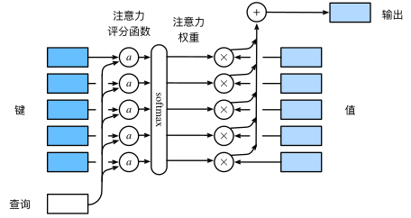
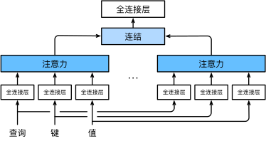
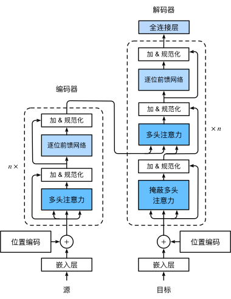

---
jupyter:
  jupytext:
    formats: ipynb,md
    text_representation:
      extension: .md
      format_name: markdown
      format_version: '1.3'
      jupytext_version: 1.19.1
  kernelspec:
    display_name: ml
    language: python
    name: python3
---

# 注意力机制 (Attention Mechanisms)

> 参考：[动手学深度学习 v2 第10章](https://zh-v2.d2l.ai/chapter_attention-mechanisms/index.html)


```python
import torch
import torch.nn as nn
import math
import numpy as np
import matplotlib.pyplot as plt


print(f"PyTorch 版本：{torch.__version__}")

```

<!-- #region -->
### 1. 注意力机制概述


人类的视觉注意力是**有限的**稀缺资源：
- **非自主性提示**（Non-volitional cue）：基于突显性（显著性）自动吸引注意，如一张红色图片中的红色物体。
- **自主性提示**（Volitional cue）：基于任务主动搜索，如寻找一本书。

**查询、键、值框架**

$$	ext{Attention}(\mathbf{q}, \{(\mathbf{k}_1,\mathbf{v}_1), \ldots, (\mathbf{k}_m,\mathbf{v}_m)\}) = \sum_{i=1}^{m} lpha(\mathbf{q}, \mathbf{k}_i)\, \mathbf{v}_i$$

| 组件 | 类比 | 说明 |
|---|---|---|
| Query $\mathbf{q}$ | 自主性提示 | 当前任务/解码器状态 |
| Key $\mathbf{k}_i$ | 非自主性提示 | 每个位置的表示 |
| Value $\mathbf{v}_i$ | 感官输入 | 每个位置的实际内容 |
| $\alpha(\mathbf{q},\mathbf{k}_i)$ | 注意力权重 | 非负，和为1（softmax后） |

注意力权重 $\alpha$ 通过**评分函数** $a(\mathbf{q}, \mathbf{k}_i)$ 经 softmax 归一化得到。




<!-- #endregion -->

**用"图书馆找书"理解 Query、Key、Value**

想象你走进一个图书馆，想找一本关于**"深度学习"**的书：

| 概念 | 图书馆类比 | 注意力机制中的角色 |
|------|-----------|-------------------|
| **Query（查询）** | 你脑中的需求："我要找深度学习的书" | 当前时间步的问题/目标 |
| **Key（键）** | 每本书封面上的**标签/标题** | 每个候选位置的"摘要"信息 |
| **Value（值）** | 每本书的**实际内容** | 每个候选位置的完整信息 |
| **注意力权重** | 你对每本书的**关注程度** | Query 与各 Key 的匹配分数（softmax 归一化） |

**过程**：
1. 你带着 Query（"深度学习"）扫视书架上所有书的 Key（标题）
2. 标题越相关的书，你给的**注意力权重越高**（比如《深度学习》→ 0.7，《机器学习》→ 0.2，《线性代数》→ 0.1）
3. 最终你获取的信息 = **各本书内容（Value）的加权平均**

$$\text{output} = 0.7 \times V_{\text{深度学习}} + 0.2 \times V_{\text{机器学习}} + 0.1 \times V_{\text{线性代数}}$$

> **Key ≠ Value 的直觉**：书的标题（Key）用来匹配你的需求，但你实际读到的是书的内容（Value）。
> 标题是"索引"，内容才是"信息"。在很多实现中 Key 和 Value 来自同一个输入经不同线性变换得到。

```python
# 用代码演示"图书馆找书"的 QKV 过程
import torch
import torch.nn.functional as F

# 假设有 3 本书，每本书用 4 维向量表示
# Key = 书的标题特征，Value = 书的内容特征
keys = torch.tensor([
    [1.0, 0.8, 0.1, 0.0],   # 书1: "深度学习入门"
    [0.8, 1.0, 0.3, 0.1],   # 书2: "机器学习实战"
    [0.1, 0.2, 1.0, 0.9],   # 书3: "线性代数"
])
book_names = ["《深度学习入门》", "《机器学习实战》", "《线性代数》"]

values = torch.tensor([
    [10.0, 20.0],  # 书1的内容向量
    [30.0, 40.0],  # 书2的内容向量
    [50.0, 60.0],  # 书3的内容向量
])

# Query = 你想找"深度学习"相关的书
query = torch.tensor([[1.0, 0.9, 0.0, 0.0]])  # 偏向深度学习/机器学习

# Step 1: 计算注意力分数 (点积)
scores = query @ keys.T  # (1, 3)
print("原始注意力分数:", scores)

# Step 2: Softmax 归一化为权重
weights = F.softmax(scores, dim=-1)
for name, w in zip(book_names, weights.squeeze()):
    print(f"  {name}: {w:.3f}")

# Step 3: 加权求和得到输出
output = weights @ values
print(f"\n最终输出 (加权混合的内容): {output.squeeze()}")
print("→ 输出更偏向深度学习和机器学习这两本书的内容")
```

<!-- #region -->
### 2. 注意力汇聚：Nadaraya-Watson 核回归

上一部分我们知道注意力机制其实就是根据Q和K，来选择哪些V，来组合成最终的输出。那么具体怎么组合，这里列举了几种方式。


**平均汇聚（Average Pooling）**——最简单的基线：
$$f(x) = \frac{1}{n}\sum_{i=1}^{n} y_i$$

**Nadaraya-Watson 核回归（1964）**——非参数注意力汇聚：
$$f(x) = \sum_{i=1}^{n} \frac{K(x - x_i)}{\sum_{j=1}^{n} K(x - x_j)} y_i = \sum_{i=1}^{n} \alpha(x, x_i)\, y_i$$

使用**高斯核** $K(u) = \frac{1}{\sqrt{2\pi}} \exp\!\left(-\frac{u^2}{2}\right)$，得到：
$$f(x) = \sum_{i=1}^{n} \mathrm{softmax}\!\left(-\frac{1}{2}(x - x_i)^2\right) y_i$$

**参数化版本**——可学习的带宽参数 $w$：
$$f(x) = \sum_{i=1}^{n} \mathrm{softmax}\!\left(-\frac{1}{2}\bigl((x-x_i)w\bigr)^2\right) y_i$$


非参数 NW 回归实现


<!-- #endregion -->

```python
# 生成训练数据
n_train = 50
x_train, _ = torch.sort(torch.rand(n_train) * 5)
y_train = torch.sin(x_train) + torch.normal(0, 0.5, (n_train,))
x_test = torch.arange(0, 5, 0.1)
y_truth = torch.sin(x_test)

# ── 非参数 Nadaraya-Watson 核回归 ──
X_repeat = x_test.repeat_interleave(n_train).reshape((-1, n_train))
attention_weights = nn.functional.softmax(-(X_repeat - x_train) ** 2 / 2, dim=1)
y_hat_nw = torch.matmul(attention_weights, y_train)

plt.figure(figsize=(8, 3))
plt.plot(x_test, y_truth, label='真实函数', linewidth=2)
plt.plot(x_test, y_hat_nw, '--', label='NW 核回归')
plt.scatter(x_train, y_train, s=15, alpha=0.5, label='训练数据')
plt.legend(); plt.title('非参数 Nadaraya-Watson 核回归'); plt.show()

```

参数化 NW 核回归（可学习权重）实现

```python
class NWKernelRegression(nn.Module):
    def __init__(self):
        super().__init__()
        self.w = nn.Parameter(torch.rand(1, requires_grad=True))

    def forward(self, queries, keys, values):
        # queries: (nq,), keys: (nq, n_train), values: (nq, n_train)
        queries = queries.repeat_interleave(keys.shape[1]).reshape(-1, keys.shape[1])
        self.attention_weights = nn.functional.softmax(
            -((queries - keys) * self.w) ** 2 / 2, dim=1)
        return torch.bmm(self.attention_weights.unsqueeze(1),
                         values.unsqueeze(-1)).reshape(-1)

# 准备数据
keys   = x_train.repeat(len(x_test), 1)   # (len(x_test), n_train)
values = y_train.repeat(len(x_test), 1)

net = NWKernelRegression()
loss_fn = nn.MSELoss(reduction='none')
trainer = torch.optim.SGD(net.parameters(), lr=0.5)

for epoch in range(5):
    trainer.zero_grad()
    l = loss_fn(net(x_test, keys, values), y_truth)
    l.sum().backward()
    trainer.step()
    print(f'epoch {epoch+1}, loss {l.sum():.4f}, w={net.w.item():.4f}')

# 可视化注意力权重
fig, axes = plt.subplots(1, 2, figsize=(12, 3))
axes[0].imshow(net.attention_weights.detach().numpy(), aspect='auto')
axes[0].set_title('注意力权重热图'); axes[0].set_xlabel('训练样本'); axes[0].set_ylabel('查询')
axes[1].plot(x_test, y_truth, label='真实函数')
axes[1].plot(x_test, net(x_test, keys, values).detach(), '--', label='参数化NW')
axes[1].scatter(x_train, y_train, s=15, alpha=0.5)
axes[1].legend(); axes[1].set_title('参数化 NW 核回归拟合')
plt.tight_layout(); plt.show()

```

### 3. 注意力评分函数

我们知道注意力机制其实就是根据Q和K，来选择哪些V，来组合成最终的输出。上一部分我们讲了怎么组合，那么这里就是要讲怎么选择，这个如何选择也就是如何得到注意力评分函数：

$$\alpha(\mathbf{q}, \mathbf{k}_i) = \frac{\exp(a(\mathbf{q}, \mathbf{k}_i))}{\sum_j \exp(a(\mathbf{q}, \mathbf{k}_j))}$$

**（1）加性注意力（Additive Attention）**

适用于**查询和键维度不同**的情形：

$$a(\mathbf{q}, \mathbf{k}) = \mathbf{w}_v^\top \tanh(\mathbf{W}_q \mathbf{q} + \mathbf{W}_k \mathbf{k}) \in \mathbb{R}$$

其中 $\mathbf{W}_q \in \mathbb{R}^{h \times q}$，$\mathbf{W}_k \in \mathbb{R}^{h \times k}$，$\mathbf{w}_v \in \mathbb{R}^h$。

**（2）缩放点积注意力（Scaled Dot-Product Attention）**

适用于**查询和键维度相同**（均为 $d$）的情形，计算效率更高，这也是transformer中使用的注意力机制函数：

$$a(\mathbf{q}, \mathbf{k}) = \frac{\mathbf{q}^\top \mathbf{k}}{\sqrt{d}}$$

批量矩阵形式（$n$ 个查询，$m$ 个键值对）：

$$\mathrm{softmax}\!\left(\frac{\mathbf{Q}\mathbf{K}^\top}{\sqrt{d}}\right)\mathbf{V} \in \mathbb{R}^{n \times v}$$

> **缩放的意义**：防止点积随 $d$ 增大而过大，导致 softmax 梯度消失。

在实际应用时，我们还需要对一些不需要注意力的位置进行掩码，也就是遮蔽 softmax（Masked Softmax）:对填充（padding）位置赋予极小值（$-10^6$），使其注意力权重趋近于零。


**缩放点积注意力实现**

```python
def masked_softmax(X, valid_lens):
    """对 scores 做 softmax，超出 valid_lens 的位置用 -1e6 遮蔽"""
    if valid_lens is None:
        return F.softmax(X, dim=-1)
    shape = X.shape
    if valid_lens.dim() == 1:
        # (B,) -> 每个样本所有查询共享同一个有效长度
        valid_lens = valid_lens.repeat_interleave(shape[1])
    else:
        valid_lens = valid_lens.reshape(-1)
    # 将超出有效长度的位置替换为极小值
    mask = torch.arange(shape[-1], device=X.device)[None, :] >= valid_lens[:, None]
    X = X.reshape(-1, shape[-1])
    X[mask] = -1e6
    return F.softmax(X.reshape(shape), dim=-1)


class DotProductAttention(nn.Module):
    '''缩放点积注意力：适用于 q_dim == k_dim 的情形'''
    def __init__(self, dropout):
        super().__init__()
        self.dropout = nn.Dropout(dropout)

    def forward(self, queries, keys, values, valid_lens=None):
        # queries/keys/values: (B, n, d), (B, m, d), (B, m, v)
        d = queries.shape[-1]
        # scores: (B, n, m)
        scores = torch.bmm(queries, keys.transpose(1, 2)) / math.sqrt(d)
        self.attention_weights = masked_softmax(scores, valid_lens)
        return torch.bmm(self.dropout(self.attention_weights), values)


import torch.nn.functional as F

# 示例数据：batch=2, 10个键值对, q_dim=k_dim=2, v_dim=4
keys   = torch.ones(2, 10, 2)
values = torch.arange(40, dtype=torch.float32).reshape(2, 10, 2)
queries = torch.normal(0, 1, (2, 1, 2))
valid_lens = torch.tensor([2, 6])   # 第1个样本只看前2个key，第2个看前6个

dot_attn = DotProductAttention(dropout=0.5)
dot_attn.eval()
output = dot_attn(queries, keys, values, valid_lens)
print(f"缩放点积注意力输出形状: {output.shape}")   # (2, 1, 2)
print(f"注意力权重:\n{dot_attn.attention_weights}")
```

<!-- #region -->
### 4. 多头注意力


单一注意力机制只能在一个表示子空间中捕获依赖关系。**多头注意力**让模型同时在多个子空间中学习不同的注意力模式。




数学原理：定义**第 $i$ 个注意力头**（独立的线性投影 + 注意力）：

$$\mathbf{h}_i = f\bigl(\mathbf{W}_i^{(q)}\mathbf{q},\; \mathbf{W}_i^{(k)}\mathbf{k},\; \mathbf{W}_i^{(v)}\mathbf{v}\bigr) \in \mathbb{R}^{p_v}$$

**拼接并线性变换**：

$$\mathbf{W}_o \begin{bmatrix}\mathbf{h}_1 \\ \vdots \\ \mathbf{h}_h\end{bmatrix} \in \mathbb{R}^{p_o}$$

其中 $\mathbf{W}_o \in \mathbb{R}^{p_o \times hp_v}$。

> **关键实现技巧**：通过 tensor reshape + permute 将所有头**并行计算**，避免 for 循环。

典型设置：$p_q = p_k = p_v = p_o / h$（每个头的维度 = 总维度 / 头数）。

<!-- #endregion -->

```python
def transpose_qkv(X, num_heads):
    '''将 (batch, seq, num_hiddens) 变换为 (batch*num_heads, seq, num_hiddens/num_heads)'''
    X = X.reshape(X.shape[0], X.shape[1], num_heads, -1)
    X = X.permute(0, 2, 1, 3)
    return X.reshape(-1, X.shape[2], X.shape[3])

def transpose_output(X, num_heads):
    '''transpose_qkv 的逆操作'''
    X = X.reshape(-1, num_heads, X.shape[1], X.shape[2])
    X = X.permute(0, 2, 1, 3)
    return X.reshape(X.shape[0], X.shape[1], -1)


class MultiHeadAttention(nn.Module):
    def __init__(self, key_size, query_size, value_size,
                 num_hiddens, num_heads, dropout, bias=False):
        super().__init__()
        self.num_heads = num_heads
        self.attention = DotProductAttention(dropout)
        self.W_q = nn.Linear(query_size, num_hiddens, bias=bias)
        self.W_k = nn.Linear(key_size,   num_hiddens, bias=bias)
        self.W_v = nn.Linear(value_size, num_hiddens, bias=bias)
        self.W_o = nn.Linear(num_hiddens, num_hiddens, bias=bias)

    def forward(self, queries, keys, values, valid_lens):
        # 投影后并行展开所有头
        queries = transpose_qkv(self.W_q(queries), self.num_heads)
        keys    = transpose_qkv(self.W_k(keys),    self.num_heads)
        values  = transpose_qkv(self.W_v(values),  self.num_heads)

        if valid_lens is not None:
            valid_lens = torch.repeat_interleave(valid_lens, self.num_heads, dim=0)

        output = self.attention(queries, keys, values, valid_lens)
        output_concat = transpose_output(output, self.num_heads)
        return self.W_o(output_concat)

# 验证
num_hiddens, num_heads = 100, 5
attention = MultiHeadAttention(num_hiddens, num_hiddens, num_hiddens,
                               num_hiddens, num_heads, dropout=0.5)
attention.eval()
batch_size, num_queries, num_kvpairs = 2, 4, 6
valid_lens = torch.tensor([3, 2])
X = torch.ones((batch_size, num_queries,  num_hiddens))
Y = torch.ones((batch_size, num_kvpairs, num_hiddens))
out = attention(X, Y, Y, valid_lens)
print(f"多头注意力输出形状: {out.shape}")  # (2, 4, 100)

```

<!-- #region -->
### 5. 自注意力


将同一组输入序列同时用作查询、键、值：

$$\text{self-attention}(\mathbf{X}) = \text{Attention}(\mathbf{X}, \mathbf{X}, \mathbf{X})$$

自注意力是**置换不变的**（position-agnostic），需要手动注入位置信息。

**正弦/余弦位置编码**：位置 $i$，维度 $2j$（偶数）和 $2j+1$（奇数）：

$$p_{i,2j} = \sin\!\left(\frac{i}{10000^{2j/d}}\right), \quad p_{i,2j+1} = \cos\!\left(\frac{i}{10000^{2j/d}}\right)$$

**相对位置性质**：位置 $i+\delta$ 可由位置 $i$ 通过仅依赖偏移量 $\delta$ 的线性（旋转）变换得到，使模型能学习相对位置关系。

<!-- #endregion -->

### 6. Transformer

Transformer模型由2017年Vaswani等人提出，完全基于注意力机制，没有任何卷积层或循环神经网络层。这里详细的讲解可以参考 [Transformer 模型](../LLM/transformer.md)。




```python
# ── 位置前馈网络（Position-wise FFN）──
class PositionWiseFFN(nn.Module):
    '''对序列每个位置独立应用相同的 2 层 MLP'''
    def __init__(self, ffn_num_input, ffn_num_hiddens, ffn_num_outputs):
        super().__init__()
        self.dense1 = nn.Linear(ffn_num_input, ffn_num_hiddens)
        self.relu   = nn.ReLU()
        self.dense2 = nn.Linear(ffn_num_hiddens, ffn_num_outputs)

    def forward(self, X):
        return self.dense2(self.relu(self.dense1(X)))

# 验证：输出形状与输入相同（位置间独立）
ffn = PositionWiseFFN(4, 4, 8)
ffn.eval()
print(f"FFN 输出形状: {ffn(torch.ones(2, 3, 4)).shape}")  # (2, 3, 8)

```

```python
# ── Add & Norm ──
class AddNorm(nn.Module):
    def __init__(self, normalized_shape, dropout):
        super().__init__()
        self.dropout = nn.Dropout(dropout)
        self.ln = nn.LayerNorm(normalized_shape)

    def forward(self, X, Y):
        return self.ln(self.dropout(Y) + X)

# LayerNorm vs BatchNorm 直觉对比
ln = nn.LayerNorm(2)
bn = nn.BatchNorm1d(2)
X = torch.tensor([[1, 2], [2, 3]], dtype=torch.float32)
print(f"LayerNorm 输出（对每行特征归一化）:\n{ln(X)}")
print(f"BatchNorm 输出（对每列批次归一化）:\n{bn(X)}")

```

```python
# ── Encoder Block ──
class EncoderBlock(nn.Module):
    def __init__(self, key_size, query_size, value_size, num_hiddens,
                 norm_shape, ffn_num_input, ffn_num_hiddens, num_heads, dropout):
        super().__init__()
        self.attention = MultiHeadAttention(
            key_size, query_size, value_size, num_hiddens, num_heads, dropout)
        self.addnorm1 = AddNorm(norm_shape, dropout)
        self.ffn      = PositionWiseFFN(ffn_num_input, ffn_num_hiddens, num_hiddens)
        self.addnorm2 = AddNorm(norm_shape, dropout)

    def forward(self, X, valid_lens):
        # 多头自注意力 + 残差
        Y = self.addnorm1(X, self.attention(X, X, X, valid_lens))
        # FFN + 残差
        return self.addnorm2(Y, self.ffn(Y))

# 验证
X = torch.ones((2, 100, 24))  # (batch, seq_len, num_hiddens)
valid_lens = torch.tensor([3, 2])
encoder_blk = EncoderBlock(24, 24, 24, 24, [24], 24, 48, 8, dropout=0.5)
encoder_blk.eval()
out = encoder_blk(X, valid_lens)
print(f"EncoderBlock 输出形状: {out.shape}")  # (2, 100, 24)

```

```python
# ── Transformer Encoder ──
class TransformerEncoder(d2l.Encoder):
    def __init__(self, vocab_size, key_size, query_size, value_size,
                 num_hiddens, norm_shape, ffn_num_input, ffn_num_hiddens,
                 num_heads, num_layers, dropout):
        super().__init__()
        self.num_hiddens = num_hiddens
        self.embedding   = nn.Embedding(vocab_size, num_hiddens)
        self.pos_encoding = PositionalEncoding(num_hiddens, dropout)
        self.blks = nn.Sequential(*[
            EncoderBlock(key_size, query_size, value_size, num_hiddens,
                         norm_shape, ffn_num_input, ffn_num_hiddens, num_heads, dropout)
            for _ in range(num_layers)
        ])

    def forward(self, X, valid_lens, *args):
        # 嵌入缩放 × √d_model，再加位置编码
        X = self.pos_encoding(self.embedding(X) * math.sqrt(self.num_hiddens))
        self.attention_weights = [None] * len(self.blks)
        for i, blk in enumerate(self.blks):
            X = blk(X, valid_lens)
            self.attention_weights[i] = blk.attention.attention.attention_weights
        return X

# 验证
encoder = TransformerEncoder(200, 24, 24, 24, 24, [24], 24, 48, 8, num_layers=2, dropout=0.5)
encoder.eval()
X = torch.ones((2, 100), dtype=torch.long)
out = encoder(X, valid_lens)
print(f"TransformerEncoder 输出形状: {out.shape}")  # (2, 100, 24)

```

```python
# ── Decoder Block ──
class DecoderBlock(nn.Module):
    def __init__(self, key_size, query_size, value_size, num_hiddens,
                 norm_shape, ffn_num_input, ffn_num_hiddens, num_heads, dropout, i):
        super().__init__()
        self.i = i
        # 1. 掩蔽自注意力（causal，防止看到未来）
        self.attention1 = MultiHeadAttention(
            key_size, query_size, value_size, num_hiddens, num_heads, dropout)
        self.addnorm1 = AddNorm(norm_shape, dropout)
        # 2. 编-解码器交叉注意力（encoder outputs 作为 K, V）
        self.attention2 = MultiHeadAttention(
            key_size, query_size, value_size, num_hiddens, num_heads, dropout)
        self.addnorm2 = AddNorm(norm_shape, dropout)
        # 3. Position-wise FFN
        self.ffn      = PositionWiseFFN(ffn_num_input, ffn_num_hiddens, num_hiddens)
        self.addnorm3 = AddNorm(norm_shape, dropout)

    def forward(self, X, state):
        enc_outputs, enc_valid_lens = state[0], state[1]

        # 推理阶段逐步缓存 key-value
        if state[2][self.i] is None:
            key_values = X
        else:
            key_values = torch.cat((state[2][self.i], X), axis=1)
        state[2][self.i] = key_values

        # 训练时用掩码防止看到未来；推理时不需要（已逐步生成）
        if self.training:
            batch_size, num_steps, _ = X.shape
            dec_valid_lens = torch.arange(1, num_steps + 1, device=X.device
                             ).repeat(batch_size, 1)
        else:
            dec_valid_lens = None

        # Masked Self-Attention + Add&Norm
        X2 = self.attention1(X, key_values, key_values, dec_valid_lens)
        Y  = self.addnorm1(X, X2)
        # Cross-Attention + Add&Norm
        Y2 = self.attention2(Y, enc_outputs, enc_outputs, enc_valid_lens)
        Z  = self.addnorm2(Y, Y2)
        # FFN + Add&Norm
        return self.addnorm3(Z, self.ffn(Z)), state

```

```python
# ── Transformer Decoder ──
class TransformerDecoder(d2l.AttentionDecoder):
    def __init__(self, vocab_size, key_size, query_size, value_size,
                 num_hiddens, norm_shape, ffn_num_input, ffn_num_hiddens,
                 num_heads, num_layers, dropout):
        super().__init__()
        self.num_hiddens = num_hiddens
        self.num_layers  = num_layers
        self.embedding   = nn.Embedding(vocab_size, num_hiddens)
        self.pos_encoding = PositionalEncoding(num_hiddens, dropout)
        self.blks = nn.Sequential(*[
            DecoderBlock(key_size, query_size, value_size, num_hiddens,
                         norm_shape, ffn_num_input, ffn_num_hiddens,
                         num_heads, dropout, i)
            for i in range(num_layers)
        ])
        self.dense = nn.Linear(num_hiddens, vocab_size)

    def init_state(self, enc_outputs, enc_valid_lens, *args):
        return [enc_outputs, enc_valid_lens, [None] * self.num_layers]

    def forward(self, X, state):
        X = self.pos_encoding(self.embedding(X) * math.sqrt(self.num_hiddens))
        self._attention_weights = [[None] * len(self.blks) for _ in range(2)]
        for i, blk in enumerate(self.blks):
            X, state = blk(X, state)
            self._attention_weights[0][i] = blk.attention1.attention.attention_weights
            self._attention_weights[1][i] = blk.attention2.attention.attention_weights
        return self.dense(X), state

    @property
    def attention_weights(self):
        return self._attention_weights

```

```python
# ── 训练 Transformer（英译法） ──
num_hiddens, num_layers, dropout = 32, 2, 0.1
batch_size, num_steps = 64, 10
ffn_num_hiddens, num_heads = 64, 4
lr, num_epochs = 0.005, 200

train_iter, src_vocab, tgt_vocab = d2l.load_data_nmt(batch_size, num_steps)

encoder = TransformerEncoder(
    len(src_vocab), num_hiddens, num_hiddens, num_hiddens, num_hiddens,
    [num_hiddens], num_hiddens, ffn_num_hiddens, num_heads, num_layers, dropout)
decoder = TransformerDecoder(
    len(tgt_vocab), num_hiddens, num_hiddens, num_hiddens, num_hiddens,
    [num_hiddens], num_hiddens, ffn_num_hiddens, num_heads, num_layers, dropout)

net = d2l.EncoderDecoder(encoder, decoder)
d2l.train_seq2seq(net, train_iter, lr, num_epochs, tgt_vocab, device)

```

```python
# ── 预测与注意力可视化 ──
engs = ['go .', 'i lost .', 'he's calm .', 'i'm home .']
fras = ['va !',  'j'ai perdu .', 'il est calme .', 'je suis chez moi .']

for eng, fra in zip(engs, fras):
    translation, dec_attention_weight_seq = d2l.predict_seq2seq(
        net, eng, src_vocab, tgt_vocab, num_steps, device, save_attention_weights=True)
    print(f'{eng} => {translation}, BLEU={d2l.bleu(translation, fra, k=2):.3f}')

# 可视化编码器自注意力（第1个块）
enc_attention_weights = torch.cat(
    encoder.attention_weights, dim=0)
d2l.show_heatmaps(
    enc_attention_weights.cpu().reshape(-1, 1, num_steps, num_steps),
    xlabel='Key 位置', ylabel='Query 位置',
    titles=[f'Head {i+1}' for i in range(num_heads)],
    figsize=(7, 3.5))

```
