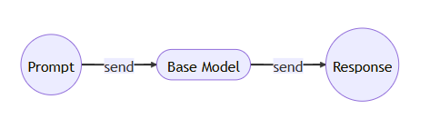
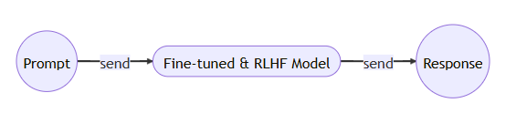

这是我对LLM的简单了解，因为并不是专门做这个的，但是这个确实太热了，我很感兴趣，就简单看了些课，做了一个简单的笔记。
**什么是LLM**：简单来说LLM就是通过海量的数据学习到一种能了解文字之间关系的一种模型，其本质上是遵循 Transformer 架构的人工神经网络。
**工作原理**：LLM的工作原理类似于一种文字预测，也就是给我一个文字输入，LLM根据训练经验给出下一个词组的概率
1.文档完善类

2.生成式（常用的）

微调：一般来说，LLM训练完成后都是第一种模式，也就是基本的补词的功能，在第一种基础上进行微调,例如GPT雇佣人工提供几十万个对答问题，才有了下面这种常用的生成式的模型
RLHF：借助强化学习在微调后模型的基础上一以人类反馈设计为奖励模型进而训练大模型在做进一步的学习更新

