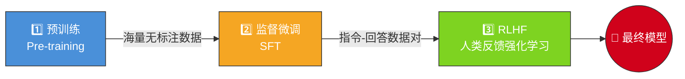
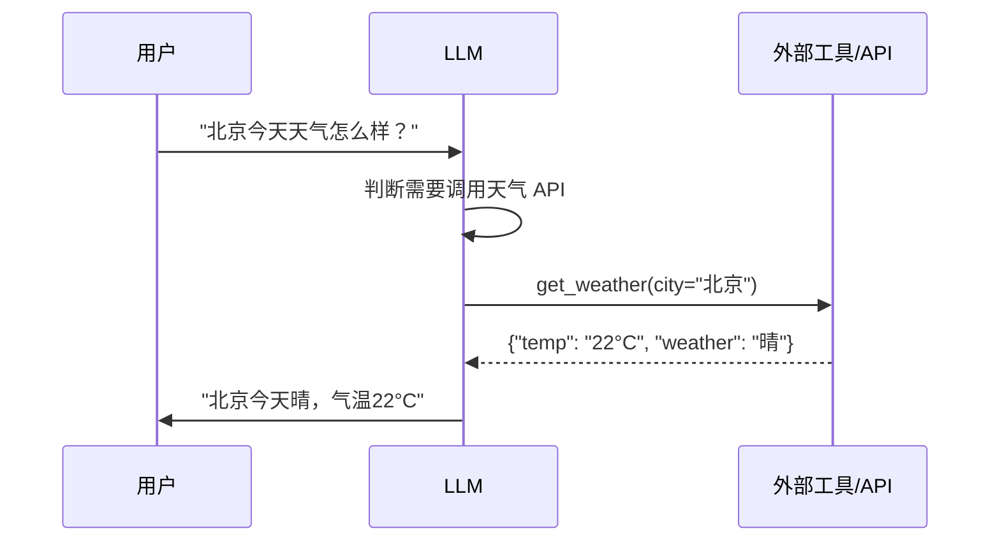
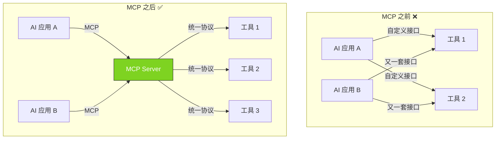
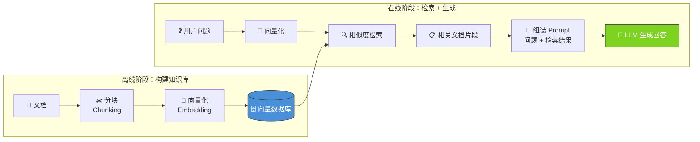
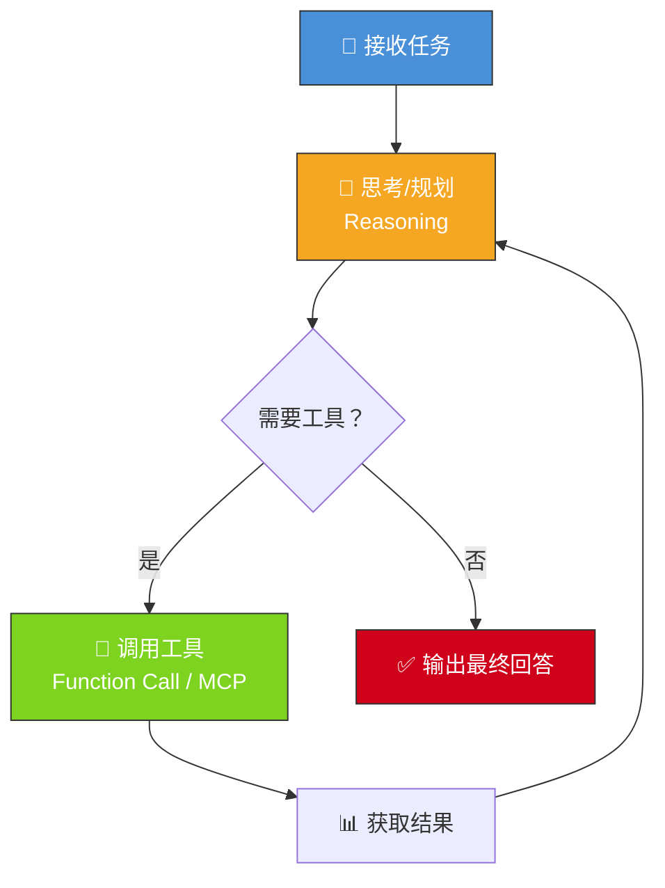
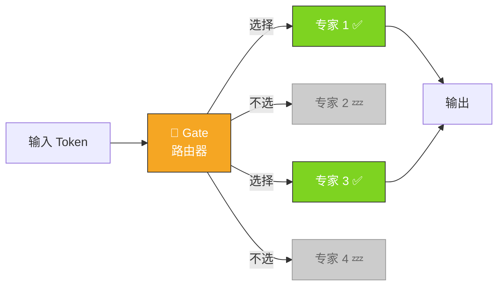

---

## 一、什么是LLM

**LLM（Large Language Model，大语言模型）** 是通过海量数据学习文字之间关系的模型，本质上是遵循 ==Transformer 架构== 的人工神经网络。

---

## 二、核心架构 —— Transformer

LLM 的基石是 2017 年 Google 提出的 **Transformer** 架构（论文：*Attention Is All You Need*）。

### 2.1 关键概念：Tokenization（分词）

> [!info] Token ≠ 文字
> LLM 不直接处理文字，而是先将文本切分为 **token**（词元）。

- 英文示例：`"Hello world"` → `["Hello", " world"]`
- 中文示例：`"大语言模型"` → `["大", "语言", "模型"]`
- 常用分词算法：**BPE**（Byte Pair Encoding）、**WordPiece**、**SentencePiece**

### 2.2 关键概念：自注意力机制（Self-Attention）

Transformer 的核心是 **多头自注意力机制（Multi-Head Self-Attention）**：

- 让模型在处理每个词时，能"关注"到输入序列中==所有其他词==的信息
- 通过 **Q（Query）、K（Key）、V（Value）** 三个矩阵计算注意力权重
- 这使得模型能够捕捉长距离的语义依赖关系

$$
Attention(Q,K,V) = softmax\left(\frac{QK^T}{\sqrt{d_k}}\right)V
$$

### 2.3 上下文窗口（Context Window）

> [!example] 上下文窗口的演进
> - ==GPT-3==：2,048 tokens
> - ==GPT-4==：8K / 32K tokens
> - ==Claude / Gemini==：128K ~ 200K tokens
> - 更长的窗口 = 能"记住"更多对话历史

---

## 三、工作原理

> [!note] 核心思想：自回归生成
> LLM 的工作原理类似于==文字预测==：给一个文字输入，根据训练经验给出下一个 token 的概率。每次预测一个 token，加入输入后继续预测下一个，循环往复直到生成完整回答。

### 3.1 文档补全类（Base Model）

![[LLM/assets/1.png]]

基座模型的本质就是一个"补全机器"：给定前文，预测最可能的后续文本。

### 3.2 生成式 / 对话式（常用的）

![[LLM/assets/2.png]]

经过微调后的模型能够理解用户意图，以对话形式给出有用的回答。

---

## 四、训练过程

LLM 的训练通常分为 ==三个阶段==：

### 4.1 预训练（Pre-training）

- 使用海量无标注文本数据（书籍、网页、代码等）
- 任务：**下一个 token 预测**（Next Token Prediction）
- 需要大量算力：GPT-3 训练据估计花费约 ==460 万美元==
- 训练完成后得到 **基座模型（Base Model）**，具备基本的语言理解和生成能力

### 4.2 监督微调 / 指令微调（SFT - Supervised Fine-Tuning）

**微调**：一般来说，LLM训练完成后都是第一种模式，也就是基本的补词的功能，在第一种基础上进行微调。例如 GPT 雇佣人工提供几十万个对答问题，才有了常用的生成式的模型。

> [!important] 核心要点
> - 构建高质量的 **指令-回答** 数据对（Instruction-Response pairs）
> - 让模型学会遵循指令、以对话方式回答问题
> - 数据量相对预训练==小得多==，但质量要求很高

### 4.3 RLHF（Reinforcement Learning from Human Feedback）

**RLHF**：借助强化学习在微调后模型的基础上，以人类反馈设计奖励模型，进而训练大模型做进一步的学习更新。

> [!tip] 2025 新进展：RLRF
> DeepSeek-R1 提出了 **RLRF（Reinforcement Learning with Reasoning Feedback）**，不再依赖主观的人类偏好，而是引入基于逻辑正确性、推理步骤准确性的==客观结构化反馈信号==，显著提升了模型的推理能力。

---
## 五、概念汇总

### 5.1 涌现能力（Emergent Abilities）

> [!warning] 何为"涌现"？
> 当模型参数量超过一定阈值时，会==突然==表现出小模型不具备的能力，这被称为 **涌现能力（Emergent Abilities）**。这不是通过显式编程实现的，而是模型在规模增大后"自发"获得的。

- **思维链推理（Chain-of-Thought, CoT）** — 分步骤推理复杂问题，而非直接给出答案
- **少样本学习（Few-shot Learning）** — 仅给几个示例就能完成新任务，无需额外训练
- **零样本学习（Zero-shot Learning）** — 不给示例，仅靠指令描述就能完成全新任务
- **代码生成** — 理解自然语言需求并生成可运行的代码
- **工具使用（Tool Use）** — 学会调用外部 API、搜索引擎等工具

---

### 5.2 Prompt Engineering（提示工程）

> [!info] 与 LLM 对话的"技巧"
> 提示工程是指通过精心设计输入提示（Prompt），引导 LLM 生成更高质量输出的技术。==不改变模型本身，只改变"问法"==。

常见策略：

| 策略 | 说明 | 示例 |
|:----:|------|------|
| **Zero-shot** | 直接提问，不给例子 | `"翻译成英文：你好"` |
| **Few-shot** | 给几个示例，让模型学习格式 | `"猫→cat，狗→dog，鱼→?"` |
| **CoT** | 要求模型"一步步思考" | `"请一步步推理这道数学题"` |
| **System Prompt** | 设定模型的角色和行为规则 | `"你是一个专业的Python程序员"` |

---

### 5.3 Function Call（函数调用）

> [!abstract] 让 LLM "动手做事"的关键能力
> **Function Call** 是 LLM 调用外部工具/函数的机制。LLM 本身只能生成文本，但通过 Function Call，它可以==触发真实的操作==。

**工作流程：**

> [!example] 实际示例
> 用户问："帮我查一下 AAPL 的股价"
> 1. LLM 识别出需要调用 `get_stock_price` 函数
> 2. LLM 输出结构化的函数调用：`get_stock_price(symbol="AAPL")`
> 3. 系统执行函数，获取真实股价数据
> 4. LLM 拿到结果后，组织成自然语言回复给用户

**关键点：**
- LLM 不直接执行函数，而是==生成调用意图==（JSON 格式），由外部系统实际执行
- 开发者需要提前定义可用的函数列表（名称、参数、描述）
- OpenAI 在 GPT-3.5/4 中首先引入了 Function Calling API

---

### 5.4 MCP（Model Context Protocol）

> [!tip] AI 时代的"USB 接口"
> **MCP（Model Context Protocol，模型上下文协议）** 是 Anthropic 于 ==2024 年 11 月== 发布的开放协议，为 LLM 应用连接外部数据源和工具提供了==统一标准==。

**为什么需要 MCP？**

在 MCP 之前，每个 AI 应用要连接不同工具（数据库、文件系统、API），都需要单独写对接代码，就像早期每种设备都有不同的充电线一样。MCP 就是 AI 领域的"USB-C"——==一个协议，连接一切==。

**MCP 架构三要素：**

| 组件 | 角色 | 类比 |
|:----:|------|:----:|
| **MCP Host** | 发起连接的 AI 应用（如 Claude Desktop） | 电脑 |
| **MCP Client** | 与 Server 保持通信的协议层 | USB 线 |
| **MCP Server** | 暴露具体能力（工具/资源/提示）的服务 | U盘/键盘 |

**MCP Server 提供三种能力：**
- **Tools（工具）** — LLM 可以调用的函数，如查询数据库、发送邮件
- **Resources（资源）** — LLM 可以读取的数据，如文件内容、数据库记录
- **Prompts（提示模板）** — 预定义的提示模板，标准化常见交互

---

### 5.5 Skill（技能）

> [!info] Agent 的"技能包"
> **Skill** 是赋予 AI Agent 特定领域能力的==可复用模块==。如果说 Agent 是一个"员工"，那 Skill 就是它掌握的各种"专业技能"。

**Skill 与 Function Call 的区别：**

| 对比  |    Function Call    |           Skill           |
| :-: | :-----------------: | :-----------------------: |
| 粒度  |       单个函数调用        |         一组相关能力的集合         |
| 复杂度 |      简单的输入→输出       |      可能包含多步骤流程、内置知识       |
| 示例  | `get_weather(city)` | "学术写作"技能（含文献检索+大纲生成+论文撰写） |

**实际示例：**
- 一个 "数据分析" Skill 可能包含：读取 CSV → 统计描述 → 生成可视化 → 输出报告
- 一个 "科学写作" Skill 可能包含：文献检索 → 引用管理 → LaTeX 排版 → PDF 导出

---

### 5.6 RAG（检索增强生成）

> [!abstract] 让 LLM 拥有"查资料"的能力
> **RAG（Retrieval-Augmented Generation，检索增强生成）** 是解决 LLM ==知识截止== 和 ==幻觉问题== 的核心技术。核心思想：**先检索，再生成**。

**为什么需要 RAG？**
- LLM 的知识停留在训练时的数据，无法回答训练后发生的事
- LLM 可能"编造"不存在的信息（幻觉）
- 企业需要 LLM 基于==自己的私有数据==来回答问题

**RAG 工作流程：**

**关键步骤详解：**

| 步骤 | 说明 |
|:----:|------|
| **Chunking** | 将长文档切分为小段（如 512 token），便于检索 |
| **Embedding** | 用向量模型将文本转为高维向量（语义表示） |
| **向量数据库** | 存储向量并支持高效相似度搜索（Pinecone、Milvus、Qdrant 等） |
| **检索** | 将用户问题也转为向量，在数据库中找最相似的文档片段 |
| **生成** | 将检索到的文档作为上下文，连同用户问题一起发给 LLM |

---

### 5.7 Agent（智能体）

> [!success] LLM 的最终形态：从"聊天"到"做事"
> **Agent（智能体）** 是以 LLM 为"大脑"，能够==自主规划、决策、执行==多步骤任务的系统。

**Agent 的核心循环：**

**Agent 与普通 LLM 对话的区别：**

| 对比 | 普通对话 | Agent |
|:----:|:-------:|:-----:|
| 交互 | 一问一答 | 多轮自主执行 |
| 工具 | 不使用 | 主动调用 Function Call / MCP |
| 规划 | 无 | 分解任务、制定步骤 |
| 记忆 | 仅上下文窗口 | 可持久化记忆 |
| 示例 | "帮我写一首诗" | "帮我调研竞品并生成分析报告" |

---

### 5.8 混合专家模型（MoE - Mixture of Experts）

> [!example] MoE 核心思想
> 模型拥有大量参数，但每次推理只激活一小部分"专家"网络，==用更少的计算获得更强的能力==。

- Qwen3.5-Plus：总参数 ==3970 亿==，仅激活 ==170 亿==（激活率约 4%）

---

### 5.9 多模态（Multimodal）

> [!info] 从"只看文字"到"眼观六路"
> 现代 LLM 不再局限于文本，开始融合 **图像、音频、视频、3D** 等多种模态。

| 能力 | 代表模型 | 说明 |
|:----:|:--------:|------|
| 图像理解 | GPT-4V、Gemini | 看图回答问题、分析图表 |
| 图像生成 | Claude 4.5、GPT-4o | 根据文字描述生成图片 |
| 语音对话 | GPT-4o | 实时语音交互，支持情感表达 |
| 视频理解 | Gemini 3.1 Pro | 分析视频内容、提取关键信息 |

---

### 5.10 推理时扩展（Inference-Time Scaling）

> [!note] "想得越久，答得越好"
> 传统思路是训练时投入更多算力（更大模型、更多数据），而推理时扩展的核心理念是：在生成回答时也投入更多计算，让模型=="慢思考"==。

- **代表模型**：OpenAI o1 / o3、DeepSeek-R1
- **核心机制**：模型在输出前先进行内部"推理链"思考，可能思考数十秒甚至数分钟
- **效果**：在数学、编程、逻辑推理等任务上==大幅提升准确率==
- **2026 年趋势**：成为提升模型能力的重要方向，与训练时扩展互补

## 六、发展历程

| 时间 | 模型 | 意义 |
|:----:|------|------|
| 2017 | **Transformer** | Google 提出 Transformer 架构，奠定基础 |
| 2018 | **BERT**（Google） | 双向编码器，开创预训练+微调范式 |
| 2018 | **GPT-1**（OpenAI） | 单向解码器，验证了生成式预训练的可行性 |
| 2019 | **GPT-2** | 15亿参数，展示零样本学习能力 |
| 2020 | **GPT-3** | ==1750亿参数==，引爆LLM热潮，展现涌现能力 |
| 2022 | **ChatGPT** | 基于 GPT-3.5 + RLHF，==引发全民关注== |
| 2023 | **GPT-4** | 多模态能力，可以理解图像 |
| 2023 | **LLaMA**（Meta） | 开源模型，推动开源 LLM 生态发展 |
| 2023 | **Claude**（Anthropic） | 强调安全性和长上下文能力 |
| 2025.01 | **DeepSeek-R1** | 极低训练成本，RLRF 推理突破 |
| 2025.08 | **GPT-5** | OpenAI 最新一代模型 |
| 2026 | **Claude 4.5 Sonnet** | 领跑真实专家级工作评测 |

---

%%
相关笔记：[[LLM/transformer]]
最后更新：2026-04-07
%%
