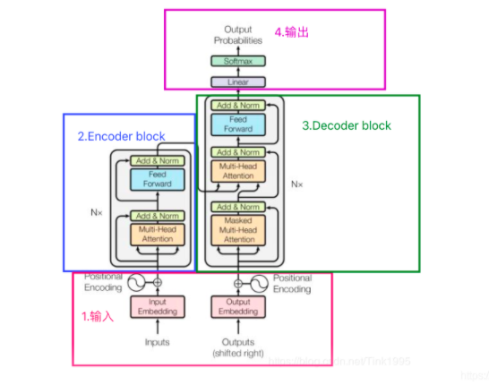
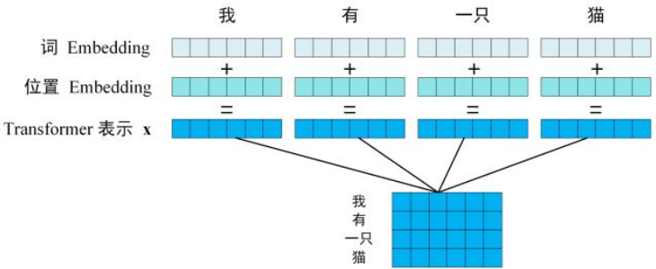
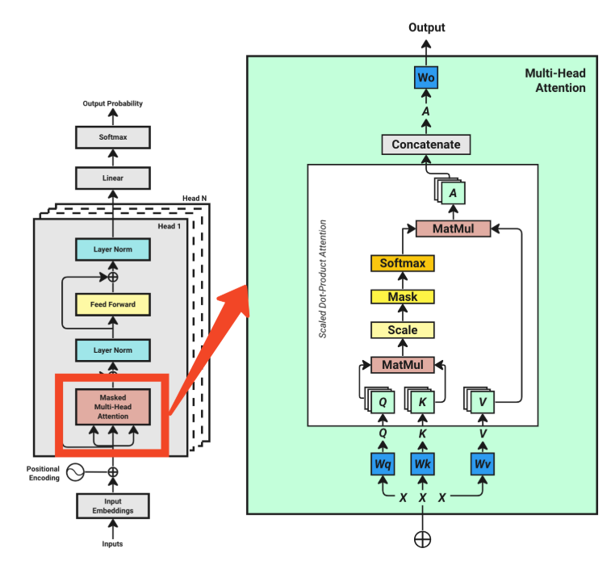

### **整体预览：这里以decoder为例**

1.首先，我们需要一系列输入字符作为训练数据(我是一个),这些输入被转换为矢量嵌入格式（对应的词、位置向量）。
2.向量加维度成矩阵表示不同语境，输入自注意力机制（QKV都是“我是一个”）来比较
3.归一化+前馈得到为给定的输入文本生成可能的下一个字符的概率分布（人：0.8，狗：0.2）
4.该模型根据训练数据集中的实际后续特征评估预测结果，相应地调整概率或“权重”（样本是有label的，对应的label就是“是一个人”，结果与label对比进行xunlian ）。
5.最后，该模型迭代地改进了这一过程，不断更新其参数以提高未来预测的精度。

### 1.Tokenization

将输入文本借助词表转化成对应的编码（token），主要就是拆分+转化

拆分：可以有单词级、字符级、子词级
转化：根据对应的词库，如tiktoken，就可以得到一段数字组成的列表

### 2.Word Embeddings

在Tokenization后，我们会引入一个Token Embedding Look-up Table（token标号数*维度，这些数字都是随机的，后面训练后才后有意义），这里的token标号数是总共有几种token，维度就是单个词在不同维度的含义

input embedding就是在这个表中找到对应token的行，拼接起来

### 3.Positional Encoding

初始的位置编码,原文用了这个公式来计算,基本就是借助三角函数让每个位置的编码都不太一样又不至于差很多：

$$
PE(pos, 2i) = sin(pos / 10000^{(2i/d_{model})})
//
PE(pos, 2i+1) = cos(pos / 10000^{(2i+1/d_{model})})
$$

取出的这个矩阵与上面那个矩阵相加就有了最终的输入

### 4. Transform

**多头注意力层：**

（1）这里是自注意力机制，所以输入的向量进来之后会分成三份，分别表示为QKV，这里的核心公式如下，图中各个部分都是根据公式来处理的：

$$
Attention(A,K,V)=softmax(\frac{QK^T}{\sqrt{d_k}})V
$$

（2）Transform要学的是什么，要学习的是注意力权重，也就是蓝色的wq\wk\wv这些

（3）matmul:这里表示Q与K的转置相乘，得到的就是这段话每个字与其他子的一个相似度

（4）Scale:除以一个数防止矩阵的一些数过大，这里除的是$\sqrt{d_k}$

（5）mask：因为我们的目的是根据当前句子预测下一个字吗，所以当前的字只能知道他跟前面字的相似度，不能知道它跟后面字的相似度，所以QK的结果右三角的概率要设为0

（6）softmax:数值转概率

（7）再进一步与V相乘

（8）concatenate:这里是指之前的操作是多头的，也就是64个维度分成4个头，每个投16维分别处理，这里就是4个头处理完之后加起来

**Layer Norm：**缩小值

**残差链接：** 防止过拟合

**Feed Forward**：就是加了一层神经网络

**Linear：** 矩阵相乘，得到句子字数*词汇表字数大小的一个矩阵，也就是词汇表里每个词施加一个概率，表示接下来最可能出现的下个字的差别的大小
