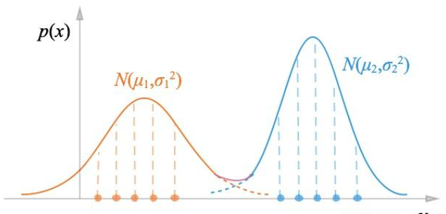
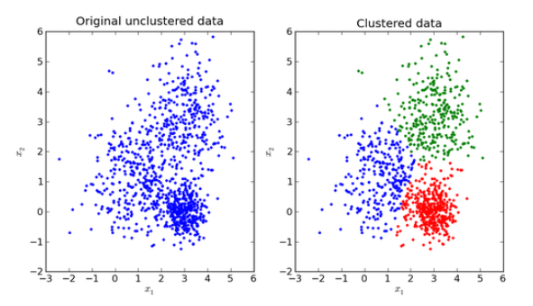
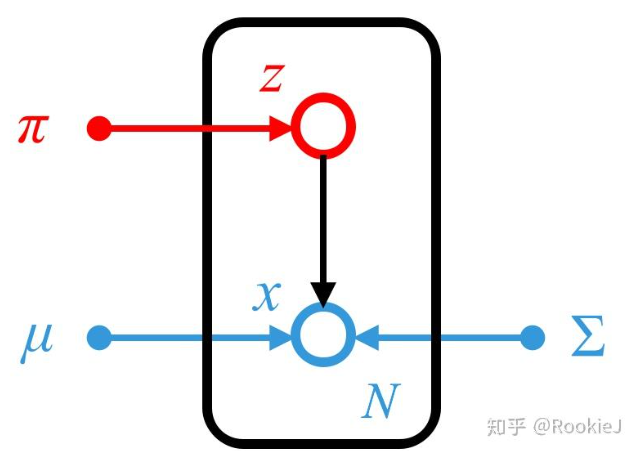

# 高斯混合模型

#### 基本思想

**1.几何角度：** 多个高斯分布的加权平均

$$
p(x)=\sum\limits_{k=1}^K\alpha_k\mathcal{N}(\mu_k,\Sigma_k)
$$

**2.混合模型角度：**

对于一组可观测的样本$X=\{x_i\}_{i=1}^N$,为了表示对应的样本$x$属于哪一个高斯分布

我们引入一组隐变量$Z=\{z_i\}_{i=1}^N$，这个变量是一个离散的随机变量，对于每个$x_i$,其对应的$z_i$都有：

| $z$ | 1 | 2 | ... | k |
| --- | --- | --- | --- | --- |
| $p(z)$ | $p_1$ | $p_2$ | ... | $p_k$ |

$$
p(z=i)=p_i,\sum\limits_{i=1}^kp(z=i)=1
$$

**3.生成模型角度：**

作为一个生成式模型，高斯混合模型通过隐变量 $z$ 的分布来生成样本。用概率图来表示：

其中，节点 $z$ 就是上面的概率，$x$ 就是生成的高斯分布。也就是说$z$先决定属于哪个高斯分布，然后再根据对应的高斯分布的特点采样，于是对 $p(x)$：

$$
p(x)=\sum\limits_zp(x,z)=\sum\limits_{k=1}^Kp(x,z=k)=\sum\limits_{k=1}^Kp(z=k)p(x|z=k)
$$

因此：

$$
p(x)=\sum\limits_{k=1}^Kp_k\mathcal{N}(x|\mu_k,\Sigma_k)
$$

#### 极大似然估计

对于高斯混合模型的概率密度函数：

$$
p(x)=\sum\limits_{k=1}^Kp_k\mathcal{N}(x|\mu_k,\Sigma_k)
$$

参数为 $\theta=\{p_1,p_2,\cdots,p_K,\mu_1,\mu_2,\cdots,\mu_K\Sigma_1,\Sigma_2,\cdots,\Sigma_K\}$。
我们通过极大似然估计得到 $\theta$ 的值：

$$
\theta_{MLE}=\mathop{argmax}\limits_{\theta}\log p(X)=\mathop{argmax}_{\theta}\sum\limits_{i=1}^N\log p(x_i)\\=\mathop{argmax}_\theta\sum\limits_{i=1}^N\log \sum\limits_{k=1}^Kp_k\mathcal{N}(x_i|\mu_k,\Sigma_k)
$$

这个表达式直接通过求导，由于连加号的存在，无法得到解析解。因此需要使用 EM 算法。

## EM 求解 GMM

EM 算法的基本表达式为(其中期望那一部分也可也表示为$Q(\theta,\theta^{t+1})$)：

$$
\theta^{t+1}=\mathop{argmax}\limits_{\theta}\mathbb{E}_{z|x,\theta^t}[\log p(x,z|\theta)]
$$

**E步：** 求$Q(\theta,\theta^{t+1})$（求期望）

套用 GMM 的表达式，对数据集来说：

$$
Q(\theta,\theta^t)=\sum\limits_z[\log\prod\limits_{i=1}^Np(x_i,z_i|\theta)]\prod \limits_{i=1}^Np(z_i|x_i,\theta^t)\\

=\sum\limits_z[\sum\limits_{i=1}^N\log p(x_i,z_i|\theta)]\prod \limits_{i=1}^Np(z_i|x_i,\theta^t)\\

\sum\limits_z[\log p(x_1,z_1|\theta)+...+\log p(x_N,z_N|\theta)]\prod\limits_{i=1}^Np(z_i|x_i,\theta^t)\\
$$

> 对于中间的那个求和号，我们看一下第1项：
> 
> $$
> \sum\limits_z\log p(x_1,z_1|\theta)\prod\limits_{i=1}^Np(z_i|x_i,\theta^t)\\
> 
> =\sum\limits_z\log p(x_1,z_1|\theta)p(z_1|x_1,\theta^t)\prod\limits_{i=2}^Np(z_i|x_i,\theta^t)\\
> 
> =\sum\limits_{z_1}\log p(x_1,z_1|\theta)p(z_1|x_1,\theta^t)\sum\limits_{z_2,\cdots,z_K}\prod\limits_{i=2}^Np(z_i|x_i,\theta^t)\\
> 
> =\sum\limits_{z_1}\log p(x_1,z_1|\theta)p(z_1|x_1,\theta^t)
> $$
> 
> 这里有两点不太好理解:
> 第一，什么叫对$z$求和:这里的$z$不是一个数，而是一个离散的概率密度分布，而$z$又不止一个，所以这里是对N个离散概率密度函数求和。
> 第二，为什么后面那一部分没了，其实写开就可以发现，它是多个概率密度函数积分的乘积，也就是$1*1*1$

类似地，$Q$ 可以写为：

$$
Q(\theta,\theta^t)=\sum\limits_{i=1}^N\sum\limits_{z_i}\log p(x_i,z_i|\theta)p(z_i|x_i,\theta^t)
$$

对于 $p(x,z|\theta)$：

$$
p(x,z|\theta)=p(z|\theta)p(x|z,\theta)=p_z\mathcal{N}(x|\mu_z,\Sigma_z)
$$

对 $p(z|x,\theta^t)$：

$$
p(z|x,\theta^t)=\frac{p(x,z|\theta^t)}{p(x|\theta^t)}=\frac{p_z^t\mathcal{N}(x|\mu_z^t,\Sigma_z^t)}{\sum\limits_kp_k^t\mathcal{N}(x|\mu_k^t,\Sigma_k^t)}
$$

代入 $Q$：

$$
Q=\sum\limits_{i=1}^N\sum\limits_{z_i}\log p_{z_i}\mathcal{N(x_i|\mu_{z_i},\Sigma_{z_i})}\frac{p_{z_i}^t\mathcal{N}(x_i|\mu_{z_i}^t,\Sigma_{z_i}^t)}{\sum\limits_kp_k^t\mathcal{N}(x_i|\mu_k^t,\Sigma_k^t)}
$$

**M步：** 求最大

对于$Q$:

$$
Q=\sum\limits_{i=1}^N\sum\limits_{z_i}\log p_{z_i}\mathcal{N(x_i|\mu_{z_i},\Sigma_{z_i})}\frac{p_{z_i}^t\mathcal{N}(x_i|\mu_{z_i}^t,\Sigma_{z_i}^t)}{\sum\limits_kp_k^t\mathcal{N}(x_i|\mu_k^t,\Sigma_k^t)}
$$

后面那一部分其实是个常数，我们用$p(z_i|x_i,\theta^t)$表示，那么就有：

$$
Q=\sum\limits_{i=1}^N\sum\limits_{z_i}\log p_{z_i}\mathcal{N(x_i|\mu_{z_i},\Sigma_{z_i})}p(z_i|x_i,\theta^t)\\
=\sum\limits_{k=1}^K\sum\limits_{i=1}^N[\log p_k+\log \mathcal{N}(x_i|\mu_k,\Sigma_k)]p(z_i=k|x_i,\theta^t)
$$

以$p_k^{t+1}$为例，进行参数估计：

$$
p_k^{t+1}=\mathop{argmax}\limits_{p_k}\sum\limits_{k=1}^K\sum\limits_{i=1}^N[\log p_k+\log \mathcal{N}(x_i|\mu_k,\Sigma_k)]p(z_i=k|x_i,\theta^t)\\\ s.t.\ \sum\limits_{k=1}^Kp_k=1
$$

即：

$$
p_k^{t+1}=\mathop{argmax}\limits_{p_k}\sum\limits_{k=1}^K\sum\limits_{i=1}^N\log p_kp(z_i=k|x_i,\theta^t)\ s.t.\ \sum\limits_{k=1}^Kp_k=1
$$

引入 Lagrange 乘子：

$$
L(p_k,\lambda)=\sum\limits_{k=1}^K\sum\limits_{i=1}^N\log p_kp(z_i=k|x_i,\theta^t)-\lambda(1-\sum\limits_{k=1}^Kp_k)
$$

对于单项

$$
\frac{\partial L}{\partial p_k}=\sum\limits_{i=1}^N\frac{1}{p_k}p(z_i=k|x_i,\theta^t)+\lambda=0\\
$$

对于通项

$$
\Rightarrow \sum\limits_k\sum\limits_{i=1}^Np(z_i=k|x_i,\theta^t)+\lambda\sum\limits_kp_k=0\\
\Rightarrow\lambda=-N
$$

于是有：

$$
p_k^{t+1}=\frac{1}{N}\sum\limits_{i=1}^Np(z_i=k|x_i,\theta^t)
$$

2. $\mu_k,\Sigma_k$，这两个参数是无约束的，直接求导即可。

