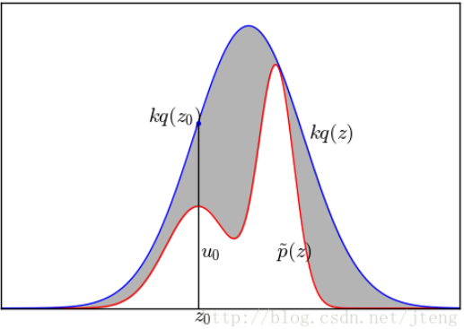

# 马尔可夫链蒙特卡洛

#### 背景

前面讲到的变分推断的基本思路是公式中有个KL散度,因此可以求解一个$q(z)$来近似后验$p(z|x)$，这种近似是确定性的。
而在本章节要讲的MCMC方法中，就不会通过推导的方式确定$q(z)$，而是直接随机采样得到$p(z|x)$。

MCMC 是一种随机的近似推断，也是一种求后验的方法，其核心就是基于采样的随机近似方法蒙特卡洛方法。

对于采样任务来说，有下面一些常用的场景：

1. 采样作为任务，用于生成新的样本
2. 求和/求积分

采样结束后，我们需要评价采样出来的样本点是不是好的样本集：

1. 样本趋向于高概率的区域
2. 样本之间必须独立

具体采样中，采样是一个困难的过程：

1. 无法采样得到归一化因子，即无法直接对概率 $ p(x)=\frac{1}{Z}\hat{p}(x)$ 采样，常常需要对 CDF 采样，但复杂的情况不行
2. 如果归一化因子可以求得，但是对高维数据依然不能均匀采样（维度灾难），这是由于对 $p$ 维空间，总的状态空间是 $K^p$ 这么大，于是在这种情况下，直接采样也不行

因此需要借助其他手段，如蒙特卡洛方法中的拒绝采样，重要性采样和 MCMC。

#### 蒙特卡洛方法

蒙特卡洛方法简单来说就是用样本均值拟合期望，假如我知道了一个参数的分布$p(z)$,现在要求一个关于参数$z$更复杂分布$f(z)$的期望

我们就可以根据$p(z)$，得到$z^1,z^2,...,z^n$，然后计算一个$\frac1N \sum\limits_{i=1}^Nf(z_i)$来代替

那么怎么根据$p(z)$，得到$z^1,z^2,...,z^n$呢，这就涉及到采样方法的问题，采样方法有：

**概率分布采样:** 首先求得$p(z)$的累积密度函数 CDF，然后求得 CDF 的反函数，在0到1之间均匀采样，代入反函数，就得到了采样点。但是实际大部分概率分布不能得到 CDF,反函数也非常难求。
**Rejection Sampling 拒绝采样：** 对于概率分布 $p(z)$，直接对其采样可能是十分复杂的，于是我们引入简单的提议分布 $q(z)$，使得 $\forall z_i,Mq(z_i)\ge p(z_i)$。我们先在 $ q(z)$ 中采样，定义接受率：$\alpha=\frac{p(z^i)}{Mq(z^i)}$。

算法描述为：

1. 取 $z^i\sim q(z)$。
2. 在均匀分布中选取 $u$。
3. 如果 $u\le\alpha$，则接受 $z^i$，否则，拒绝这个值。

**Importance Sampling：** 直接对期望：$\mathbb{E}_{p(z)}[f(z)]$ 进行采样。

$$
\mathbb{E}_{p(z)}[f(z)]=\int p(z)f(z)dz=\int \frac{p(z)}{q(z)}f(z)q(z)dz\simeq\frac{1}{N}\sum\limits_{i=1}^Nf(z_i)\frac{p(z_i)}{q(z_i)}
$$

这样做引入了一个新的$q(z)$，可以通过这个$q(z)$进行采样，同时引入了一个权重$\frac{p(z_i)}{q(z_i)}$,这个权重取决于两个分布的相似程度，如果相似程度低，其权重就非常小，采样效率非常低

重要性采样有一个变种 Sampling-Importance-Resampling，这种方法，首先和上面一样进行采样，然后在采样出来的 $N$ 个样本中，重新采样，这个重新采样，使用每个样本点的权重作为概率分布进行采样。

## MCMC

马尔可夫链式一种时间状态都是离散的随机变量序列。我们关注的主要是齐次的一阶马尔可夫链。马尔可夫链满足：$p(X_{t+1}|X_1,X_2,\cdots,X_t)=p(X_{t+1}|X_t)$。这个式子可以写成转移矩阵的形式 $p_{ij}=p(X_{t+1}=j|X_t=i)$。我们有：

$$
\pi_{t+1}(x^*)=\int\pi_i(x)p_{x\to x^*}dx
$$

如果存在 $\pi=(\pi(1),\pi(2),\cdots),\sum\limits_{i=1}^{+\infin}\pi(i)=1$，有上式成立，这个序列就叫马尔可夫链 $X_t$ 的平稳分布，平稳分布就是表示在某一个时刻后，分布不再改变。MCMC 就是通过构建马尔可夫链概率序列，使其收敛到平稳分布 $p(z)$。引入细致平衡：$\pi(x)p_{x\to x^*}=\pi(x^*)p_{x^*\to x}$。如果一个分布满足细致平衡，那么一定满足平稳分布（反之不成立）：

$$
\int\pi(x)p_{x\to x^*}dx=\int\pi(x^*)p_{x^*\to x}dx=\pi(x^*)
$$

细致平衡条件将平稳分布的序列和马尔可夫链的转移矩阵联系在一起了，通过转移矩阵可以不断生成样本点。假定随机取一个转移矩阵 $(Q=Q_{ij})$，作为一个提议矩阵。我们有：

$$
p(z)\cdot Q_{z\to z^*}\alpha(z,z^*)=p(z^*)\cdot Q_{z^*\to z}\alpha(z^*,z)
$$

取 ：

$$
\alpha(z,z^*)=\min\{1,\frac{p(z^*)Q_{z^*\to z}}{p(z)Q_{z\to z^*}}\}
$$

则

$$
p(z)\cdot Q_{z\to z^*}\alpha(z,z^*)=\min\{p(z)Q_{z\to z^*},p(z^*)Q_{z^*\to z}\}=p(z^*)\cdot Q_{z^*\to z}\alpha(z^*,z)
$$

于是，迭代就得到了序列，这个算法叫做 Metropolis-Hastings 算法：

1. 通过在0，1之间均匀分布取点 $u$
2. 生成 $z^*\sim Q(z^*|z^{i-1})$
3. 计算 $\alpha$ 值
4. 如果 $\alpha\ge u$，则 $z^i=z^*$，否则 $z^{i}=z^{i-1}$

这样取的样本就服从 $p(z)=\frac{\hat{p}(z)}{z_p}\sim \hat{p}(z)$。

下面介绍另一种采样方式 Gibbs 采样，如果 $z$ 的维度非常高，那么通过固定被采样的维度其余的维度来简化采样过程：$z_i\sim p(z_i|z_{-i})$：

1. 给定初始值 $z_1^0,z_2^0,\cdots$
2. 在 $t+1$ 时刻，采样 $z_i^{t+1}\sim p(z_i|z_{-i})$，从第一个维度一个个采样。

Gibbs 采样方法是一种特殊的 MH 采样，可以计算 Gibbs 采样的接受率：

$$
\frac{p(z^*)Q_{z^*\to z}}{p(z)Q_{z\to z^*}}=\frac{p(z_i^*|z^*_{-i})p(z^*_{-i})p(z_i|z_{-i}^*)}{p(z_i|z_{-i})p(z_{-i})p(z_i^*|z_{-i})}
$$

对于每个 Gibbs 采样步骤，$z_{-i}=z_{-i}^*$，这是由于每个维度 $i$ 采样的时候，其余的参量保持不变。所以上式为1。于是 Gibbs 采样过程中，相当于找到了一个步骤，使得所有的接受率为 1。

## 平稳分布

定义随机矩阵：

$$
Q=\begin{pmatrix}Q_{11}&Q_{12}&\cdots&Q_{1K}\\\vdots&\vdots&\vdots&\vdots\\Q_{k1}&Q_{k2}&\cdots&Q_{KK}\end{pmatrix}
$$

这个矩阵每一行或者每一列的和都是1。随机矩阵的特征值都小于等于1。假设只有一个特征值为 $\lambda_i=1$。于是在马尔可夫过程中：

$$
q^{t+1}(x=j)=\sum\limits_{i=1}^Kq^t(x=i)Q_{ij}\\
\Rightarrow q^{t+1}=q^t\cdot Q=q^1Q^t
$$

于是有：

$$
q^{t+1}=q^1A\Lambda^t A^{-1}
$$

如果 $m$ 足够大，那么，$\Lambda^m=diag(0,0,\cdots,1,\cdots,0)$，则：$q^{m+1}=q^{m}$ ，则趋于平稳分布了。马尔可夫链可能具有平稳分布的性质，所以我们可以构建马尔可夫链使其平稳分布收敛于需要的概率分布（设计转移矩阵）。

在采样过程中，需要经历一定的时间（燃烧期/混合时间）才能达到平稳分布。但是 MCMC 方法有一些问题：

1. 无法判断是否已经收敛
2. 燃烧期过长（维度太高，并且维度之间有关，可能无法采样到某些维度），例如在 GMM 中，可能无法采样到某些峰。于是在一些模型中，需要对隐变量之间的关系作出约束，如 RBM 假设隐变量之间无关。
3. 样本之间一定是有相关性的，如果每个时刻都取一个点，那么每个样本一定和前一个相关，这可以通过间隔一段时间采样。
