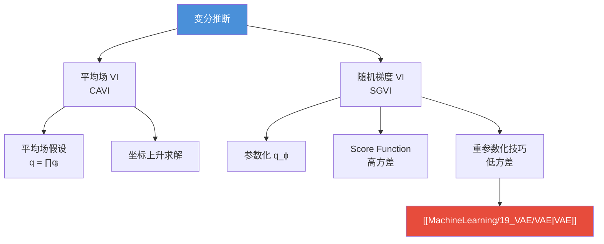

# 变分推断（Variational Inference）

## 背景

> [!abstract] 核心思想
> 变分推断的本质是将**推断问题（求后验）转化为优化问题**：用一个简单的分布 $q(Z)$ 去逼近难以求解的真实后验 $p(Z|X)$，通过最大化 ELBO（证据下界）来实现。

在 [[MachineLearning/11_inference/inference.md|推断]] 中，如果后验的参数空间十分大，无法精确求解，只能通过**近似方式**求解。近似推断主要分为两大类：

- **确定性近似**：变分推断（Variational Inference）
- **随机近似**：[[MachineLearning/11_inference/MCMC.md|MCMC]]、MH 采样、Gibbs 采样等

> [!tip] 变分推断 vs MCMC
> | 特性 | 变分推断 | MCMC |
> |------|---------|------|
> | 本质 | 优化问题 | 采样问题 |
> | 速度 | 快，适合大规模数据 | 慢，采样开销大 |
> | 精度 | 近似解（受假设限制） | 理论上可收敛到精确解 |
> | 适用 | 大规模模型、在线学习 | 小规模精确推断 |

---

## 从 ELBO 出发

我们记 $X$ 为观测数据，$Z$ 为隐变量和参数的集合。

> [!info] 为什么 $Z$ 包含参数 $\theta$？
> 贝叶斯派认为 $\theta$ 不是确定的值而是一个随机变量，所以将隐变量和参数统一记为 $Z$。

### ELBO 推导

回顾 [[MachineLearning/9_EM/EM.md|EM 算法]] 中的推导，引入一个变分分布 $q(Z)$：

$$
\log p(X)=\log p(X,Z)-\log p(Z|X)=\log\frac{p(X,Z)}{q(Z)}-\log\frac{p(Z|X)}{q(Z)}
$$

左右两边对 $q(Z)$ 积分：

$$
\text{Left:}\quad\int_Z q(Z)\log p(X)\,dZ=\log p(X)
$$

$$
\text{Right:}\quad\int_Z\left[\log \frac{p(X,Z)}{q(Z)}-\log \frac{p(Z|X)}{q(Z)}\right]q(Z)\,dZ
$$

$$
=\underbrace{\int_Z q(Z)\log \frac{p(X,Z)}{q(Z)}\,dZ}_{\text{ELBO}\triangleq L(q)}+\underbrace{\int_Z q(Z)\log \frac{q(Z)}{p(Z|X)}\,dZ}_{\text{KL}(q\|p)}
$$

因此我们得到核心等式：

$$
\boxed{\log p(X) = L(q) + \text{KL}(q(Z)\|p(Z|X))}
$$

### 优化目标

> [!important] 关键推理
> 1. 我们的目标是求后验 $p(Z|X)$，但它很难直接计算
> 2. 我们发现 KL 散度衡量了 $q(Z)$ 与 $p(Z|X)$ 的距离
> 3. 等式左边 $\log p(X)$ 是常数（与 $q$ 无关）
> 4. 因此：**最小化 KL 散度 $\Leftrightarrow$ 最大化 ELBO $L(q)$**

于是问题转化为优化问题：

$$
\hat{q}(Z)=\mathop{\arg\max}\limits_{q(Z)}L(q)
$$

> [!note] 与 EM 的关系
> EM 算法可以看作变分推断的一个特例：
> - **E 步**：固定 $\theta$，令 $q(Z)=p(Z|X,\theta)$，此时 KL=0，ELBO 紧贴 $\log p(X)$
> - **M 步**：固定 $q$，最大化 ELBO 关于 $\theta$ 的部分
>
> 变分推断更一般化：不要求 $q$ 恰好等于真实后验，而是在一个**分布族**中找最优近似。

---

## 基于平均场假设的变分推断

### 平均场近似

$q(Z)$ 是由多个隐变量和参数组成的联合概率分布，直接优化非常困难。为了计算方便，我们假设 $q(Z)$ 可以**分解为 $M$ 个独立的组**（平均场近似 / Mean Field Approximation）：

$$
q(Z)=\prod\limits_{i=1}^M q_i(z_i)
$$

> [!warning] 平均场假设的含义
> 这个假设意味着各组隐变量之间**相互独立**。这是一个很强的假设——实际的后验分布中，变量之间往往存在复杂的依赖关系。

### 坐标上升变分推断（CAVI）

在平均场假设下，我们对 ELBO 进行推导，逐个优化每个 $q_j(z_j)$。

**展开 ELBO**：$L(q)=\int_Z q(Z)\log p(X,Z)\,dZ - \int_Z q(Z)\log q(Z)\,dZ$

**第一项**，其中 $Z=(z_1, z_2, \dots, z_M)$：

$$
\int_Z \prod\limits_{i=1}^M q_i(z_i)\log p(X,Z)\,dZ
$$

$$
=\int_{z_j} q_j(z_j)\left[\int_{Z_{-j}}\prod\limits_{i\ne j}q_i(z_i)\log p(X,Z)\,d Z_{-j}\right]dz_j
$$

$$
=\int_{z_j}q_j(z_j)\;\mathbb{E}_{\prod_{i\ne j}q_i(z_i)}[\log p(X,Z)]\;dz_j
$$

**第二项**：

$$
\int_Z q(Z)\log q(Z)\,dZ=\int_Z\prod\limits_{i=1}^M q_i(z_i)\sum\limits_{i=1}^M\log q_i(z_i)\,dZ
$$

展开求和项中关于 $q_1$ 的项为例：

$$
\int_Z\prod\limits_{i=1}^M q_i(z_i)\log q_1(z_1)\,dZ = \int_{z_1}q_1(z_1)\log q_1(z_1)\,dz_1 \cdot \underbrace{\int_{z_2}q_2(z_2)\,dz_2}_{=1}\cdots = \int_{z_1}q_1(z_1)\log q_1(z_1)\,dz_1
$$

所以第二项可以写成：

$$
\int_Z q(Z)\log q(Z)\,dZ=\sum\limits_{i=1}^M\int_{z_i}q_i(z_i)\log q_i(z_i)\,dz_i = \int_{z_j}q_j(z_j)\log q_j(z_j)\,dz_j+\text{Const}
$$

### 最优解

两项合并后，令 $\log \hat{p}(X,z_j) \triangleq \mathbb{E}_{\prod_{i\ne j}q_i(z_i)}[\log p(X,Z)]$，则：

$$
L(q) = \int_{z_j}q_j(z_j)\log\hat{p}(X,z_j)\,dz_j - \int_{z_j}q_j(z_j)\log q_j(z_j)\,dz_j + \text{Const}
$$

$$
= -\text{KL}\!\left(q_j(z_j)\;\|\;\hat{p}(X,z_j)\right) + \text{Const}
$$

于是最大化 ELBO 等价于令 KL 散度为零，即：

$$
\boxed{q_j^*(z_j) = \hat{p}(X,z_j) \propto \exp\left\{\mathbb{E}_{\prod_{i\ne j}q_i(z_i)}[\log p(X,Z)]\right\}}
$$

> [!tip] 坐标上升求解（CAVI 算法）
> 对每一个 $q_j$，固定其余所有 $q_i\ (i\ne j)$，用上式更新 $q_j$。不断迭代直到收敛。
>
> **算法流程：**
> 1. 初始化所有变分因子 $q_1, q_2, \dots, q_M$
> 2. **repeat** 直到 ELBO 收敛：
>    - **for** $j = 1, 2, \dots, M$：
>      - $q_j(z_j) \leftarrow \exp\{\mathbb{E}_{q_{-j}}[\log p(X, Z)]\} / \text{归一化常数}$
> 3. **return** $q^*(Z) = \prod_j q_j^*(z_j)$

### 平均场变分推断的局限

> [!danger] 存在的问题
> 1. **假设太强**：当 $Z$ 内部存在强依赖时，独立假设会导致严重的近似误差
> 2. **积分不可解**：期望 $\mathbb{E}_{q_{-j}}[\log p(X,Z)]$ 中的积分可能没有解析解
> 3. **只能找到局部最优**：ELBO 可能是非凸的，坐标上升只保证局部收敛

---

## SGVI（随机梯度变分推断）

### 动机

基于平均场的变分推断依赖坐标上升法，但在某些情况下假设太强且积分不可解。我们希望用更通用的**梯度上升**方法来求解。

### 参数化变分分布

为了使用梯度方法，我们给 $q$ 一个参数化形式 $q(Z) = q_\phi(Z)$，优化目标变为：

$$
\mathop{\arg\max}\limits_{\phi}\;L(\phi) = \mathbb{E}_{q_\phi}\!\left[\log p_\theta(x^i, z) - \log q_\phi(z)\right]
$$

其中 $x^i$ 表示第 $i$ 个样本。

### 梯度推导（Score Function Estimator）

对 $L$ 求关于 $\phi$ 的梯度：

$$
\nabla_\phi L(\phi) = \nabla_\phi \int q_\phi(z)\left[\log p_\theta(x^i,z) - \log q_\phi(z)\right]dz
$$

利用乘积法则展开，并利用 $\nabla_\phi q_\phi = q_\phi \nabla_\phi \log q_\phi$（Score Function / REINFORCE 技巧）以及 $\int \nabla_\phi q_\phi\,dz = \nabla_\phi 1 = 0$，经推导可得：

$$
\nabla_\phi L(\phi) = \mathbb{E}_{q_\phi}\!\left[(\nabla_\phi\log q_\phi)\cdot(\log p_\theta(x^i,z)-\log q_\phi(z))\right]
$$

%%
详细推导过程：
∇L = ∫ ∇q·[log p - log q] dz + ∫ q·∇[log p - log q] dz
    = ∫ ∇q·[log p - log q] dz - ∫ q·∇log q dz
    = ∫ ∇q·[log p - log q] dz - ∫ ∇q dz
    = ∫ ∇q·[log p - log q] dz - 0
    = E_q[ ∇log q · (log p - log q) ]
%%

通过**蒙特卡洛采样**近似这个期望：

$$
z^l \sim q_\phi(z), \quad l = 1, \dots, L
$$

$$
\nabla_\phi L(\phi) \approx \frac{1}{L}\sum\limits_{l=1}^L (\nabla_\phi\log q_\phi(z^l))\cdot(\log p_\theta(x^i,z^l)-\log q_\phi(z^l))
$$

> [!warning] 高方差问题
> 由于求和中存在对数项 $\log q_\phi(z)$，当采样到的 $q_\phi(z)$ 接近 0 时，函数值变化非常大，导致**方差极大**，需要大量采样才能得到可靠的梯度估计。

---

## 重参数化技巧（Reparameterization Trick）

### 核心思想

为了解决 Score Function Estimator 方差过大的问题，我们希望将**分布的随机性**从 $q_\phi$ 转移到一个与 $\phi$ 无关的简单分布上。

具体做法：引入一个确定性函数 $g_\phi$ 和噪声变量 $\varepsilon$：

$$
z = g_\phi(\varepsilon, x^i), \quad \varepsilon \sim p(\varepsilon)
$$

使得 $z \sim q_\phi(z|x^i)$，并且满足换元定理 $|q_\phi(z|x^i)\,dz| = |p(\varepsilon)\,d\varepsilon|$。

> [!example] 常见例子
> 若 $q_\phi(z) = \mathcal{N}(\mu, \sigma^2)$，令 $\varepsilon \sim \mathcal{N}(0, 1)$，则 $z = \mu + \sigma \cdot \varepsilon$。
> 此时 $\phi = (\mu, \sigma)$，梯度可以直接通过 $g_\phi = \mu + \sigma\varepsilon$ 反向传播。

### 梯度推导

将 $z = g_\phi(\varepsilon, x^i)$ 代入 ELBO 梯度：

$$
\nabla_\phi L(\phi) = \nabla_\phi \int \left[\log p_\theta(x^i,z)-\log q_\phi(z)\right] q_\phi\,dz
$$

$$
= \nabla_\phi \int \left[\log p_\theta(x^i,z)-\log q_\phi(z)\right] p(\varepsilon)\,d\varepsilon
$$

$$
= \mathbb{E}_{p(\varepsilon)}\!\left[\nabla_\phi\left[\log p_\theta(x^i,z)-\log q_\phi(z)\right]\right]
$$

利用链式法则 $\nabla_\phi = \nabla_z \cdot \nabla_\phi z$：

$$
= \mathbb{E}_{p(\varepsilon)}\!\left[\nabla_z\!\left[\log p_\theta(x^i,z)-\log q_\phi(z)\right]\cdot\nabla_\phi g_\phi(\varepsilon,x^i)\right]
$$

对此式进行蒙特卡洛采样计算期望，得到低方差的梯度估计。

### 参数更新

$$
\phi^{t+1}\leftarrow\phi^{t}+\lambda^t\nabla_\phi L(\phi)
$$

> [!success] 重参数化的优势
> 1. **方差显著降低**：梯度通过确定性路径 $g_\phi$ 传播，不再依赖高方差的 score function
> 2. **与深度学习兼容**：可以直接用反向传播（backprop）计算梯度
> 3. **是 VAE 的核心技术**：正是这个技巧使得变分自编码器的端到端训练成为可能

---

## 与 VAE 的联系

变分推断（特别是 SGVI + 重参数化技巧）是 **变分自编码器（VAE）** 的理论基础：

| 概念 | 变分推断 | VAE |
|------|---------|-----|
| $q_\phi(z\|x)$ | 变分后验 | **编码器**（Encoder） |
| $p_\theta(x\|z)$ | 似然函数 | **解码器**（Decoder） |
| $p(z)$ | 先验 | 标准正态 $\mathcal{N}(0, I)$ |
| 优化目标 | 最大化 ELBO | 最大化 ELBO |
| 求解方法 | 重参数化 + 梯度上升 | 重参数化 + SGD |

VAE 的 ELBO 可以写为：

$$
L(\theta,\phi;x^i) = \mathbb{E}_{q_\phi(z|x^i)}\!\left[\log p_\theta(x^i|z)\right] - \text{KL}\!\left(q_\phi(z|x^i)\|p(z)\right)
$$

- 第一项是**重构误差**：解码器还原数据的能力
- 第二项是**正则化项**：让编码器的后验不要偏离先验太远

---

## 总结

> [!abstract] 方法对比
> | 方法 | 假设 | 求解方式 | 优点 | 缺点 |
> |------|------|---------|------|------|
> | 平均场 VI | $q(Z) = \prod q_i(z_i)$ | 坐标上升 | 结构清晰，收敛有保证 | 假设太强，积分可能无解 |
> | SGVI (Score) | $q_\phi(Z)$ 参数化 | 梯度上升 + MC采样 | 更灵活，假设更弱 | 方差大，收敛慢 |
> | SGVI (Reparam) | $z=g_\phi(\varepsilon,x)$ | 梯度上升 + 重参数化 | 低方差，与神经网络兼容 | 需要 $q$ 可重参数化 |
