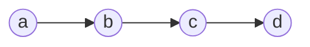
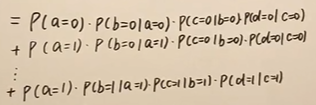
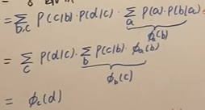
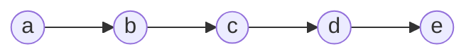
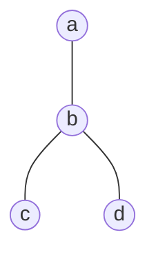

# 推断

#### 背景

**什么是推断：本质的本质就是求概率**

有一种理解思路是这样的：对于隐变量和参数$Z$以及观测数据$X$，可以认为从 $Z$ 到 $X$ 的过程叫做生成过程或译码，而反过来的过程就是推断过程或编码过程，

回顾下机器学习的两个派别：

**频率派**本质是一个优化问题：

$$
模型（输入输出关系）\longrightarrow 策略（损失函数）\longrightarrow 算法（估计参数）
$$

**贝叶斯派**基本思路为

$$
贝叶斯推断（求后验）\longrightarrow 贝叶斯决策（新样本的分布）
$$

贝叶斯推断：本质上就是求后验,本质上求一个概率

$$
p(\theta|X)=\frac{p(X|\theta)\cdot p(\theta)}{p(X)}=\frac{p(X|\theta)\cdot p(\theta)}{\int\limits _{\theta}p(X|\theta)\cdot p(\theta)d\theta}
$$

贝叶斯决策：从贝叶斯角度来看推断，本质上是求个积分，对于 $\hat{x}$ 这样的新样本，需要得到：

$$
p(\hat{x}|X)=\int_\theta p(\hat{x},\theta|X)d\theta=\int_\theta p(\theta|X)p(\hat{x}|\theta,X)d\theta=\mathbb{E}_{\theta|x}[p(\hat x |\theta)]
$$

由此可见机器学习贝叶斯派的基本思路是根据现有数据总结经验（求后验），再根据此经验处理新数据（贝叶斯决策），而推断就是求后验概率的这个过程。

#### 概率类型

在概率图模型中，推断可以求以下几种类型的概率

边缘概率 $P(x)=p(x_1,x_2,..,x_p)$

条件概率 $P(x)=p(x_A|x_B)$

以及使用 MAP 来求得参数

#### 类别

**精确推断**

1. Variable Elimination(VE)
2. Belief Propagation(BP, Sum-Product Algo)，从 VE 发展而来
3. Junction Tree，上面两种在树结构上应用，Junction Tree 在图结构上应用

**近似推断**

1. Loop Belief Propagation（针对有环图）
2. Mente Carlo Interference：例如 Importance Sampling，MCMC
3. Variational Inference

# 精确推断

#### 变量消除法（VE）

变量消除的方法是在求解概率分布的时候，将相关的条件概率先行求和或积分，从而一步步地消除变量，例如在马尔可夫链中：

$$
P(d)=\sum\limits_{a,b,c}P(a,b,c,d)=\sum\limits_{a,b,c}P(a)P(b|a)P(c|b)P(d|c)
$$

这里我们假设$abcd$都是离散的01变量，那么我们计算$P(d)$就可以变为8个因子式的加和：

那么这里其实可以做一个类似乘法分配律的操作，先对有关$a$的进行求和$\sum\limits_{b,c}p(c|b)p(d|c)\sum\limits_ap(b|a)p(a)$这里的$\sum\limits_ap(b|a)p(a)$又可以写成一个关于$b$对$a$求和的函数$\phi_a(b)$最终经推导

**核心思想：先对相关小的部分求和，消除对应的变量（这里是a），然后逐步消除推断**

变量消除的缺点很明显：

1. 计算步骤无法存储，会重复计算
2. 消除的最优次序是一个 NP-hard 问题

#### 信念传播法（BP）

为了克服 VE 的第一个缺陷-计算步骤无法存储。我们进一步地对上面的马尔可夫链进行观察：

要求 $p(e)$，当然使用 VE，从 $a$ 一直消除到 $d$，记 $\sum\limits_ap(a)p(b|a)=m_{a\to b(b)}$，表示这是消除 $a$ 后的关于 $b$ 的概率，类似地，记 $\sum\limits_bp(c|b)m_{a\to b}(b)=m_{b\to c}(c)$。

于是 $p(e)=\sum\limits_dp(e|d)m_{b\to c}(c)$。

进一步观察，对 $p(c)$：

$$
p(c)=[\sum\limits_bp(c|b)\sum\limits_ap(b|a)p(a)]\cdot[\sum\limits_dp(d|c)\sum\limits_ep(e|d)]
$$

这个式子可以分成两个部分，一部分是从 $a$ 传播过来的概率，第二部分是从 $ e$ 传播过来的概率。而我们发现前半部分其实和前面的$m_{b\to c}(c)$是一样的。

**核心思想：那么为了不重复计算，我们把前向和后向遍历每一个这种$m_{b\to c}(c)$记录下来就可以了。**

**例子：** 一般地，对于图（只对树形状的图）：

这四个团（对于无向图是团，对于有向图就是概率为除了根的节点为1），有四个节点，三个边：

$$
p(a,b,c,d)=\frac{1}{Z}\phi_a(a)\phi_b(b)\phi_c(c)\phi_d(d)\cdot\phi_{ab}(a,b)\phi_{bc}(c,b)\phi_{bd}(d,b)
$$

套用上面关于有向图的观察，如果求解边缘概率 $p(a)$，定义 $m_{c\to b}(b)=\sum\limits_c\phi_c(c)\phi_{bc}(bc)$，$m_{d\to b}(b)=\sum\limits_d\phi_d(d)\phi_{bd}(bd)$，$m_{b\to a}(a)=\sum\limits_b\phi_{ba}(ba)\phi_b(b)m_{c\to b}(b)_{d\to b}m(b)$，这样概率就一步步地传播到了 $a$：

$$
p(a)=\phi_a(a)m_{b\to a}(a)
$$

写成一般的形式，对于相邻节点 $i,j$：

$$
m_{j\to i}(i)=\sum\limits_j\phi_j(j)\phi_{ij}(ij)\prod\limits_{k\in Neighbour(j)-i}m_{k\to j}(j)
$$

这个表达式，就可以保存计算过程了，只要对每条边的传播分别计算，对于一个无向树形图可以递归并行实现：

1. 任取一个节点 $a$ 作为根节点
2. 对这个根节点的邻居中的每一个节点，收集信息（计算入信息）
3. 对根节点的邻居，分发信息（计算出信息）

#### Max-Product 算法

在推断任务中，MAP 也是常常需要的，MAP 的目的是寻找最佳参数：

$$
(\hat{a},\hat{b},\hat{c},\hat{d})=\mathop{argmax}_{a,b,c,d}p(a,b,c,d|E)
$$

类似 BP，我们采用信息传递的方式来求得最优参数，不同的是，我们在所有信息传递中，传递的是最大化参数的概率，而不是将所有可能求和：

$$
m_{j\to i}=\max\limits_{j}\phi_j\phi_{ij}\prod\limits_{k\in Neighbour(j)-i}m_{k\to j}
$$

于是对于上面的图：

$$
\max_a p(a,b,c,d)=\max_a\phi_a\phi_{ab}m_{c\to b}m_{d\to b}
$$

这个算法是 Sum-Product 算法的改进，也是在 HMM 中应用给的 Viterbi 算法的推广。
