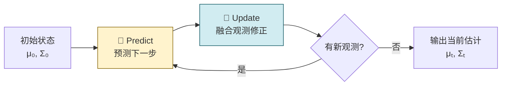

# 卡尔曼滤波（Kalman Filter）

## 一句话理解

> [!quote] 核心思想
> 卡尔曼滤波就是：**在有噪声的观测中，不断"预测→修正"，实时估计出系统真实状态的最优方法。**

---

## 从 HMM 到卡尔曼滤波

> [!tip] 前置知识
> 如果你了解隐马尔可夫模型（HMM），卡尔曼滤波可以看作它的"连续版本"。

| 对比项 | HMM | 卡尔曼滤波（LDS） |
|--------|-----|-------------------|
| 隐变量 | **离散**（有限个状态） | **连续**（实数向量） |
| 分布假设 | 离散概率表 | **高斯分布** |
| 状态转移 | 转移矩阵 | **线性变换** $z_t = A z_{t-1} + B + \epsilon$ |
| 观测模型 | 发射矩阵 | **线性变换** $x_t = C z_t + D + \delta$ |
| 推断算法 | 前向-后向算法 | 卡尔曼滤波/平滑 |

---

## 生活中的例子 🚗

> [!example] GPS 导航
> 想象你开车时 GPS 每秒给你一个位置，但**信号有噪声**（有时漂移几十米）。
>
> 你知道两件事：
> 1. **运动规律**：车按一定速度直线行驶（预测）
> 2. **GPS 读数**：虽然不准，但提供了观测信息（修正）
>
> 卡尔曼滤波就是把这两个信息**最优地融合**，得到比单独用 GPS 更准确的位置估计。

---

## 模型定义

卡尔曼滤波的数学模型由两个方程组成：

### 状态方程（系统如何演化）

$$
z_t = A \cdot z_{t-1} + B + \epsilon, \quad \epsilon \sim \mathcal{N}(0, Q)
$$

| 符号 | 含义 | 例子（GPS 场景） |
|------|------|-----------------|
| $z_t$ | $t$ 时刻的**真实状态**（隐变量） | 真实位置和速度 |
| $A$ | **状态转移矩阵**（上一刻→这一刻的规律） | 匀速运动的物理公式 |
| $B$ | **控制输入/偏置** | 加速踏板的影响 |
| $\epsilon$ | **过程噪声**（系统本身的不确定性） | 路面颠簸、风阻变化 |
| $Q$ | 过程噪声的协方差 | 噪声有多大 |

### 观测方程（我们能看到什么）

$$
x_t = C \cdot z_t + D + \delta, \quad \delta \sim \mathcal{N}(0, R)
$$

| 符号 | 含义 | 例子（GPS 场景） |
|------|------|-----------------|
| $x_t$ | $t$ 时刻的**观测值** | GPS 显示的坐标 |
| $C$ | **观测矩阵**（状态→观测的映射） | 传感器怎么读取位置 |
| $D$ | **观测偏置** | 传感器的系统偏差 |
| $\delta$ | **观测噪声** | GPS 信号漂移 |
| $R$ | 观测噪声的协方差 | 观测有多不靠谱 |

> [!note] "线性"的含义
> 名字中的"线性"指的是：
> - 状态转移是**线性**的：$z_t = A z_{t-1} + B$
> - 观测也是**线性**的：$x_t = C z_t + D$
>
> 如果这些关系是非线性的，就需要用扩展卡尔曼滤波（EKF）或粒子滤波。

---

## 概率视角

用概率语言重新表述上面的模型：

$$
p(z_t \mid z_{t-1}) \sim \mathcal{N}(A \cdot z_{t-1} + B,\; Q) \tag{状态转移概率}
$$

$$
p(x_t \mid z_t) \sim \mathcal{N}(C \cdot z_t + D,\; R) \tag{观测概率}
$$

$$
z_1 \sim \mathcal{N}(\mu_1, \Sigma_1) \tag{初始状态}
$$

---

## 核心算法：Predict-Update 循环

> [!important] 卡尔曼滤波的核心
> 整个算法就是不断重复两步：**预测（Predict）** 和 **更新（Update）**。
> 这是一个 **Online（在线）** 算法——数据来一个处理一个，不需要存储所有历史。

### 滤波问题是什么？

我们要求的是：**在已知所有观测 $x_1, x_2, \dots, x_t$ 的情况下，估计当前状态 $z_t$ 的概率分布**：

$$
p(z_t \mid x_{1:t})
$$

### 递推公式的推导

通过贝叶斯公式展开：

$$
p(z_t \mid x_{1:t}) = \frac{p(x_t \mid z_t) \cdot p(z_t \mid x_{1:t-1})}{p(x_t \mid x_{1:t-1})} \propto p(x_t \mid z_t) \cdot p(z_t \mid x_{1:t-1})
$$

其中 $p(z_t \mid x_{1:t-1})$ 是**预测分布**，可以由上一步的滤波结果递推得到：

$$
p(z_t \mid x_{1:t-1}) = \int_{z_{t-1}} p(z_t \mid z_{t-1}) \cdot p(z_{t-1} \mid x_{1:t-1}) \, dz_{t-1}
$$

> [!info] 看出递推了吗？
> 右边的 $p(z_{t-1} \mid x_{1:t-1})$ 恰好是**上一步的滤波结果**！于是我们得到了递推关系：
>
> **Update**（$t=1$）→ **Predict**（积分） → **Update**（$t=2$）→ **Predict** → $\cdots$

---

### Step 1：Predict（预测）

> 用上一步的估计 + 运动模型，预测这一步的状态。

已知上一步 Update 的结果是一个高斯分布：

$$
p(z_{t-1} \mid x_{1:t-1}) = \mathcal{N}(\mu_{t-1}, \Sigma_{t-1})
$$

代入状态转移方程做积分：

$$
p(z_t \mid x_{1:t-1}) = \int \mathcal{N}(A z_{t-1} + B, Q) \cdot \mathcal{N}(\mu_{t-1}, \Sigma_{t-1}) \, dz_{t-1}
$$

利用**线性高斯模型的性质**（高斯分布的线性变换仍然是高斯），可以直接写出解析解：

$$
\boxed{p(z_t \mid x_{1:t-1}) = \mathcal{N}\big(A\mu_{t-1} + B, \; Q + A\Sigma_{t-1}A^T\big)}
$$

> [!tip] 直觉理解
> - **均值**：把上一步的均值通过 $A$ 变换过来，加上偏置 $B$
> - **方差**：上一步的不确定性通过 $A$ 传播（$A\Sigma_{t-1}A^T$），再加上过程噪声 $Q$
> - 预测之后，**不确定性总是会增大**（因为加了 $Q$）

---

### Step 2：Update（更新/修正）

> 用新到的观测数据修正预测，得到更准确的估计。

$$
p(z_t \mid x_{1:t}) \propto p(x_t \mid z_t) \cdot p(z_t \mid x_{1:t-1})
$$

两个高斯分布相乘，结果仍然是高斯分布。最终可得到更新后的均值和协方差（此处省略具体推导）。

> [!tip] 直觉理解
> - 如果**观测噪声小**（传感器很准），Update 之后更信任观测值
> - 如果**预测很确定**（模型很好），Update 之后更信任预测值
> - Update 之后，**不确定性总是会减小**（因为引入了新信息）

---

## 整体流程图

> 每一轮循环：
> 1. **Predict**：不确定性 ↑（因为过程噪声）
> 2. **Update**：不确定性 ↓（因为新观测信息）

---

## 总结

> [!abstract] 关键要点
> 1. 卡尔曼滤波 = **连续隐变量的 HMM** + **线性高斯假设**
> 2. 核心是 **Predict-Update** 的递推循环
> 3. 所有中间结果都是**高斯分布**，有**解析解**（不需要采样）
> 4. 是一个 **Online 算法**，适合实时系统
> 5. 广泛应用于：导航、跟踪、信号处理、机器人、金融等领域

> [!warning] 局限性
> - 要求系统是**线性**的，噪声是**高斯**的
> - 非线性系统 → 扩展卡尔曼滤波（EKF）、无迹卡尔曼滤波（UKF）
> - 非高斯噪声 → 粒子滤波（Particle Filter）

---

*参考来源：[[线性动态系统.pdf]]*
