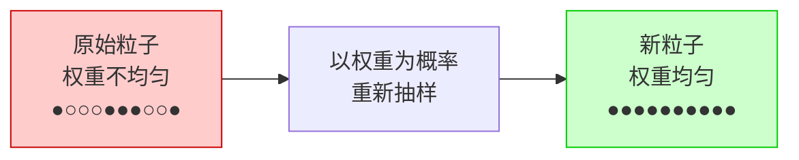
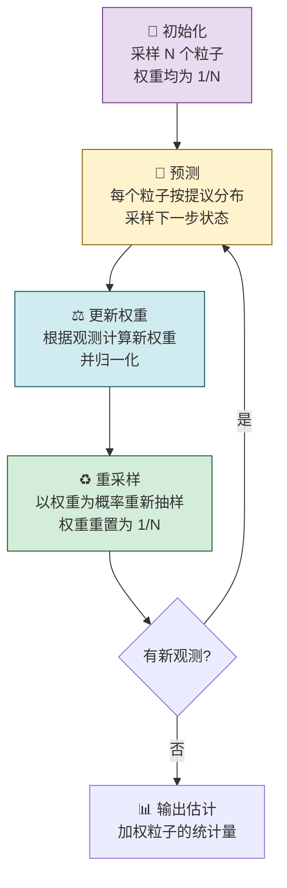

# 粒子滤波（Particle Filter）

## 一句话理解

> [!quote] 核心思想
> 粒子滤波就是：**当系统太复杂（非线性、非高斯）无法用公式算出精确答案时，撒一把"粒子"去探索，用它们的加权投票来近似真实的概率分布。**

---

## 为什么需要粒子滤波？

> [!tip] 从卡尔曼滤波说起
> 在 [[卡尔曼滤波]] 中，我们利用了**线性 + 高斯**的假设，推导出了漂亮的解析解（Predict-Update 公式）。
>
> 但现实世界中，很多系统是**非线性、非高斯**的——这时候公式推不出来了，怎么办？
> 答案是：**别算了，直接采样！**

| 对比项 | 卡尔曼滤波 | 粒子滤波 |
|--------|-----------|---------|
| 系统要求 | 线性 + 高斯 | **任意**（非线性、非高斯均可） |
| 求解方式 | 解析解（公式直接算） | **采样近似**（蒙特卡洛方法） |
| 状态表示 | 均值 $\mu$ + 协方差 $\Sigma$ | **一群带权重的粒子** |
| 计算量 | 低 | 较高（粒子越多越准） |

---

## 生活中的例子 🎯

> [!example] 在森林里找人
> 想象你要在一片大森林里定位一个迷路的人，但你只有一个很不靠谱的信号探测器。
>
> **卡尔曼滤波的思路**（仅适用于简单地形）：用一个椭圆区域表示"人可能在这里"，每次收到信号就调整椭圆。
>
> **粒子滤波的思路**（适用于任何地形）：
> 1. 派出 ==1000 个搜救犬==（粒子），随机散布在森林各处
> 2. 收到一个信号后，离信号源近的搜救犬获得 ==更高的权重==（更被信任）
> 3. 下一轮，按权重 ==重新分配搜救犬==——权重高的区域派更多犬去搜索
> 4. 几轮之后，搜救犬自然 **集中到目标附近**
>
> 这就是粒子滤波的全部思想！

---

## 核心方法：蒙特卡洛采样

### 基本思想

对于一个概率分布 $p(x)$，如果我们想计算某个函数 $f(x)$ 的期望：

$$
\mathbb{E}[f(x)] = \int f(x) \, p(x) \, dx
$$

直接积分可能很难算。但如果我们能从 $p(x)$ 中抽取 $N$ 个样本 $x^{(1)}, x^{(2)}, \dots, x^{(N)}$，就可以**用平均值近似期望**：

$$
\mathbb{E}[f(x)] \approx \frac{1}{N} \sum_{i=1}^{N} f(x^{(i)})
$$

> [!question] 问题来了
> 如果 $p(x)$ 本身就很复杂，**连从它里面采样都做不到**，怎么办？

---

### 重要性采样（Importance Sampling）

> [!info] 核心技巧
> 既然从 $p(x)$ 中采样困难，那就找一个**简单的分布** $q(x)$（称为**提议分布**）作为桥梁！

通过数学变换：

$$
\mathbb{E}_{p}[f(x)] = \int f(x) \frac{p(x)}{q(x)} q(x) \, dx \approx \sum_{i=1}^{N} f(x^{(i)}) \cdot \tilde{w}^{(i)}
$$

其中样本 $x^{(i)} \sim q(x)$，权重 $\tilde{w}^{(i)} = \frac{p(x^{(i)})}{q(x^{(i)})}$。

> [!tip] 直觉理解
> - 从简单分布 $q(x)$ 中采样（这个我们会）
> - 给每个样本一个**权重**来"补偿"分布的差异
> - 权重归一化后，加权平均就是对 $p(x)$ 的近似
>
> 就像做民意调查时，你在商场随机抓人问（简单分布），但给不同年龄段的人不同的权重（纠正偏差），最终得到接近真实民意的结果。

---

## 滤波问题中的应用

在滤波问题中，我们要求解的是后验分布：

$$
p(z_{1:t} \mid x_{1:t})
$$

即给定所有观测 $x_{1:t}$，估计隐状态序列 $z_{1:t}$ 的分布。

应用重要性采样，权重为：

$$
w_t^{(i)} = \frac{p(z_{1:t}^{(i)} \mid x_{1:t})}{q(z_{1:t}^{(i)} \mid x_{1:t})}
$$

> [!warning] 困难
> 每个时刻 $t$ 都需要采样 $N$ 个点，而且分子中的联合分布非常难算。
> 我们需要一个**权重的递推公式**——这就引出了 SIS 算法。

---

## SIS 算法（序贯重要性采样）

### 核心目标

找到权重的**递推公式**，使得每一步只需要在上一步的基础上更新，而不用从头计算。

### 推导思路

利用 HMM 的条件独立性（与 [[隐马尔可夫模型 HMM]] 和 [[卡尔曼滤波]] 中的推导类似），可以对提议分布做分解：

$$
q(z_{1:t} \mid x_{1:t}) = q(z_t \mid z_{1:t-1}, x_{1:t}) \cdot q(z_{1:t-1} \mid x_{1:t-1})
$$

对分子（后验）也做类似的递推展开后，权重的递推公式为：

$$
\boxed{w_t^{(i)} \propto w_{t-1}^{(i)} \cdot \frac{p(x_t \mid z_t^{(i)}) \cdot p(z_t^{(i)} \mid z_{t-1}^{(i)})}{q(z_t^{(i)} \mid z_{1:t-1}^{(i)}, x_{1:t})}}
$$

> [!tip] 直觉理解
> 每一步的新权重 = 旧权重 × 修正因子，其中修正因子衡量的是：
> - **新观测有多支持当前粒子**：$p(x_t \mid z_t^{(i)})$（似然）
> - **状态转移有多合理**：$p(z_t^{(i)} \mid z_{t-1}^{(i)})$
> - **提议分布采到这个点有多容易**：$q(z_t^{(i)} \mid \cdots)$（归一化用）

### SIS 算法步骤

> [!abstract] 算法流程
> 1. **初始化**（$t=1$）：采样 $N$ 个粒子，计算初始权重
> 2. **递推**（$t$ 时刻）：
>    - 对每个粒子，根据提议分布 $q(z_t \mid z_{1:t-1}, x_{1:t})$ 采样得到新的 $z_t^{(i)}$
>    - 用递推公式计算 $N$ 个新权重
> 3. **归一化**：将权重归一化使其和为 1

---

## 权值退化问题与解决方案

> [!danger] SIS 的致命问题：权值退化
> 随着时间推移，**大部分粒子的权重趋近于 0**，只剩少数几个粒子有意义。
>
> 原因：随着时间增长，状态空间的维度越来越高，$N$ 个粒子远远不够覆盖这么大的空间。
>
> 结果：有效粒子数急剧减少，估计质量严重下降。

### 解决方案一：重采样（Resampling）

> [!success] 最常用的解决办法
> **核心思想**：以权重为概率，在现有粒子中重新抽样——权重大的粒子被多次复制，权重小的被淘汰。



**具体做法**：
1. 把权重看作概率分布
2. 计算**累积分布函数**（CDF，阶梯函数）
3. 在 CDF 上均匀取点，落在哪个粒子的"台阶"上就选哪个
4. 重采样后，所有粒子权重重新设为 $\frac{1}{N}$

> [!tip] 比喻
> 就像一场选举后的议席分配——得票率高的党派分到更多席位（被多次复制），得票率极低的党派被淘汰。下一轮投票前，大家重新站在同一起跑线上。

### 解决方案二：选择好的提议分布

取提议分布为：

$$
q(z_t \mid z_{1:t-1}, x_{1:t}) = p(z_t \mid z_{t-1})
$$

即直接用**状态转移概率**作为提议分布。这样权重递推公式中的两项相消，简化为：

$$
w_t^{(i)} \propto w_{t-1}^{(i)} \cdot p(x_t \mid z_t^{(i)})
$$

> [!info] 生成与测试方法
> 这种方法也叫**生成与测试**——先按状态转移模型"生成"粒子，再用观测数据"测试"它们的质量（给予权重）。

---

## 粒子滤波的完整算法

> [!important] 粒子滤波 = SIS + 重采样
> 在 SIS 算法的每一步之后加入重采样，就得到了基本的粒子滤波算法。

### 算法流程



### SIR 算法（最常用的粒子滤波）

> [!abstract] SIR = SIS + 重采样 + 状态转移作为提议分布
> 如果同时采用：
> - 重采样解决权值退化
> - 状态转移概率 $p(z_t \mid z_{t-1})$ 作为提议分布
>
> 这个特定的算法称为 **SIR**（Sequential Importance Resampling，序贯重要性重采样），是最常用的粒子滤波实现。

SIR 每一步的操作非常简洁：

| 步骤 | 操作 | 公式 |
|------|------|------|
| ① 预测 | 按状态转移采样 | $z_t^{(i)} \sim p(z_t \mid z_{t-1}^{(i)})$ |
| ② 加权 | 用似然更新权重 | $w_t^{(i)} = p(x_t \mid z_t^{(i)})$ |
| ③ 归一化 | 权重和为 1 | $\tilde{w}_t^{(i)} = w_t^{(i)} / \sum_j w_t^{(j)}$ |
| ④ 重采样 | 按权重重新抽取 | 高权重粒子被多次选中 |

---

## 总结

> [!abstract] 关键要点
> 1. 粒子滤波是卡尔曼滤波在**非线性、非高斯**情况下的推广
> 2. 核心思想：用一群**带权重的粒子（样本）** 近似概率分布
> 3. 基于**重要性采样**——从简单分布采样，用权重修正
> 4. **SIS 算法**给出了权重的递推公式，避免从头计算
> 5. **重采样**解决权值退化，是粒子滤波的关键技巧
> 6. **SIR 算法**（SIS + 重采样 + 状态转移提议分布）是最常用的粒子滤波

> [!note] 方法演进
> ```
> HMM（离散状态）
>  └─→ 卡尔曼滤波（连续 + 线性高斯 → 解析解）
>       └─→ 粒子滤波（连续 + 任意分布 → 采样近似）
> ```

---

*参考来源：[[粒子滤波.pdf]]*
