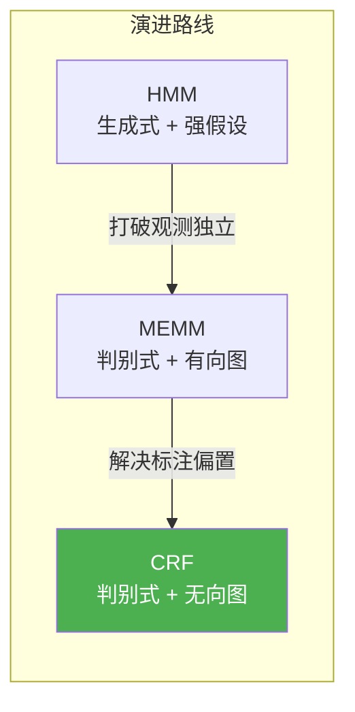
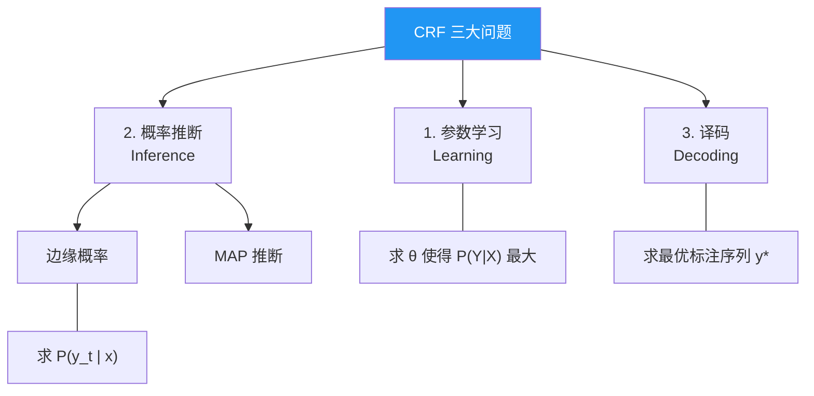

# 条件随机场 (CRF)

## 从分类模型谈起

在机器学习中，分类问题大体可以分为两类：

| 类型 | 代表模型 |
|------|----------|
| **硬分类**（直接输出类别） | SVM、感知机 (PLA)、LDA |
| **软分类**（输出概率） | Logistic 回归（判别式）、朴素贝叶斯（生成式） |

> [!tip] 一句话理解
> - **生成模型**：学习 $P(X, Y)$，"世界是怎么产生数据的"
> - **判别模型**：学习 $P(Y \mid X)$，"给定数据，该分哪类"

CRF 就是一种==判别式==的概率图模型，用来对==序列数据==做标注。

---

## 为什么需要 CRF？— 从 HMM 到 MEMM 再到 CRF

### 1️⃣ HMM（隐马尔可夫模型）

HMM 是一种**生成模型**，建模的是联合概率 $P(X, Y)$。

它有两个很强的假设：
- **齐次 Markov 假设**：当前隐状态只依赖前一个隐状态
- **观测独立性假设**：当前观测只依赖当前隐状态

> [!warning] HMM 的问题
> 观测独立性假设太强了！比如在文本序列中，这相当于假定所有单词之间毫无关联，显然不合理。

### 2️⃣ MEMM（最大熵马尔可夫模型）

MEMM 将 HMM 概率图中观测与隐变量之间的边**反向**，变成了判别模型，建模 $P(Y \mid X)$。

这样观测独立性假设就打破了 ✅ —— 给定 $X$，各 $Y$ 之间不再独立。

> [!danger] MEMM 的缺陷：标注偏置问题 (Label Bias Problem)
> MEMM 要求**局部概率归一化**：每个节点处 $P(y_t \mid y_{t-1}, x_t)$ 需要归一化。
>
> 如果某个转移概率 $P(y_t \mid y_{t-1})$ 非常接近 1，那么不管观测 $x_t$ 是什么，结果都几乎不变——观测信息被"吞掉"了。

### 3️⃣ CRF（条件随机场）— 最终方案

> [!success] CRF 的核心改进
> 把 MEMM 中隐状态之间的**有向边变为无向边**，构成==无向图==。
> 这样只需要**全局归一化**，一举解决了标注偏置问题！

---

## 线性链 CRF 的概率密度函数

线性链 CRF 对序列建模，相邻两个隐变量 $(y_{t-1}, y_t)$ 构成**最大团**。

### 势函数与特征函数

每个团的势函数可以分解为两部分：

$$
\psi(y_{t-1}, y_t, x) = \exp\!\Big(\sum_k \lambda_k f_k(y_{t-1}, y_t, x) + \sum_l \mu_l g_l(y_t, x)\Big)
$$

其中：
- $f_k(y_{t-1}, y_t, x)$ — ==转移特征函数==：描述相邻标签之间的关系
- $g_l(y_t, x)$ — ==状态特征函数==：描述观测对当前标签的影响
- $\lambda_k, \mu_l$ — 待学习的权重参数

> [!example] 通俗理解
> 想象你在做中文分词：
> - **转移特征**：前一个字是"名词"，当前字大概率不会是"动词开头"
> - **状态特征**：当前字是"的"，那它大概率是"助词"

### 概率密度函数（向量形式）

将所有特征统一为向量 $F(y, x)$，参数统一为 $\theta$，则：

$$
P(y \mid x) = \frac{1}{Z(x)} \exp\!\big(\theta^T F(y, x)\big)
$$

其中 $Z(x)$ 是**配分函数**（归一化常数）：

$$
Z(x) = \sum_{y} \exp\!\big(\theta^T F(y, x)\big)
$$

> [!note] 指数族分布
> 上面的形式是一个典型的==指数族分布==，$Z(x)$ 就是其配分函数。这与最大熵模型、Logistic 回归本质相同。

---

## CRF 要解决的三大问题

---

### 问题一：边缘概率（前向-后向算法）

**目标**：已知参数 $\theta$ 和观测 $x$，求某个位置的边缘概率 $P(y_t \mid x)$。

**难点**：直接暴力计算，需要对所有可能的 $y$ 序列求和，复杂度为 $O(K^T)$（$K$ 是标签数，$T$ 是序列长度），指数爆炸！

> [!tip] 解决思路：调整求和顺序
> 关键技巧是**从左到右逐步消元**，构造递推式，把复杂度降到 $O(K^2 T)$。

定义**前向变量** $\alpha_t(y_t)$，从左向右递推：

$$
\alpha_t(y_t) = \sum_{y_{t-1}} \alpha_{t-1}(y_{t-1}) \cdot \psi(y_{t-1}, y_t, x)
$$

类似地定义**后向变量** $\beta_t(y_t)$，从右向左递推。

> [!note] 与 HMM 的联系
> 这和 HMM 中的前向-后向算法思想完全一致，本质上都是概率图模型中的==变量消除算法==（又称信念传播）。

---

### 问题二：参数学习（梯度上升）

**目标**：给定 $N$ 个训练样本 $\{(x^{(i)}, y^{(i)})\}_{i=1}^N$，求最优参数 $\theta$。

**方法**：最大化对数似然函数：

$$
\mathcal{L}(\theta) = \sum_{i=1}^{N} \log P(y^{(i)} \mid x^{(i)}; \theta)
$$

对 $\theta$ 求梯度：

$$
\nabla_\theta \mathcal{L} = \sum_{i=1}^{N} \Big[ F(y^{(i)}, x^{(i)}) - \mathbb{E}_{P(y|x^{(i)};\theta)}\big[F(y, x^{(i)})\big] \Big]
$$

> [!info] 梯度的直觉
> 梯度 = **真实特征** − **模型期望特征**
>
> - 如果模型预测的特征比真实值小 → 梯度为正 → 增大对应权重
> - 如果模型预测的特征比真实值大 → 梯度为负 → 减小对应权重
>
> 不断迭代，直到模型的期望特征和真实特征一致。

其中期望值的计算需要边缘概率，可以复用前向-后向算法。最后用**梯度上升法**迭代求解。

---

### 问题三：译码（Viterbi 算法）

**目标**：给定 $x$，找到最可能的标注序列：

$$
y^* = \arg\max_y P(y \mid x)
$$

> [!tip] 方法：动态规划
> 和 HMM 中的 **Viterbi 算法** 完全类似，一层一层地从左到右求局部最大值，最后回溯得到全局最优路径。

---

## 总结对比

| | HMM | MEMM | CRF |
|---|---|---|---|
| **模型类型** | 生成式 | 判别式 | 判别式 |
| **图结构** | 有向图 | 有向图 | ==无向图== |
| **归一化** | 局部 | 局部 | ==全局== |
| **观测独立** | ✅ 假设成立 | ❌ 不需要 | ❌ 不需要 |
| **标注偏置** | 无 | ⚠️ 存在 | ✅ 已解决 |
| **边缘概率** | 前向-后向 | — | 前向-后向 |
| **译码** | Viterbi | — | Viterbi |
| **参数学习** | EM (Baum-Welch) | 梯度法 | 梯度法 |

> [!abstract] 一句话总结
> **CRF = 判别式 + 无向图 + 全局归一化**，它综合了 HMM 的序列建模能力和 Logistic 回归的判别优势，是序列标注任务的经典选择。
