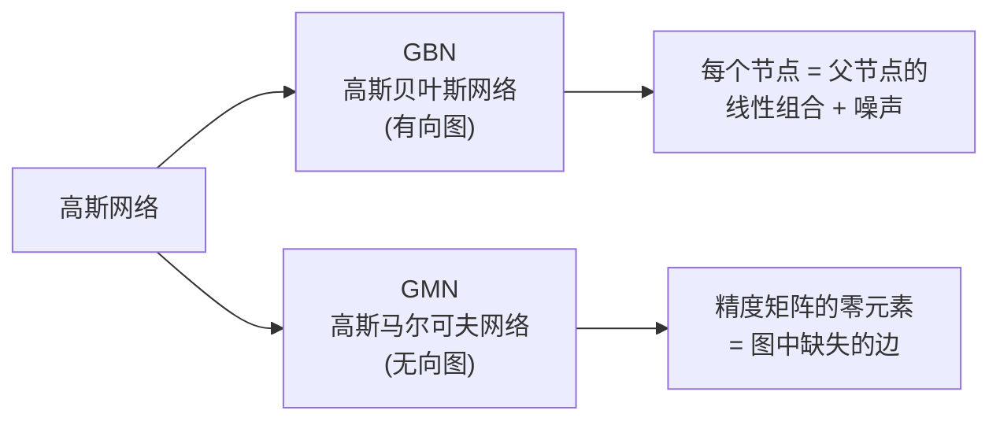

# 高斯网络

## 一句话理解

> [!tip] 核心思想
> 高斯网络就是把**概率图模型**里的每个节点都换成**高斯分布**（正态分布）。因为高斯分布的美妙性质，所有节点合在一起也是一个大的联合高斯分布，数学上非常好处理。

高斯网络有两个版本：

| 类型 | 名称 | 图的方向 | 类比 |
|------|------|----------|------|
| **GBN** | 高斯贝叶斯网络 | 有向图 → | 因果关系链 |
| **GMN** | 高斯马尔可夫网络 | 无向图 — | 相互关联网 |

---

## 基本性质

每个节点 $i$ 服从高斯分布：$\mathcal{N}(\mu_i, \Sigma_i)$，那么所有节点的**联合分布**也是高斯：

$$
X \sim \mathcal{N}(\mu, \Sigma)
$$

其中 $\mu$ 是均值向量，$\Sigma$ 是协方差矩阵。

### 三个关键结论

> [!abstract] 结论 1：协方差矩阵 → 全局独立性
> 如果协方差矩阵中 $\sigma_{ij} = 0$，则 $x_i$ 和 $x_j$ **全局独立**。
>
> 通俗理解：两个变量的协方差为零 = 它们完全不相关。

> [!abstract] 结论 2：精度矩阵 → 条件独立性
> 精度矩阵（信息矩阵）$\Lambda = \Sigma^{-1}$，记为 $\Lambda = (\lambda_{ij})_{pp}$。
>
> 如果 $\lambda_{ij} = 0$，则 $x_i \perp x_j \mid (X - \{x_i, x_j\})$，即给定其他所有变量后，$x_i$ 和 $x_j$ **条件独立**。
>
> 通俗理解：精度矩阵的零元素告诉你「在已知所有其他信息后，哪些变量之间没有直接联系」。

> [!abstract] 结论 3：节点是邻居的线性组合
> 对于无向图中的任意节点 $x_i$：
>
> $$x_i = \sum_{j \ne i} \beta_{ij} x_j + \epsilon$$
>
> 也就是说，$x_i$ 可以由**与它直接相连的邻居节点**线性组合得到（加上一些噪声）。
>
> 通俗理解：你可以用朋友的信息来预测你自己。

> [!question]- 协方差矩阵 vs 精度矩阵，到底看哪个？
> - **协方差矩阵** $\Sigma$：零元素 → **全局独立**（不需要任何条件）
> - **精度矩阵** $\Lambda = \Sigma^{-1}$：零元素 → **条件独立**（给定其他变量后独立）
>
> 在图模型中，我们更关心**条件独立性**（因为它对应图中的边），所以精度矩阵更常用。

---

## 高斯贝叶斯网络 GBN

> [!info] 直觉
> GBN 可以看成是**线性动态系统（LDS）的推广**。LDS 只看相邻时刻的依赖，像一条链；GBN 中每个节点可以有多个父节点，构成一张更复杂的有向图。

### 因子分解

根据有向图的贝叶斯网络分解：

$$
p(x) = \prod_i p(x_i \mid x_{\text{Parent}(i)}) \tag{1}
$$

每一项假设是一维的线性高斯：

$$
p(x_i \mid x_{\text{Parent}(i)}) = \mathcal{N}(x_i \mid \mu_i + W_i^T x_{\text{Parent}(i)},\; \sigma_i^2) \tag{2}
$$

> [!tip] 通俗解读
> 每个节点的值 = **自己的基准值** $\mu_i$ + **父节点的加权影响** $W_i^T x_{\text{Parent}(i)}$ + **随机噪声** $\epsilon_i$

### 矩阵形式

将每个随机变量写成：

$$
x_i = \mu_i + \sum_{j \in \text{Parent}(i)} w_{ij}(x_j - \mu_j) + \sigma_i \epsilon_i, \quad \epsilon_i \sim \mathcal{N}(0, 1) \tag{3}
$$

整理成矩阵形式，并对 $w$ 进行扩展：

$$
x - \mu = W(x - \mu) + S\epsilon \tag{4}
$$

其中 $S = \text{diag}(\sigma_i)$，因此：

$$
x - \mu = (I - W)^{-1} S\epsilon
$$

由此得到协方差矩阵：

$$
\text{Cov}(x) = \text{Cov}(x - \mu) \tag{5}
$$

$$
= (I - W)^{-1} S S^T \big((I - W)^{-1}\big)^T
$$

> [!example] 举个例子
> 想象一个三节点网络：`天气 → 心情 → 工作效率`
> - 天气（根节点）：$x_1 \sim \mathcal{N}(25, 5^2)$（平均 25°C）
> - 心情（受天气影响）：$x_2 = \mu_2 + w_{21}(x_1 - \mu_1) + \epsilon_2$
> - 工作效率（受心情影响）：$x_3 = \mu_3 + w_{32}(x_2 - \mu_2) + \epsilon_3$
>
> 权重 $w$ 描述了影响的方向和强度，$\epsilon$ 代表随机波动。

---

## 高斯马尔可夫网络 GMN

> [!info] 直觉
> GMN 是**无向图**版本，节点之间是对称的「相互关联」，没有因果方向。

### 无向图分解

$$
p(x) = \frac{1}{Z} \prod_{i=1}^{p} \phi_i(x_i) \prod_{i,j \in X} \phi_{i,j}(x_i, x_j) \tag{6}
$$

### 与高斯分布的对应

展开高斯分布中与变量相关的部分（记 $\Lambda = \Sigma^{-1}$）：

$$
p(x) \propto \exp\!\Big(-\frac{1}{2}(x-\mu)^T \Sigma^{-1}(x-\mu)\Big)
$$

$$
= \exp\!\Big(-\frac{1}{2}(x^T \Lambda x - 2\mu^T \Lambda x + \mu^T \Lambda \mu)\Big)
$$

$$
= \exp\!\Big(-\frac{1}{2} x^T \Lambda x + (\Lambda \mu)^T x\Big) \tag{7}
$$

记 $h = \Lambda \mu$ 为 **Potential Vector**（势向量），可以拆分出：

| 势函数 | 表达式 | 含义 |
|--------|--------|------|
| 与单个节点 $x_i$ 相关 | $-\frac{1}{2}\lambda_{ii}x_i^2 + h_i x_i$ | 节点自身的「偏好」 |
| 与节点对 $x_i, x_j$ 相关 | $-\lambda_{ij} x_i x_j$ | 两个节点之间的「互动强度」 |

> [!success] 核心结论
> 由此可以看出：$x_i, x_j$ 构成的势函数只和 $\lambda_{ij}$ 有关。因此：
>
> $$x_i \perp x_j \mid (X - \{x_i, x_j\}) \iff \lambda_{ij} = 0$$
>
> **精度矩阵的零模式直接对应无向图的边**：$\lambda_{ij} = 0$ 意味着 $x_i$ 和 $x_j$ 之间没有边。

---

## 总结对比

| 特性 | GBN（有向） | GMN（无向） |
|------|------------|------------|
| **分解方式** | 条件概率的乘积 | 势函数的乘积 |
| **核心参数** | 权重矩阵 $W$ + 噪声 $S$ | 精度矩阵 $\Lambda$ |
| **独立性判断** | d-分离准则 | 精度矩阵零元素 |
| **直觉** | 因果链条：谁影响谁 | 关联网络：谁和谁有关 |
| **推广自** | LDS（线性动态系统） | MRF（马尔可夫随机场） |

> [!quote] 一句话总结
> 高斯网络 = 概率图模型 + 高斯分布。有向版（GBN）用**线性回归**描述因果，无向版（GMN）用**精度矩阵**描述关联。核心工具就是协方差矩阵和精度矩阵。
