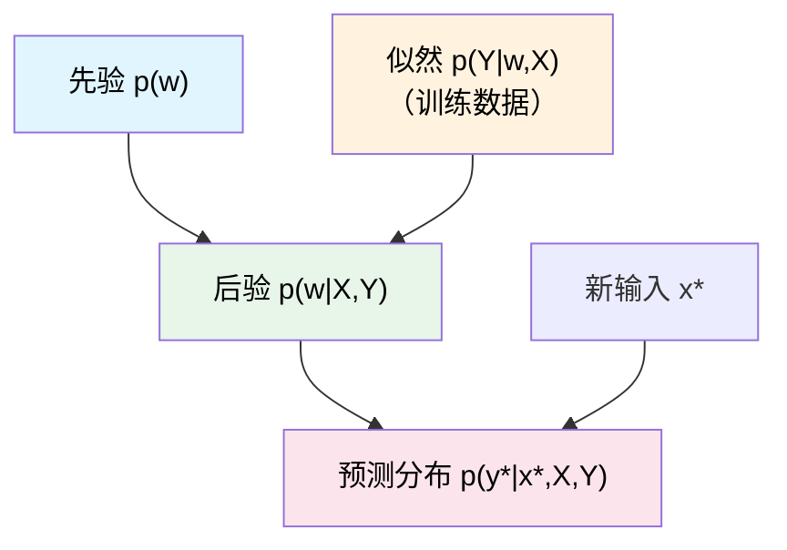

# 贝叶斯线性回归

## 从点估计到分布估计——为什么需要贝叶斯？

> [!tip] 核心思想
> 传统线性回归（MLE / MAP）只给出参数的**一个最优值**（点估计），而贝叶斯方法给出参数的**整个概率分布**（后验分布），告诉我们"参数可能是什么"以及"我们对此有多大把握"。

回顾我们已经知道的结论：

| 方法 | 先验假设 | 等价于 |
|------|---------|--------|
| MLE（最大似然估计） | 无先验 | 最小二乘回归 |
| MAP + 高斯先验 | $w \sim \mathcal{N}(0, \Sigma_p)$ | **岭回归**（L2 正则化） |
| MAP + 拉普拉斯先验 | $w \sim \text{Laplace}$ | **Lasso**（L1 正则化） |
| **贝叶斯方法** | 高斯先验 | 求参数的**完整后验分布** |

> [!note] 通俗理解
> MLE / MAP 就像考试只告诉你"最终得分是 85"，而贝叶斯方法告诉你"你的得分大概率在 80~90 之间，最可能是 85，但也有小概率是 75 或 95"。**不确定性本身也是有价值的信息。**

---

## 模型假设

线性回归的基本模型：

$$
f(x) = w^T x \tag{1}
$$

$$
y = f(x) + \varepsilon \tag{2}
$$

$$
\varepsilon \sim \mathcal{N}(0, \sigma^2) \tag{3}
$$

> [!info] 直白解释
> - $w$ 是我们要学的参数（权重向量）
> - $x$ 是输入特征
> - $y$ 是观测值 = 真实值 + 噪声
> - 噪声 $\varepsilon$ 服从均值为 0、方差为 $\sigma^2$ 的高斯分布

在贝叶斯框架下，需要解决两个问题：**推断**（inference）和**预测**（prediction）。

---

## 一、推断：求参数的后验分布

### 第一步：设定先验

我们给参数 $w$ 引入一个**高斯先验**：

$$
p(w) = \mathcal{N}(0, \Sigma_p) \tag{4}
$$

> [!tip] 通俗理解
> 先验就是"在看数据之前，我们对参数的初始猜测"。高斯先验表示我们认为参数大概率在 0 附近，不会太大。$\Sigma_p$ 控制我们对这个猜测有多"自信"——$\Sigma_p$ 越小，越确信参数在 0 附近。

### 第二步：写出后验公式（贝叶斯定理）

$$
p(w|X, Y) = \frac{p(w, X, Y)}{p(Y|X)} = \frac{p(Y|w, X) \, p(w|X)}{p(Y|X)} \tag{5}
$$

由于 $w$ 和 $X$ 独立（先验和输入无关），所以 $p(w|X) = p(w)$，分母 $p(Y|X)$ 和参数 $w$ 无关（只是归一化常数），因此：

$$
p(w|X, Y) \propto p(Y|w, X) \cdot p(w) \tag{6}
$$

$$
\boxed{\text{后验} \propto \text{似然} \times \text{先验}}
$$

### 第三步：展开似然函数

似然函数就是给定参数 $w$ 后数据出现的概率。由于每个样本独立，噪声是高斯分布：

$$
\prod_{i} \mathcal{N}(y_i \mid w^T x_i, \sigma^2) = \frac{1}{(2\pi)^{N/2} \sigma^N} \exp\left(-\frac{1}{2\sigma^2} \sum_i (y_i - w^T x_i)^2\right)
$$

写成矩阵形式：

$$
= \frac{1}{(2\pi)^{N/2} \sigma^N} \exp\left(-\frac{1}{2\sigma^2}(Y - Xw)^T(Y - Xw)\right) = \mathcal{N}(Xw, \sigma^2 I) \tag{7}
$$

### 第四步：利用共轭性求后验

> [!important] 共轭先验的威力
> **高斯似然 + 高斯先验 = 高斯后验**。这是贝叶斯分析中非常优美的性质——选对了先验，后验的形式和先验一样，可以直接算出来，不需要复杂的数值积分。

代入似然和先验：

$$
p(w|X, Y) \propto \exp\left(-\frac{1}{2\sigma^2}(Y - Xw)^T \sigma^{-2} I \,(Y - Xw) - \frac{1}{2} w^T \Sigma_p^{-1} w\right) \tag{8}
$$

假定后验是高斯分布 $\mathcal{N}(\mu_w, \Sigma_w)$，通过**配方法**（凑出标准高斯分布的形式）来求解 $\mu_w$ 和 $\Sigma_w$。

#### 配方——二次项（求 $\Sigma_w$）

提取指数中关于 $w$ 的二次项：

$$
-\frac{1}{2} w^T \underbrace{\left(\sigma^{-2} X^T X + \Sigma_p^{-1}\right)}_{A} w
$$

对比高斯分布标准形式 $-\frac{1}{2}w^T \Sigma_w^{-1} w$，得到：

$$
\boxed{\Sigma_w^{-1} = \sigma^{-2} X^T X + \Sigma_p^{-1} \triangleq A} \tag{10}
$$

#### 配方——一次项（求 $\mu_w$）

提取指数中关于 $w$ 的一次项：

$$
\frac{1}{2\sigma^2} \cdot 2 Y^T X w = \sigma^{-2} Y^T X w \tag{11}
$$

对比标准形式 $\mu_w^T \Sigma_w^{-1} w$，得到：

$$
\mu_w^T \Sigma_w^{-1} = \sigma^{-2} Y^T X
$$

$$
\boxed{\mu_w = \sigma^{-2} A^{-1} X^T Y} \tag{12}
$$

> [!success] 推断结果总结
> 参数 $w$ 的后验分布为：
> $$p(w \mid X, Y) = \mathcal{N}(\mu_w, \Sigma_w)$$
>
> 其中：
> - **后验均值**（最优估计）：$\mu_w = \sigma^{-2} A^{-1} X^T Y$
> - **后验协方差**（不确定性）：$\Sigma_w = A^{-1}$，$A = \sigma^{-2} X^T X + \Sigma_p^{-1}$
>
> 💡 注意 $\mu_w$ 的形式和岭回归的解非常相似！当 $\Sigma_p^{-1} = \lambda I$ 时，$\mu_w$ 就是岭回归的解。但贝叶斯方法额外给出了 $\Sigma_w$，量化了我们对参数估计的不确定性。

---

## 二、预测：对新样本的推断

给定新输入 $x^*$，我们要预测输出 $y^*$。

### 关键区别：贝叶斯预测 vs 点估计预测

- **点估计**：直接用 $\hat{w}$ 算出 $y^* = x^{*T} \hat{w}$（单一值）
- **贝叶斯**：对所有可能的 $w$ 进行**加权平均**（积分），得到预测的**分布**

$$
p(y^* | X, Y, x^*) = \int_w p(y^* | w, x^*) \, p(w | X, Y) \, dw \tag{13}
$$

> [!tip] 通俗理解
> 想象有无数个"平行宇宙"，每个宇宙中 $w$ 取不同的值。贝叶斯预测就是把所有宇宙的预测结果按后验概率加权平均，得到最终的预测分布。

### 预测结果

由于 $f(x^*) = x^{*T} w$，代入后验 $w \sim \mathcal{N}(\mu_w, \Sigma_w)$：

$$
x^{*T} w \sim \mathcal{N}(x^{*T} \mu_w, \; x^{*T} \Sigma_w \, x^*)
$$

再加上噪声项 $\varepsilon \sim \mathcal{N}(0, \sigma^2)$：

$$
\boxed{p(y^* | X, Y, x^*) = \mathcal{N}\left(x^{*T} \mu_w, \;\; x^{*T} \Sigma_w \, x^* + \sigma^2\right)} \tag{14}
$$

> [!success] 预测结果解读
> 预测值 $y^*$ 也服从高斯分布：
> - **预测均值**：$x^{*T} \mu_w$（和点估计的预测值相同）
> - **预测方差**：$x^{*T} \Sigma_w \, x^* + \sigma^2$
>   - $x^{*T} \Sigma_w \, x^*$：来自**参数的不确定性**（对 $w$ 不够确定）
>   - $\sigma^2$：来自**数据本身的噪声**（不可消除）
>
> 📌 随着训练数据增多，$\Sigma_w$ 会变小（对参数越来越确定），预测方差趋近于 $\sigma^2$。

---

## 整体流程图

---

## 与其他方法的对比

| 特性 | MLE | MAP（岭回归） | 贝叶斯线性回归 |
|-----|-----|-------------|-------------|
| 参数估计 | 点估计 $\hat{w}$ | 点估计 $\hat{w}$ | 分布 $p(w \mid X,Y)$ |
| 正则化 | ❌ 无 | ✅ 有 | ✅ 自然包含（先验） |
| 不确定性量化 | ❌ 无 | ❌ 无 | ✅ 通过 $\Sigma_w$ |
| 预测结果 | 单一值 | 单一值 | 预测分布（均值+方差） |
| 过拟合风险 | 高 | 中 | 低 |
| 计算复杂度 | 低 | 低 | 中（需要矩阵求逆） |

---

## 关键公式速查

> [!abstract] 公式卡片
>
> **模型**：$y = w^T x + \varepsilon, \quad \varepsilon \sim \mathcal{N}(0, \sigma^2)$
>
> **先验**：$p(w) = \mathcal{N}(0, \Sigma_p)$
>
> **后验**：$p(w|X,Y) = \mathcal{N}(\mu_w, \Sigma_w)$
> - $A = \sigma^{-2} X^T X + \Sigma_p^{-1}$
> - $\Sigma_w = A^{-1}$
> - $\mu_w = \sigma^{-2} A^{-1} X^T Y$
>
> **预测**：$p(y^*|x^*, X, Y) = \mathcal{N}(x^{*T}\mu_w, \;\; x^{*T}\Sigma_w x^* + \sigma^2)$
