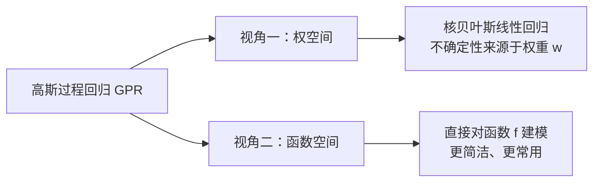

# 高斯过程回归

## 一句话理解

> [!tip] 核心直觉
> 高斯过程回归 = **用"函数的概率分布"来做回归**。它不是学一条确定的曲线，而是学出一簇可能的曲线，并告诉你每个预测点的==不确定性==有多大。

---

## 从一维到无限维：高斯过程是什么？

理解高斯过程，只需要把握一条"升维"链条：

| 层级 | 概念 | 维度 |
|------|------|------|
| 第 1 层 | 一维高斯分布 $\mathcal{N}(\mu, \sigma^2)$ | 1 维 |
| 第 2 层 | 多元高斯分布 $\mathcal{N}(\boldsymbol{\mu}, \boldsymbol{\Sigma})$ | $n$ 维 |
| 第 3 层 | **高斯过程** $\mathcal{GP}(m(x), k(x, x'))$ | ==无限维== |

> [!note] 通俗理解
> 想象一根时间轴，**每个时刻**都对应一个高斯分布的随机变量。把这些无穷多个随机变量"打包"在一起，就是一个**高斯过程**。
>
> 更直观地说：从高斯过程中"采样"，得到的不是一个数，而是**一整条函数曲线**。

### 严格定义

对于时间轴上的任意序列 $t_1, t_2, \dots, t_N$，如果：

$$
\begin{pmatrix} y(t_1) \\ y(t_2) \\ \vdots \\ y(t_N) \end{pmatrix}
\sim \mathcal{N}(\boldsymbol{\mu}, \boldsymbol{\Sigma})
$$

那么 $y(t)$ 就是一个**高斯过程**。

> [!important] 两个关键参数
> 高斯过程完全由两个函数决定（高斯过程存在性定理）：
> 1. **均值函数** $m(x) = \mathbb{E}[f(x)]$ — 函数曲线的"中心趋势"
> 2. **协方差函数（核函数）** $k(x, x') = \text{Cov}[f(x), f(x')]$ — 描述不同点之间的"关联程度"

---

## 高斯过程回归的两种视角

高斯过程回归本质上是：**贝叶斯线性回归 + 核技巧**。它有两种等价的理解方式：



---

## 视角一：权空间 — 核贝叶斯线性回归

### 从线性到非线性

普通贝叶斯线性回归的模型是 $f(x) = x^T w$，只能拟合直线。要处理非线性问题，我们引入**特征变换** $\phi(x)$：

$$
f(x) = \phi(x)^T w
$$

> [!example] 类比
> 就像把一张揉皱的纸展开到更高维空间——原本纠缠在一起的数据点，在高维空间中变得线性可分。

此时维度变高了，$w$ 也相应变为高维向量。

### 预测结果

给定训练数据 $X, Y$ 和新输入 $x_*$，预测分布仍然是高斯分布：

$$
f_* \mid X, Y, x_* \sim \mathcal{N}(\hat{\mu}_*, \hat{\sigma}_*^2)
$$

- **预测均值**（最可能的预测值）：

$$
\hat{\mu}_* = \phi(x_*)^T \Sigma_p \left( \Sigma_p \Phi^T \Phi + \sigma_n^2 I \right)^{-1} \Phi^T Y
$$

- **预测方差**（不确定性大小）：利用 Woodbury 公式化简

### 核技巧的妙处

> [!tip] 关键发现
> 推导中所有 $\phi$ 都以**内积** $\phi(x)^T \phi(x')$ 的形式出现！
>
> 我们定义 $\kappa(x, x') = \phi(x)^T \Sigma_p \, \phi(x')$，由于 $\Sigma_p$ 是正定对称矩阵，这天然就是一个**核函数**。

这意味着：
- 我们==不需要==显式计算高维特征 $\phi(x)$
- 只需要选择一个核函数 $\kappa(x, x')$（如 RBF 核）就够了
- 这个核函数恰好就是高斯过程的**协方差函数**

---

## 视角二：函数空间 — 更简洁的推导

> [!success] 推荐视角
> 函数空间的观点**更直接、更优雅**，也是实际使用中更常见的方式。

### 核心思路

不再关心权重 $w$，直接对函数值建模。核心假设：

$$
\begin{pmatrix} f(X) \\ f(X_*) \end{pmatrix}
\sim \mathcal{N}\left(
\begin{pmatrix} m(X) \\ m(X_*) \end{pmatrix},
\begin{pmatrix} K(X,X) & K(X,X_*) \\ K(X_*,X) & K(X_*,X_*) \end{pmatrix}
\right)
$$

其中 $K$ 是由核函数构建的协方差矩阵。

### 预测公式

利用多元高斯分布的条件分布公式，**直接写出**：

$$
\boxed{
\begin{aligned}
\hat{\mu}_* &= K(X_*, X) \left[ K(X, X) + \sigma_n^2 I \right]^{-1} Y \\
\hat{\Sigma}_* &= K(X_*, X_*) - K(X_*, X) \left[ K(X, X) + \sigma_n^2 I \right]^{-1} K(X, X_*)
\end{aligned}
}
$$

> [!note] 公式解读（大白话版）
> - **预测均值** $\hat{\mu}_*$：新点的预测 = 训练数据的**加权组合**，权重由核函数（"相似度"）决定。离新点越近的训练点，权重越大。
> - **预测方差** $\hat{\Sigma}_*$：先验不确定性 $-$ 观测数据带来的信息量。训练数据越密集的地方，不确定性越小。

---

## 两种视角的对比

| | 权空间视角 | 函数空间视角 |
|---|---|---|
| 建模对象 | 权重 $w$ 的分布 | 函数 $f$ 的分布 |
| 推导复杂度 | 较复杂（需要 Woodbury 公式） | ==简洁直接== |
| 核心工具 | 核技巧替换内积 | 条件高斯分布 |
| 结果 | 完全等价 | 完全等价 |

---

## 常用核函数

> [!info] 核函数的选择决定了 GPR 的"先验假设"——你认为函数长什么样子。

| 核函数 | 公式 | 适用场景 |
|--------|------|----------|
| RBF（径向基） | $k(x,x') = \sigma^2 \exp\left(-\frac{\|x-x'\|^2}{2l^2}\right)$ | 最常用，假设函数光滑 |
| Matérn | 含参数 $\nu$ 控制光滑度 | 需要控制光滑程度时 |
| 线性核 | $k(x,x') = \sigma^2 x^T x'$ | 线性关系 |
| 周期核 | 含 $\sin$ 项 | 周期性数据 |

---

## 总结

> [!abstract] 一图总结
> ```
> 训练数据 (X, Y)
>        │
>        ▼
>  选择核函数 k(x,x')    ← 先验：你认为函数长什么样
>        │
>        ▼
>  构建协方差矩阵 K
>        │
>        ▼
>  条件高斯分布公式
>        │
>        ├──→ 预测均值 μ*    ← 最可能的预测值
>        └──→ 预测方差 σ*²   ← 不确定性（置信区间）
> ```

**高斯过程回归的三大优势：**
1. ✅ 自带不确定性估计（不只给预测值，还告诉你有多"不靠谱"）
2. ✅ 非参数模型（不需要预先假定函数形式）
3. ✅ 贝叶斯框架（小数据也能给出合理预测）

**主要局限：**
1. ⚠️ 计算复杂度 $O(n^3)$（需要矩阵求逆），大数据集较慢
2. ⚠️ 核函数的选择需要经验或交叉验证
