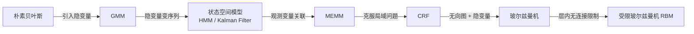

# 受限玻尔兹曼机 (RBM)

## 一句话理解

> [!tip] 核心思想
> 受限玻尔兹曼机就像一个"**双层神经网络**"：一层是你能看到的数据（可见层），另一层是隐藏的特征（隐藏层）。两层之间全连接，但**同层内部没有连接**——这个"受限"正是它名字的由来。

---

## 从概率图模型家族说起

RBM 不是凭空出现的，它是概率图模型大家族的一员。我们可以这样理解这条演化链：

> [!info] 概率图模型的五大假设维度
> 1. **方向** — 边的性质（有向 vs 无向）
> 2. **离散/连续/混合** — 节点取值的性质
> 3. **条件独立性** — 边所蕴含的独立性
> 4. **隐变量** — 是否存在不可观测的节点
> 5. **指数族** — 分布的结构特点

---

## 玻尔兹曼机 → 受限玻尔兹曼机

### 玻尔兹曼机（BM）

将观测变量记为 $v$，隐变量记为 $h$，无向图按照最大团分解，写成**玻尔兹曼分布**：

$$
p(x) = \frac{1}{Z} \exp\bigl(-E(x)\bigr)
$$

这是一个指数族分布，其中 $E(x)$ 称为**能量函数**，$Z$ 是归一化常数（配分函数）。

> [!warning] BM 的问题
> - 精确推断：**不可行**（指数级复杂度）
> - 近似推断：**计算量过大**

### 受限玻尔兹曼机（RBM）的"限制"

为了让推断变得可行，RBM 做了一个关键假设：

> [!abstract] 核心限制
> - 隐变量之间**没有连接**
> - 观测变量之间**没有连接**
> - **只在**隐变量和观测变量之间有连接

用大白话说：同一层的节点互不"聊天"，只跟对面那一层交流。

---

## RBM 的数学结构

### 联合分布

$$
p(v, h) = \frac{1}{Z} \exp\bigl(-E(v, h)\bigr)
$$

### 能量函数

能量函数分为**三部分**：

$$
E(v, h) = -(h^T W v + \alpha^T v + \beta^T h)
$$

| 项 | 含义 | 通俗理解 |
|---|---|---|
| $h^T W v$ | 隐层与可见层之间的连接权重 | 两层之间的"桥梁" |
| $\alpha^T v$ | 可见层节点的偏置 | 每个可见节点自身的"倾向" |
| $\beta^T h$ | 隐层节点的偏置 | 每个隐节点自身的"倾向" |

### 展开形式

将联合分布完全展开，可以分解为因子的乘积：

$$
p(x) = \frac{1}{Z} \exp(h^T W v) \exp(\alpha^T v) \exp(\beta^T h)
$$

$$
= \frac{1}{Z} \prod_{i,j} \exp(h_i w_{ij} v_j) \cdot \prod_j \exp(\alpha_j v_j) \cdot \prod_i \exp(\beta_i h_i)
$$

> [!note] 因子图对应
> 上面的分解与 RBM 的**因子图**一一对应——每一项因子都对应图中的一个因子节点。

---

## 推断

推断任务有两个：
1. **后验概率**：$p(h|v)$，$p(v|h)$
2. **边缘概率**：$p(v)$

### 后验概率 $p(h|v)$

由于 RBM 是无向图，满足**局域 Markov 性质**：

$$
p(h_i \mid h_{-\{h_i\}}, v) = p(h_i \mid \text{Neighbour}(h_i)) = p(h_i \mid v)
$$

> [!tip] 通俗理解
> 因为隐节点之间没有连接，所以每个隐节点 $h_i$ **只依赖于可见层** $v$，与其他隐节点无关！这就是"受限"带来的最大好处。

因此后验概率可以分解为各隐节点独立的乘积：

$$
p(h|v) = \prod_i p(h_i | v)
$$

### Binary RBM 的具体推导

考虑所有隐变量只取 $\{0, 1\}$ 两个值：

将能量函数分成与 $h_i$ 相关和不相关的两项：

$$
E(v,h) = h_i \underbrace{\Bigl(\sum_j w_{ij} v_j + \beta_i\Bigr)}_{H_i(v)} + \underbrace{\bar{H}(\mathbf{h}_{-i}, v)}_{\text{与 } h_i \text{ 无关}}
$$

定义：$H_i(v) = \sum_j w_{ij} v_j + \beta_i$

代入后验概率公式：

$$
p(h_i = 1 \mid v) = \frac{\exp\bigl(H_i(v)\bigr)}{\exp\bigl(H_i(v)\bigr) + \exp\bigl(\bar{H}\bigr)} = \frac{1}{1 + \exp\bigl(-H_i(v)\bigr)} = \sigma\bigl(H_i(v)\bigr)
$$

> [!success] 关键结论
> 后验概率就是一个 **Sigmoid 函数** $\sigma(\cdot)$！
> $$p(h_i = 1 \mid v) = \sigma\!\left(\sum_j w_{ij} v_j + \beta_i\right)$$
>
> 对于 $p(v|h)$ 的推导是**完全对称**的，结果类似。

### 边缘概率 $p(v)$

对隐变量求和（边缘化）：

$$
p(v) = \sum_h p(h, v) = \sum_h \frac{1}{Z} \exp(h^T W v + \alpha^T v + \beta^T h)
$$

$$
= \exp(\alpha^T v) \cdot \frac{1}{Z} \prod_{i=1}^{K} \bigl(1 + \exp(w_i^T v + \beta_i)\bigr)
$$

取对数后：

$$
\log p(v) \propto \alpha^T v + \sum_{i=1}^{K} \log\bigl(1 + \exp(w_i^T v + \beta_i)\bigr) - \log Z
$$

> [!info] Softplus 函数
> 其中 $\log(1 + \exp(x))$ 就是 **Softplus 函数**，它是 ReLU 的平滑近似版本。

---

## 直觉总结

> [!example] 打个比方
> 把 RBM 想象成一家**餐厅**：
> - **可见层** $v$ = 顾客点的菜（你能看到的数据）
> - **隐藏层** $h$ = 厨师的口味偏好（隐含的特征）
> - **权重** $W$ = 每道菜和厨师偏好之间的关联
> - **"受限"** = 顾客之间不互相商量，厨师之间也不互相影响，但每个厨师都能看到所有顾客点的菜
>
> 训练 RBM 就是根据顾客点菜的数据，学习出隐含的厨师偏好模式。

---

## 参考

- ![[受限玻尔兹曼机.pdf]] — 原始 PDF 笔记
