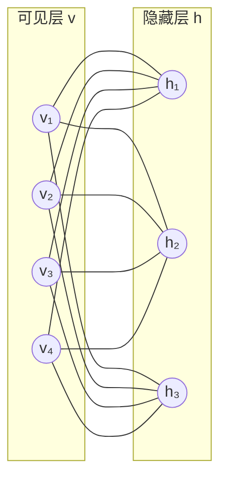
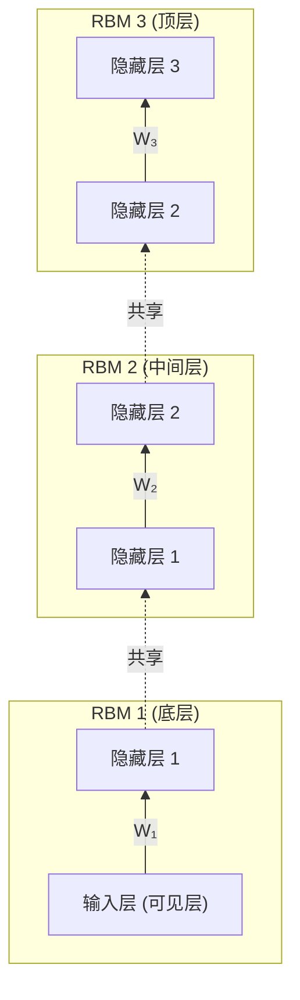

# Deep Belief Network (深度置信网络)

> [!abstract] 一句话总结
> DBN = **多层 RBM 堆叠** + **逐层贪心预训练** + **反向传播微调**。它是深度学习复兴的标志性模型（Hinton, 2006），证明了"深度网络是可以训练的"。

---

## 1 为什么需要 DBN？

在 2006 年之前，深层神经网络面临两大难题：

| 问题 | 表现 |
|------|------|
| **梯度消失** | 反向传播到浅层时梯度趋近于零，权重几乎不更新 |
| **局部最优** | 随机初始化的权重很容易陷入差的局部极小值 |

> [!tip] Hinton 的关键洞察
> 如果我们能先用**无监督学习**为每一层找到一组好的初始权重，再用有监督的反向传播做微调，深层网络就能被有效训练。这就是 DBN 的核心思想——**逐层贪心预训练（Greedy Layer-wise Pretraining）**。

---

## 2 前置知识：受限玻尔兹曼机 (RBM)

RBM 是 DBN 的基本构建模块，理解 RBM 是理解 DBN 的关键。

### 2.1 什么是 RBM？

RBM 是一个**两层无向图模型**，包含：

- **可见层 (Visible Layer)** $\mathbf{v} = (v_1, v_2, \dots, v_n)$：接收输入数据
- **隐藏层 (Hidden Layer)** $\mathbf{h} = (h_1, h_2, \dots, h_m)$：学习特征

> [!important] "受限"在哪里？
> **同层神经元之间没有连接**，只有层间连接。这个限制使得给定一层时，另一层的各单元**条件独立**，从而推断变得高效。



### 2.2 能量函数

RBM 是基于**能量的模型（Energy-Based Model）**。对于二值 RBM（$v_i, h_j \in \{0,1\}$），能量函数定义为：

$$
E(\mathbf{v}, \mathbf{h}) = -\sum_{i=1}^{n} b_i v_i - \sum_{j=1}^{m} c_j h_j - \sum_{i=1}^{n}\sum_{j=1}^{m} v_i w_{ij} h_j
$$

其中：
- $w_{ij}$：可见单元 $i$ 和隐藏单元 $j$ 之间的权重
- $b_i$：可见单元 $i$ 的偏置
- $c_j$：隐藏单元 $j$ 的偏置

> [!note] 直觉理解
> **能量越低 → 概率越高**。模型的学习目标就是让训练数据对应的状态处于低能量区域（高概率），让其他状态处于高能量区域（低概率）。这就像物理学中系统倾向于稳定在低能量状态。

用矩阵形式可以更简洁地写为：

$$
E(\mathbf{v}, \mathbf{h}) = -\mathbf{b}^\top \mathbf{v} - \mathbf{c}^\top \mathbf{h} - \mathbf{v}^\top \mathbf{W} \mathbf{h}
$$

### 2.3 从能量到概率（玻尔兹曼分布）

由统计力学中的**玻尔兹曼分布**，联合概率为：

$$
P(\mathbf{v}, \mathbf{h}) = \frac{1}{Z} e^{-E(\mathbf{v}, \mathbf{h})}
$$

其中 $Z$ 是**配分函数（Partition Function）**，起归一化作用：

$$
Z = \sum_{\mathbf{v}} \sum_{\mathbf{h}} e^{-E(\mathbf{v}, \mathbf{h})}
$$

对可见层的边缘概率为：

$$
P(\mathbf{v}) = \frac{1}{Z} \sum_{\mathbf{h}} e^{-E(\mathbf{v}, \mathbf{h})}
$$

> [!warning] 计算困难
> 配分函数 $Z$ 需要对所有可能的 $(\mathbf{v}, \mathbf{h})$ 组合求和，对于 $n$ 个可见单元和 $m$ 个隐藏单元，共有 $2^{n+m}$ 种组合，直接计算不可行。这也是为什么需要近似算法。

### 2.4 条件概率的推导 ⭐

这是 RBM 最优美的性质。由于层内无连接（"受限"），条件概率可以**解析求解**。

**推导过程：给定 $\mathbf{v}$，求 $P(h_j = 1 | \mathbf{v})$**

$$
P(h_j = 1 \mid \mathbf{v}) = \frac{P(h_j = 1, \mathbf{v})}{P(\mathbf{v})} = \frac{P(h_j=1, \mathbf{v})}{P(h_j=0, \mathbf{v}) + P(h_j=1, \mathbf{v})}
$$

将能量函数代入，注意到与 $h_j$ 无关的项在分子分母中可以抵消：

$$
P(h_j = 1 \mid \mathbf{v}) = \frac{e^{c_j + \sum_i v_i w_{ij}}}{1 + e^{c_j + \sum_i v_i w_{ij}}}
$$

这正好是 **sigmoid 函数**的形式！

$$
\boxed{P(h_j = 1 \mid \mathbf{v}) = \sigma\!\left(c_j + \sum_{i=1}^{n} v_i w_{ij}\right) = \sigma(\mathbf{W}^\top \mathbf{v} + \mathbf{c})_j}
$$

**对称地**，给定 $\mathbf{h}$，求可见层：

$$
\boxed{P(v_i = 1 \mid \mathbf{h}) = \sigma\!\left(b_i + \sum_{j=1}^{m} w_{ij} h_j\right) = \sigma(\mathbf{W}\mathbf{h} + \mathbf{b})_i}
$$

> [!success] 为什么这很重要？
> 这意味着：
> 1. 给定可见层，所有隐藏单元**并行独立**采样
> 2. 给定隐藏层，所有可见单元**并行独立**采样
> 3. 这使得 **Gibbs 采样** 变得极为高效

### 2.5 训练 RBM：对数似然梯度推导 ⭐⭐

训练目标：**最大化训练数据的对数似然**。

$$
\mathcal{L}(\theta) = \frac{1}{N}\sum_{k=1}^{N} \ln P(\mathbf{v}^{(k)})
$$

对单个样本 $\mathbf{v}$ 求权重 $w_{ij}$ 的梯度：

$$
\frac{\partial \ln P(\mathbf{v})}{\partial w_{ij}} = \frac{\partial}{\partial w_{ij}} \ln \left( \frac{1}{Z} \sum_{\mathbf{h}} e^{-E(\mathbf{v}, \mathbf{h})} \right)
$$

展开后得到两项：

$$
\frac{\partial \ln P(\mathbf{v})}{\partial w_{ij}} = \underbrace{\left\langle v_i h_j \right\rangle_{\text{data}}}_{\text{正相 (Positive Phase)}} - \underbrace{\left\langle v_i h_j \right\rangle_{\text{model}}}_{\text{负相 (Negative Phase)}}
$$

其中：
- **正相** $\langle v_i h_j \rangle_{\text{data}} = \sum_\mathbf{h} P(\mathbf{h}|\mathbf{v})\, v_i h_j$：用真实数据 $\mathbf{v}$ 计算，容易求
- **负相** $\langle v_i h_j \rangle_{\text{model}} = \sum_{\mathbf{v},\mathbf{h}} P(\mathbf{v},\mathbf{h})\, v_i h_j$：需要从模型分布中采样，**非常难算**

> [!note] 直觉理解梯度
> - **正相**：把真实数据的概率"拉高"（降低真实数据的能量）
> - **负相**：把模型幻想出来的数据的概率"压低"（升高虚假数据的能量）
> - 训练就是让模型学会区分"什么是真实的，什么是虚假的"

### 2.6 对比散度算法 (Contrastive Divergence, CD-k) ⭐⭐⭐

由于负相需要长时间的 Gibbs 采样才能收敛，Hinton (2002) 提出了 **CD-k** 算法作为近似。

**核心思想**：不需要等 Gibbs 链收敛，只跑 $k$ 步（通常 $k=1$）就足够好了！

**CD-1 算法流程：**

```
输入: 训练样本 v⁰, 学习率 ε
━━━━━━━━━━━━━━━━━━━━━━━━━━━━━━
1. 正相 (Positive Phase):
   ● 用 v⁰ 计算: P(h=1|v⁰) = σ(W^T v⁰ + c)
   ● 采样得到:    h⁰ ~ P(h|v⁰)

2. 负相 (Negative Phase) — 1步 Gibbs 采样:
   ● 重构可见层: P(v=1|h⁰) = σ(W h⁰ + b)
   ● 采样得到:   v¹ ~ P(v|h⁰)
   ● 再算隐藏层: P(h=1|v¹) = σ(W^T v¹ + c)

3. 参数更新:
   ● ΔW  = ε (v⁰ · P(h|v⁰)^T − v¹ · P(h|v¹)^T)
   ● Δb  = ε (v⁰ − v¹)
   ● Δc  = ε (P(h|v⁰) − P(h|v¹))
━━━━━━━━━━━━━━━━━━━━━━━━━━━━━━
```

> [!tip] 为什么 CD-1 就够用？
> Hinton 指出，当用训练数据作为 Gibbs 链的起点时，链的初始状态已经接近数据分布，因此只需 1 步就能获得合理的梯度近似。虽然不是精确梯度，但在实践中效果很好。

---

## 3 DBN 的结构

DBN 就是**将多个 RBM 堆叠起来**：



**关键特点：**
- 相邻 RBM 之间**共享中间层**：上一个 RBM 的隐藏层 = 下一个 RBM 的可见层
- 除了顶层两层之间是**无向连接**（RBM），其余层之间是**有向连接**（自顶向下的生成模型）
- 这种混合结构使 DBN 成为一个**概率生成模型**

---

## 4 DBN 训练过程

### 4.1 阶段一：逐层贪心预训练（无监督）

这是 DBN 最核心的训练策略：

```
Step 1: 用原始数据 X 训练 RBM₁ → 得到 W₁
        X → [RBM₁] → H₁

Step 2: 将 H₁ 作为新的"数据"训练 RBM₂ → 得到 W₂
        H₁ → [RBM₂] → H₂

Step 3: 将 H₂ 作为新的"数据"训练 RBM₃ → 得到 W₃
        H₂ → [RBM₃] → H₃

...依此类推，直到训练完所有层
```

> [!important] 为什么逐层预训练有效？
> Hinton (2006) 证明了一个重要定理：**每增加一层 RBM，整个模型的对数似然下界（variational lower bound）不会降低**。
>
> 即：$\ln P(\mathbf{v}; \theta_{\text{new}}) \geq \ln P(\mathbf{v}; \theta_{\text{old}})$
>
> 这保证了逐层训练在理论上是合理的——每一层都在改善模型对数据的表示。

### 4.2 阶段二：有监督微调

预训练完成后，在 DBN 顶部添加一个分类层（如 Softmax），然后用**反向传播**对整个网络进行端到端的微调：

```
[输入 X]
    ↓ W₁ (预训练初始化)
[隐藏层 1]
    ↓ W₂ (预训练初始化)
[隐藏层 2]
    ↓ W₃ (预训练初始化)
[隐藏层 3]
    ↓ W_out (随机初始化)
[Softmax 输出层] → 类别预测
    ↕
  反向传播微调所有权重
```

> [!note] 类比理解
> 把预训练想象成"素描打底"，微调就是"上色润色"。预训练给了网络一个好的起点，微调再针对具体任务做精细调整。

---

## 5 关键数学推导：逐层预训练的理论保证

### 5.1 变分下界

对于 DBN 的对数似然，我们可以写出变分下界：

$$
\ln P(\mathbf{v}) \geq \sum_{\mathbf{h}^{(1)}} Q(\mathbf{h}^{(1)} | \mathbf{v}) \left[ \ln P(\mathbf{v} | \mathbf{h}^{(1)}) + \ln P(\mathbf{h}^{(1)}) - \ln Q(\mathbf{h}^{(1)} | \mathbf{v}) \right]
$$

其中 $Q(\mathbf{h}^{(1)} | \mathbf{v})$ 是后验的近似分布。

### 5.2 Hinton 的核心论证

当我们用 RBM 的参数初始化第一层时：
1. 令 $Q(\mathbf{h}^{(1)} | \mathbf{v}) = P_{\text{RBM}}(\mathbf{h}^{(1)} | \mathbf{v})$（用 RBM 的后验作为近似后验）
2. 此时 KL 散度 $D_{KL}(Q \| P) = 0$，下界最紧

当我们在此基础上增加第二个 RBM 来建模 $P(\mathbf{h}^{(1)})$ 时，只要第二个 RBM 能更好地建模 $\mathbf{h}^{(1)}$ 的分布（即 $P_{\text{new}}(\mathbf{h}^{(1)}) \geq P_{\text{old}}(\mathbf{h}^{(1)})$），整体的变分下界就会提升。

$$
\mathcal{L}_{\text{new}} \geq \mathcal{L}_{\text{old}}
$$

> [!success] 这就是逐层训练的理论基础
> 每一个新的 RBM 层都在更好地建模上一层隐藏表示的先验分布，从而持续提升整个模型的似然下界。

---

## 6 DBN 的生成过程

训练好的 DBN 可以**自顶向下生成数据**：

```
Step 1: 在顶层 RBM 中运行 Gibbs 采样，得到顶层表示
Step 2: 用 P(h²|h³) 自顶向下逐层采样
Step 3: 最终从 P(v|h¹) 采样生成可见层数据
```

$$
\mathbf{h}^{(L)} \xrightarrow{P(\mathbf{h}^{(L-1)}|\mathbf{h}^{(L)})} \mathbf{h}^{(L-1)} \xrightarrow{} \cdots \xrightarrow{P(\mathbf{v}|\mathbf{h}^{(1)})} \mathbf{v}
$$

这使得 DBN 既是一个**判别模型**（加分类层后），也是一个**生成模型**（可以生成新样本）。

---

## 7 DBN vs 其他模型

| 特性 | DBN | 普通深度网络 | AutoEncoder | DBM |
|------|-----|-------------|-------------|-----|
| 预训练 | ✅ 逐层 RBM | ❌ | ✅ 逐层 AE | ✅ 逐层 |
| 生成能力 | ✅ | ❌ | ✅ (VAE) | ✅ |
| 连接类型 | 有向+无向 | 前馈 | 前馈 | 全无向 |
| 训练方式 | CD + BP | BP | 重构 + BP | CD 变体 |
| 推断精确性 | 较高 | — | — | 需近似 |

> [!warning] DBN 的局限性
> - 在现代深度学习中，由于 **ReLU、BatchNorm、Dropout、Adam** 等技术的出现，随机初始化 + 直接训练已经足够好，预训练不再是必须的
> - CD 算法是近似的，训练效率不如直接反向传播
> - 扩展到大规模数据集时，RBM 的训练比较慢
> - 但 DBN 的**历史意义**巨大：它证明了深层网络可以被有效训练，直接推动了深度学习的复兴

---

## 8 完整算法总结

> [!example] DBN 训练算法伪代码
>
> ```
> 输入: 训练数据集 X, 层数 L, 每层大小 [n₁, n₂, ..., nₗ]
> 输出: DBN 参数 {W₁, W₂, ..., Wₗ, b, c}
>
> ═══ 阶段一：逐层预训练 ═══
> data = X
> FOR l = 1 TO L:
>     创建 RBM(可见=nₗ₋₁, 隐藏=nₗ)
>     用 CD-1 训练该 RBM:
>         FOR each mini-batch in data:
>             v⁰ = mini-batch
>             h⁰ ~ P(h|v⁰)          # 正相采样
>             v¹ ~ P(v|h⁰)          # 重构
>             h¹ ~ P(h|v¹)          # 负相采样
>             ΔW = ε(v⁰h⁰ᵀ - v¹h¹ᵀ)
>             更新 W, b, c
>     保存 Wₗ
>     data = σ(Wₗᵀ · data + cₗ)    # 将数据映射到隐藏层
>
> ═══ 阶段二：有监督微调 ═══
> 用 {W₁, ..., Wₗ} 初始化深度网络
> 添加输出层 (Softmax)
> 用反向传播 + 标签数据微调整个网络
> ```

---

## 9 参考资料

- [Hinton, G. E., Osindero, S., & Teh, Y. W. (2006). A fast learning algorithm for deep belief nets. *Neural Computation*, 18(7), 1527-1554.](https://www.cs.toronto.edu/~hinton/absps/fastnc.pdf)
- [Deep Belief Network - Wikipedia](https://en.wikipedia.org/wiki/Deep_belief_network)
- [Restricted Boltzmann Machine - Wikipedia](https://en.wikipedia.org/wiki/Restricted_Boltzmann_machine)
- [RBM and DBN Tutorial and Survey (arXiv:2107.12521)](https://arxiv.org/abs/2107.12521)
- [Hinton's 2007 NIPS Tutorial on Deep Belief Nets](https://www.cs.toronto.edu/~hinton/nipstutorial/nipstut3.pdf)
- [GeeksforGeeks: Deep Belief Network in Deep Learning](https://www.geeksforgeeks.org/deep-learning/deep-belief-network-dbn-in-deep-learning/)
- [刘建平 - 受限玻尔兹曼机原理总结](https://www.cnblogs.com/pinard/p/6530523.html)
