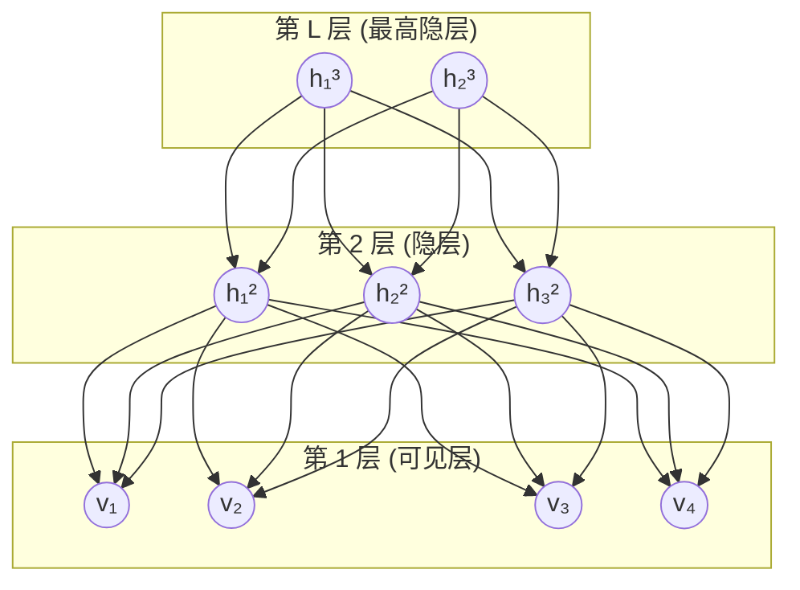

# Sigmoid Belief Network (SBN)

## 1 一句话理解

> [!tip] 核心直觉
> Sigmoid Belief Network 就是一个**多层"掷硬币"生成器**——从最顶层开始，每一层的节点根据上一层节点的加权求和经过 Sigmoid 函数得到"正面概率"，然后掷硬币决定 0 或 1，一层层往下，最终生成我们能观测到的数据。

它由 **Neal (1992)** 提出，是最早的**有向深度生成模型**之一，也是后来 [[Deep Belief Network|Deep Belief Network (DBN)]]、Helmholtz Machine、VAE 等模型的理论前身。

---

## 2 模型结构

### 2.1 网络拓扑



> [!info] 关键特征
> - **有向无环图 (DAG)**：箭头从顶层指向底层，表示"生成"方向
> - **所有变量都是二值的 (0/1)**
> - **层间全连接**：上一层的每个节点都连接到下一层的每个节点
> - **层内无连接**：同一层的节点之间没有边

### 2.2 数学定义

假设网络有 $L+1$ 层：可见层 $\mathbf{v}$（第 0 层）和隐层 $\mathbf{h}^{(1)}, \mathbf{h}^{(2)}, \dots, \mathbf{h}^{(L)}$。

对于第 $l$ 层的第 $i$ 个节点，其条件概率为：

$$
p\!\left(s_i^{(l)} = 1 \;\middle|\; \mathbf{s}^{(l+1)}\right) = \sigma\!\left(b_i^{(l)} + \sum_j W_{ij}^{(l)}\, s_j^{(l+1)}\right)
$$

其中：
- $s_i^{(l)} \in \{0, 1\}$ 是第 $l$ 层第 $i$ 个单元的状态
- $\sigma(x) = \dfrac{1}{1 + e^{-x}}$ 是 **Sigmoid 函数**
- $b_i^{(l)}$ 是偏置
- $W_{ij}^{(l)}$ 是从第 $l+1$ 层的第 $j$ 个单元到第 $l$ 层的第 $i$ 个单元的权重

> [!note] 为什么叫 "Sigmoid" Belief Network？
> 正是因为每个节点的激活概率由 Sigmoid 函数决定。Sigmoid 把 $(-\infty, +\infty)$ 的加权输入映射到 $(0,1)$ 的概率值。

---

## 3 生成过程（采样/前向）

> [!example] 类比：层层掷硬币
> 想象你在造一幅画：
> 1. 先确定**抽象主题**（顶层隐变量）
> 2. 再决定**具体构图**（中间隐层）
> 3. 最后画出**像素**（可见层）

形式化的采样过程：

$$
\boxed{
\begin{aligned}
&\text{For } l = L, L-1, \dots, 1, 0: \\
&\quad \text{For each unit } i \text{ in layer } l: \\
&\qquad p_i = \sigma\!\left(b_i^{(l)} + \sum_j W_{ij}^{(l)} s_j^{(l+1)}\right) \\
&\qquad s_i^{(l)} \sim \mathrm{Bernoulli}(p_i)
\end{aligned}
}
$$

（顶层 $\mathbf{h}^{(L)}$ 没有父节点，直接由偏置 $b_i^{(L)}$ 决定先验概率）

---

## 4 联合概率分布

### 4.1 推导

由贝叶斯网络的链式法则，联合概率可以分解为各节点条件概率的乘积：

$$
p(\mathbf{v}, \mathbf{h}^{(1)}, \dots, \mathbf{h}^{(L)}) = \prod_{l=0}^{L} \prod_{i} p\!\left(s_i^{(l)} \;\middle|\; \mathbf{s}^{(l+1)}\right)
$$

其中每个因子为：

$$
p\!\left(s_i^{(l)} \;\middle|\; \mathbf{s}^{(l+1)}\right) = \sigma\!\left(a_i^{(l)}\right)^{s_i^{(l)}} \cdot \left[1 - \sigma\!\left(a_i^{(l)}\right)\right]^{1 - s_i^{(l)}}
$$

这里 $a_i^{(l)} = b_i^{(l)} + \sum_j W_{ij}^{(l)} s_j^{(l+1)}$ 是加权输入（pre-activation）。

### 4.2 对数联合概率

取对数后得到更方便的形式：

$$
\log p(\mathbf{v}, \mathbf{h}) = \sum_{l=0}^{L} \sum_i \left[ s_i^{(l)} \log \sigma(a_i^{(l)}) + (1-s_i^{(l)}) \log(1-\sigma(a_i^{(l)})) \right]
$$

利用 Sigmoid 的性质 $1 - \sigma(x) = \sigma(-x)$，可以化简为：

$$
\boxed{
\log p(\mathbf{v}, \mathbf{h}) = \sum_{l=0}^{L} \sum_i \left[ s_i^{(l)}\, a_i^{(l)} - \log\!\left(1 + e^{a_i^{(l)}}\right) \right]
}
$$

> [!abstract] 推导细节
> $$
> \begin{aligned}
> s \log \sigma(a) + (1-s)\log \sigma(-a)
> &= s \log \frac{1}{1+e^{-a}} + (1-s)\log \frac{1}{1+e^{a}} \\
> &= -s\log(1+e^{-a}) - (1-s)\log(1+e^{a}) \\
> &= -s\log\frac{1+e^{-a}}{1} - (1-s)\log(1+e^{a}) \\
> &= s \cdot a - s\log(1+e^{a}) - \log(1+e^{a}) + s\log(1+e^{a}) \\
> &= s \cdot a - \log(1+e^{a})
> \end{aligned}
> $$

---

## 5 推断问题（核心难点）

### 5.1 为什么推断困难？

给定观测数据 $\mathbf{v}$，我们需要计算后验概率 $p(\mathbf{h} | \mathbf{v})$：

$$
p(\mathbf{h} | \mathbf{v}) = \frac{p(\mathbf{v}, \mathbf{h})}{\sum_{\mathbf{h}'} p(\mathbf{v}, \mathbf{h}')}
$$

> [!danger] 计算量爆炸
> 分母需要对**所有可能的隐变量组合**求和。如果有 $N$ 个隐变量，就需要对 $2^N$ 种组合求和——这是 **NP-hard** 的！

> [!warning] 与无向模型的对比
> 在 RBM（受限玻尔兹曼机）中，给定可见层后各隐单元**条件独立**，推断很容易。但在 SBN 中，即使在生成方向上同层节点条件独立，**给定子节点后父节点之间会产生 "explaining away" 效应**，导致后验中隐变量不再独立。

### 5.2 Explaining Away 效应

这是理解 SBN 推断困难的关键：

```
    h₁     h₂       (两个可能的原因)
     \    /
      \  /
       v            (一个观测结果)
```

假设 $h_1$ 和 $h_2$ 先验独立，都能导致 $v=1$。当我们**观测到** $v=1$ 后：
- 如果知道 $h_1 = 1$（原因 1 已经解释了 $v$），那么 $h_2 = 1$ 的概率就**降低**了
- 这意味着 $h_1$ 和 $h_2$ 在后验中**不再独立**

这就是 **explaining away**——一个原因的存在"解释掉了"另一个原因的必要性。

---

## 6 变分推断（Variational Inference）

### 6.1 核心思想

既然真实后验 $p(\mathbf{h}|\mathbf{v})$ 算不出来，我们就用一个**简单的分布** $q(\mathbf{h})$ 去近似它。

### 6.2 ELBO 推导

从对数边际似然出发：

$$
\log p(\mathbf{v}) = \log \sum_{\mathbf{h}} p(\mathbf{v}, \mathbf{h})
$$

引入任意分布 $q(\mathbf{h})$：

$$
\begin{aligned}
\log p(\mathbf{v}) &= \log \sum_{\mathbf{h}} q(\mathbf{h}) \frac{p(\mathbf{v}, \mathbf{h})}{q(\mathbf{h})} \\[6pt]
&\geq \sum_{\mathbf{h}} q(\mathbf{h}) \log \frac{p(\mathbf{v}, \mathbf{h})}{q(\mathbf{h})} \quad \text{(Jensen 不等式)} \\[6pt]
&= \underbrace{\mathbb{E}_{q}\!\left[\log p(\mathbf{v}, \mathbf{h})\right] - \mathbb{E}_{q}\!\left[\log q(\mathbf{h})\right]}_{\text{ELBO}(\mathbf{v}; q)}
\end{aligned}
$$

等价地：

$$
\boxed{
\text{ELBO} = \mathbb{E}_{q(\mathbf{h})}\!\left[\log p(\mathbf{v}, \mathbf{h})\right] + \mathcal{H}[q]
}
$$

其中 $\mathcal{H}[q] = -\sum_{\mathbf{h}} q(\mathbf{h}) \log q(\mathbf{h})$ 是 $q$ 的**熵**。

### 6.3 ELBO 与 KL 散度的关系

$$
\log p(\mathbf{v}) = \text{ELBO} + D_{\mathrm{KL}}\!\left(q(\mathbf{h}) \;\|\; p(\mathbf{h}|\mathbf{v})\right)
$$

因为 $D_{\mathrm{KL}} \geq 0$，所以 ELBO 确实是 $\log p(\mathbf{v})$ 的下界。当且仅当 $q(\mathbf{h}) = p(\mathbf{h}|\mathbf{v})$ 时等号成立。

> [!tip] 优化目标
> **最大化 ELBO** 等价于 **最小化** $q(\mathbf{h})$ 和真实后验之间的 **KL 散度**。

### 6.4 平均场近似（Mean-Field Approximation）

最常见的近似是假设隐变量**完全独立**（因子化）：

$$
q(\mathbf{h}) = \prod_{l=1}^{L} \prod_i q_i^{(l)}(h_i^{(l)}) = \prod_{l,i} \left[\mu_i^{(l)}\right]^{h_i^{(l)}} \left[1 - \mu_i^{(l)}\right]^{1-h_i^{(l)}}
$$

其中 $\mu_i^{(l)} \in (0,1)$ 是**变分参数**——第 $l$ 层第 $i$ 个隐单元取 1 的概率。

**优化**：对每个 $\mu_i^{(l)}$ 求 ELBO 的导数并令其为零，得到迭代更新公式，反复迭代直到收敛。

---

## 7 学习算法

### 7.1 目标

给定训练数据 $\{\mathbf{v}^{(n)}\}_{n=1}^N$，最大化对数似然：

$$
\mathcal{L}(\theta) = \sum_{n=1}^N \log p(\mathbf{v}^{(n)}; \theta) \geq \sum_{n=1}^N \text{ELBO}(\mathbf{v}^{(n)}; q_n, \theta)
$$

### 7.2 Wake-Sleep 算法

> [!info] 历史背景
> Hinton et al. (1995) 为 **Helmholtz Machine**（两个对称的 SBN 组成的模型）提出了 Wake-Sleep 算法。

Wake-Sleep 使用一个额外的**识别网络（Recognition Network）** $q_\phi(\mathbf{h}|\mathbf{v})$，参数为 $\phi$，来近似后验。

#### Wake 阶段（醒着——看数据）

1. 用真实数据 $\mathbf{v}$ 通过识别网络采样 $\mathbf{h} \sim q_\phi(\mathbf{h}|\mathbf{v})$
2. 用采样的 $(\mathbf{v}, \mathbf{h})$ 对更新**生成网络**参数 $\theta$：

$$
\Delta W^{(l)} \propto \nabla_W \log p(\mathbf{v}, \mathbf{h}; \theta)
$$

#### Sleep 阶段（做梦——生成幻想）

1. 用生成网络从顶向下采样"幻想"数据 $(\tilde{\mathbf{v}}, \tilde{\mathbf{h}}) \sim p_\theta(\mathbf{v}, \mathbf{h})$
2. 用这些幻想数据更新**识别网络**参数 $\phi$：

$$
\Delta \phi \propto \nabla_\phi \log q_\phi(\tilde{\mathbf{h}} | \tilde{\mathbf{v}})
$$

> [!warning] Wake-Sleep 的问题
> - Wake 阶段和 Sleep 阶段优化的**不是同一个目标函数**
> - Sleep 阶段最小化的是 $D_{\mathrm{KL}}(p_\theta \| q_\phi)$ 而非 $D_{\mathrm{KL}}(q_\phi \| p_\theta)$
> - 因此不保证收敛到全局最优

### 7.3 权重更新推导（生成网络）

对于权重 $W_{ij}^{(l)}$，log 联合概率对其的梯度：

$$
\frac{\partial \log p(\mathbf{v}, \mathbf{h})}{\partial W_{ij}^{(l)}} = \frac{\partial}{\partial W_{ij}^{(l)}} \left[ s_i^{(l)} a_i^{(l)} - \log(1+e^{a_i^{(l)}}) \right]
$$

因为 $a_i^{(l)} = b_i^{(l)} + \sum_j W_{ij}^{(l)} s_j^{(l+1)}$，所以 $\frac{\partial a_i^{(l)}}{\partial W_{ij}^{(l)}} = s_j^{(l+1)}$：

$$
\boxed{
\frac{\partial \log p(\mathbf{v}, \mathbf{h})}{\partial W_{ij}^{(l)}} = \left(s_i^{(l)} - \sigma(a_i^{(l)})\right) \cdot s_j^{(l+1)}
}
$$

> [!abstract] 直觉解读
> 梯度 = (**实际值** − **期望值**) × **输入**
>
> 这和逻辑回归的梯度形式完全一致！当预测准确时梯度为零，当有偏差时朝着减小偏差的方向更新。

---

## 8 与相关模型的对比

| 特性 | **SBN** | **RBM** | **VAE** |
|------|---------|---------|---------|
| 图类型 | 有向 (DAG) | 无向 | 有向 |
| 变量类型 | 离散 (二值) | 离散 (二值) | 连续 (潜变量) |
| 精确后验 | ❌ 不可行 | ✅ 层内条件独立 | ❌ 不可行 |
| 精确似然 | ❌ 不可行 | ❌ 不可行 | ❌ 不可行 |
| 采样生成 | ✅ 前向直接采样 | ⚠️ 需要 Gibbs | ✅ 前向直接采样 |
| 训练方法 | Wake-Sleep / VI | CD / PCD | 重参数化 + SGD |
| 年代 | 1992 | 2002 | 2013 |

---

## 9 总结

> [!success] 关键要点
> 1. **SBN 是有向生成模型**：从顶层到底层逐层采样，生成过程高效
> 2. **推断是核心难点**：explaining away 导致后验复杂，必须用近似方法
> 3. **变分推断是主要工具**：通过最大化 ELBO 来近似后验和学习参数
> 4. **梯度形式优美**：权重梯度 = (实际 − 预测) × 输入，与逻辑回归一致
> 5. **历史地位重要**：SBN → Helmholtz Machine → DBN → VAE，是深度生成模型的理论源头

---

## 参考资料

- Neal, R. M. (1992). *Connectionist learning of belief networks*. Artificial Intelligence.
- [Hinton (2007) NIPS Tutorial: Deep Belief Nets](https://www.cs.toronto.edu/~hinton/nipstutorial/nipstut3.pdf)
- [Saul et al. - Mean Field Theory for Sigmoid Belief Networks](https://arxiv.org/pdf/cs/9603102)
- [CMU 10-708 Lecture Notes on SBN](https://www.cs.cmu.edu/~epxing/Class/10708-16/note/10708_scribe_lecture26.pdf)
- [Gan et al. (2015) - Learning Deep SBN with Data Augmentation](http://proceedings.mlr.press/v38/gan15.pdf)
- [ELBO Derivation — Gregory Gundersen](https://gregorygundersen.com/blog/2021/04/16/variational-inference/)
- [Bornschein & Bengio (2014) - Reweighted Wake-Sleep](https://arxiv.org/pdf/1406.2751v2)
