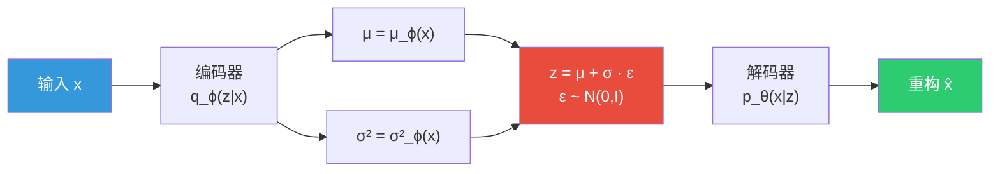
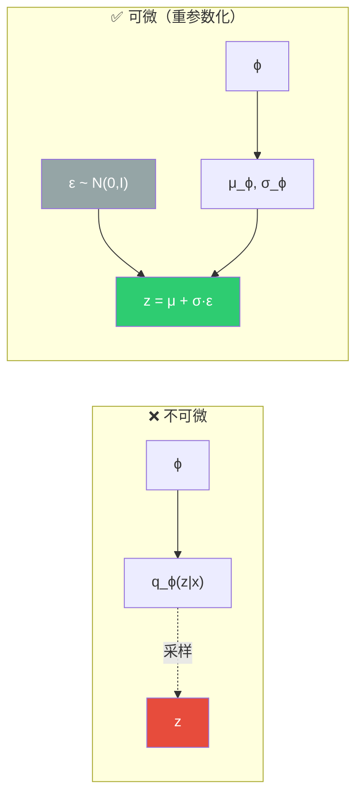
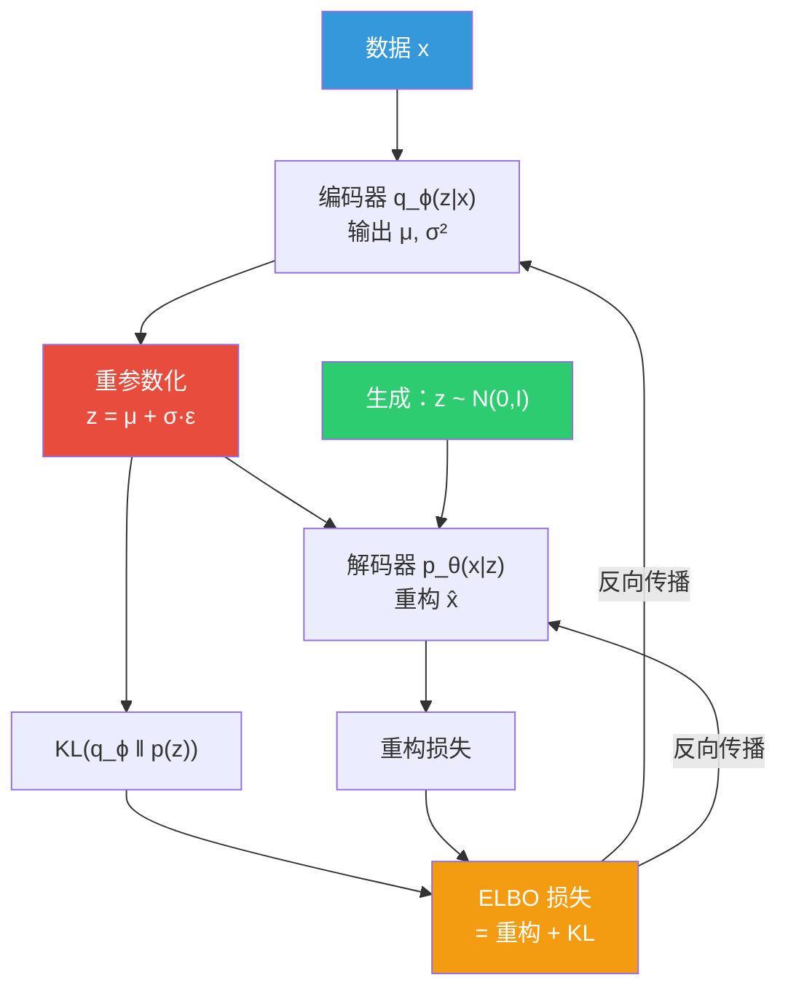

# 变分自编码器（Variational Autoencoder）

## 概述

> [!abstract] 核心思想
> VAE 是一种**深度生成模型**，它将 [[MachineLearning/11_inference/VI|变分推断]] 与神经网络相结合：
> - 用一个**编码器**网络将数据 $x$ 映射到潜在空间 $z$ 的分布参数
> - 用一个**解码器**网络从潜在变量 $z$ 重构数据 $x$
> - 通过最大化 **ELBO**（证据下界）来训练整个模型
>
> 本质上，VAE 是在做**摊销变分推断**（Amortized Variational Inference）——用一个神经网络来"摊销"每个样本的推断过程。

### 为什么需要 VAE？

传统的自编码器（AE）只学一个确定性的编码，无法从潜在空间**生成新样本**。VAE 将潜在表示建模为**概率分布**，使得我们可以：

1. 从潜在空间采样，**生成**全新的数据
2. 学到**有意义的、连续的**潜在表示
3. 对数据进行**概率建模**，而非简单的压缩

> [!tip] 直觉理解
> 想象你在学画人脸：
> - **普通 AE**：死记硬背每张脸的特征编码 → 只能复现见过的脸
> - **VAE**：学会"脸型大概是什么范围、眼睛大概在什么范围" → 可以在这些范围内随机组合，画出从未见过的新面孔

---

## 概率模型框架

### 生成过程

VAE 假设数据 $x$ 是由以下过程生成的：

$$
z \sim p(z) = \mathcal{N}(0, I) \quad \text{（从先验中采样潜在变量）}
$$

$$
x \sim p_\theta(x|z) \quad \text{（通过解码器生成数据）}
$$

其中 $p_\theta(x|z)$ 由一个参数为 $\theta$ 的神经网络（解码器）参数化。

### 核心问题

我们希望最大化数据的**边际似然**（marginal likelihood）：

$$
p_\theta(x) = \int_z p_\theta(x|z)\,p(z)\,dz
$$

> [!danger] 为什么这个积分很难？
> 这个积分需要遍历**所有可能的 $z$**。在高维空间中，绝大多数 $z$ 对应的 $p_\theta(x|z)$ 几乎为零，只有极少数 $z$ 能真正"生成"出像样的 $x$。暴力积分或蒙特卡洛采样效率极低。
>
> 同样地，真实后验 $p_\theta(z|x) = \frac{p_\theta(x|z)\,p(z)}{p_\theta(x)}$ 也因为分母 $p_\theta(x)$ 不可解而无法直接计算。

因此，我们需要一个**近似后验** $q_\phi(z|x)$ 来逼近真实后验 $p_\theta(z|x)$。

---

## ELBO 推导

### 从 KL 散度出发

回顾 [[MachineLearning/11_inference/VI|变分推断]] 和 [[MachineLearning/9_EM/EM|EM 算法]] 中的推导。我们引入变分后验 $q_\phi(z|x)$，从 KL 散度的非负性出发：

$$
\text{KL}\big(q_\phi(z|x)\,\|\,p_\theta(z|x)\big) \ge 0
$$

展开 KL 散度：

$$
\text{KL}\big(q_\phi(z|x)\,\|\,p_\theta(z|x)\big) = \mathbb{E}_{q_\phi(z|x)}\!\left[\log \frac{q_\phi(z|x)}{p_\theta(z|x)}\right]
$$

$$
= \mathbb{E}_{q_\phi}\!\left[\log q_\phi(z|x) - \log p_\theta(z|x)\right]
$$

利用贝叶斯公式 $p_\theta(z|x) = \frac{p_\theta(x,z)}{p_\theta(x)} = \frac{p_\theta(x|z)\,p(z)}{p_\theta(x)}$：

$$
= \mathbb{E}_{q_\phi}\!\left[\log q_\phi(z|x) - \log p_\theta(x|z) - \log p(z) + \log p_\theta(x)\right]
$$

$$
= \log p_\theta(x) - \mathbb{E}_{q_\phi}\!\left[\log p_\theta(x|z)\right] + \mathbb{E}_{q_\phi}\!\left[\log \frac{q_\phi(z|x)}{p(z)}\right]
$$

整理得到：

$$
\boxed{\log p_\theta(x) = \underbrace{\mathbb{E}_{q_\phi(z|x)}\!\left[\log p_\theta(x|z)\right] - \text{KL}\big(q_\phi(z|x)\,\|\,p(z)\big)}_{\text{ELBO}(\theta,\phi;x) \triangleq L(\theta,\phi;x)} + \text{KL}\big(q_\phi(z|x)\,\|\,p_\theta(z|x)\big)}
$$

由于 KL 散度 $\ge 0$，我们得到：

$$
\log p_\theta(x) \ge L(\theta, \phi; x) = \mathbb{E}_{q_\phi(z|x)}\!\left[\log p_\theta(x|z)\right] - \text{KL}\big(q_\phi(z|x)\,\|\,p(z)\big)
$$

### ELBO 的两项含义

> [!important] ELBO = 重构项 - 正则化项
>
> $$L(\theta,\phi;x) = \underbrace{\mathbb{E}_{q_\phi(z|x)}\!\left[\log p_\theta(x|z)\right]}_{\text{重构项（Reconstruction）}} - \underbrace{\text{KL}\big(q_\phi(z|x)\,\|\,p(z)\big)}_{\text{正则化项（Regularization）}}$$
>
> | 项 | 含义 | 直觉 |
> |---|------|------|
> | 重构项 | 在 $q_\phi$ 采样的 $z$ 下，解码器还原 $x$ 的能力 | "编码后能不能解码回来" |
> | KL 项 | 编码器输出的分布与先验 $\mathcal{N}(0,I)$ 的距离 | "潜在空间不要太离谱" |
>
> 两项之间存在**张力**：重构项希望潜在表示尽可能丰富（更好地重构），KL 项希望潜在表示尽可能规整（接近标准正态）。

---

## 模型架构

### 编码器与解码器

- **编码器** $q_\phi(z|x)$：输入 $x$，输出潜在分布的参数 $\mu_\phi(x)$ 和 $\sigma^2_\phi(x)$
- **解码器** $p_\theta(x|z)$：输入潜在变量 $z$，输出重构的 $x$

### 分布假设

通常假设：

$$
q_\phi(z|x) = \mathcal{N}\big(z;\,\mu_\phi(x),\,\text{diag}(\sigma^2_\phi(x))\big)
$$

$$
p(z) = \mathcal{N}(z;\,0,\,I)
$$

对于解码器输出分布：
- **连续数据**（如图像像素归一化到 $[0,1]$）：$p_\theta(x|z)$ 取高斯分布或伯努利分布
- **离散数据**：$p_\theta(x|z)$ 取 Categorical 分布

---

## 重参数化技巧

### 问题：采样不可导

训练时需要从 $q_\phi(z|x)$ 中**采样** $z$，然后通过解码器计算重构误差。但采样操作是**不可微的**——梯度无法通过随机采样节点反向传播到编码器参数 $\phi$。

### 解决：分离随机性

> [!success] 重参数化技巧（Reparameterization Trick）
> 将随机变量 $z$ 重写为**确定性变换 + 外部噪声**：
>
> $$z = \mu_\phi(x) + \sigma_\phi(x) \odot \varepsilon, \quad \varepsilon \sim \mathcal{N}(0, I)$$
>
> 其中 $\odot$ 表示逐元素相乘。
>
> **关键洞察**：随机性从 $z$ 转移到了 $\varepsilon$，而 $z$ 关于 $\phi$ 是可微的！

> [!note] 与 VI 的联系
> 重参数化技巧并非 VAE 独创——它来源于 [[MachineLearning/11_inference/VI#重参数化技巧（Reparameterization Trick）|SGVI 中的重参数化方法]]，正是这个技巧使得变分推断可以与神经网络无缝结合。

---

## 损失函数推导

### KL 散度的闭式解

当编码器输出高斯分布、先验为标准正态时，KL 散度有**解析解**。

设 $q_\phi(z|x) = \mathcal{N}(\mu, \text{diag}(\sigma^2))$，$p(z) = \mathcal{N}(0, I)$，$z$ 的维度为 $J$。

> [!quote]- KL 散度闭式解推导（点击展开）
>
> 回顾两个高斯分布之间 KL 散度的一般公式：
>
> $$\text{KL}\big(\mathcal{N}(\mu_1, \Sigma_1)\,\|\,\mathcal{N}(\mu_2, \Sigma_2)\big) = \frac{1}{2}\left[\log\frac{|\Sigma_2|}{|\Sigma_1|} - d + \text{tr}(\Sigma_2^{-1}\Sigma_1) + (\mu_2-\mu_1)^T\Sigma_2^{-1}(\mu_2-\mu_1)\right]$$
>
> 代入 $\mu_1=\mu,\;\Sigma_1=\text{diag}(\sigma^2),\;\mu_2=0,\;\Sigma_2=I$：
>
> $$= \frac{1}{2}\left[\log\frac{|I|}{|\text{diag}(\sigma^2)|} - J + \text{tr}(\text{diag}(\sigma^2)) + \mu^T\mu\right]$$
>
> - $|I| = 1$
> - $|\text{diag}(\sigma^2)| = \prod_{j=1}^J \sigma_j^2$，所以 $\log \frac{1}{\prod \sigma_j^2} = -\sum_{j=1}^J \log \sigma_j^2$
> - $\text{tr}(\text{diag}(\sigma^2)) = \sum_{j=1}^J \sigma_j^2$
> - $\mu^T\mu = \sum_{j=1}^J \mu_j^2$
>
> 代入化简：
>
> $$= \frac{1}{2}\left[-\sum_{j=1}^J \log \sigma_j^2 - J + \sum_{j=1}^J \sigma_j^2 + \sum_{j=1}^J \mu_j^2\right]$$

因此：

$$
\boxed{\text{KL}\big(q_\phi(z|x)\,\|\,p(z)\big) = \frac{1}{2}\sum_{j=1}^J\left(\sigma_j^2 + \mu_j^2 - \log \sigma_j^2 - 1\right)}$$

> [!tip] 直觉理解每一项
> | 项 | 含义 |
> |---|------|
> | $\mu_j^2$ | 均值偏离 0 越远，惩罚越大 |
> | $\sigma_j^2$ | 方差越大（不确定性越大），惩罚越大 |
> | $-\log \sigma_j^2$ | 方差越小（太确定），惩罚也大 |
> | $-1$ | 平衡项，当 $\mu=0, \sigma=1$ 时 KL=0 |
>
> 总体效果：鼓励 $q_\phi(z|x)$ 接近标准正态 $\mathcal{N}(0, I)$。

### 重构项

重构项 $\mathbb{E}_{q_\phi(z|x)}[\log p_\theta(x|z)]$ 的具体形式取决于解码器的分布假设：

**伯努利解码器**（适用于二值数据，如 MNIST）：

$$
\log p_\theta(x|z) = \sum_{d=1}^D \left[x_d \log \hat{x}_d + (1-x_d)\log(1-\hat{x}_d)\right]
$$

即**二元交叉熵**（Binary Cross-Entropy），其中 $\hat{x}_d = \text{Decoder}_\theta(z)_d$。

**高斯解码器**（适用于连续数据）：

$$
\log p_\theta(x|z) = -\frac{D}{2}\log(2\pi\sigma^2_{\text{dec}}) - \frac{1}{2\sigma^2_{\text{dec}}}\|x - \hat{x}\|^2
$$

若方差固定为常数，本质上就是**均方误差**（MSE）。

### 最终损失函数

$$
\boxed{\mathcal{L}(\theta, \phi; x) = -L(\theta, \phi; x) = \underbrace{-\mathbb{E}_{q_\phi(z|x)}\!\left[\log p_\theta(x|z)\right]}_{\text{重构损失}} + \underbrace{\frac{1}{2}\sum_{j=1}^J\left(\sigma_j^2 + \mu_j^2 - \log \sigma_j^2 - 1\right)}_{\text{KL 正则化}}}
$$

实际训练中，期望通过**单次采样的蒙特卡洛估计**近似（$L=1$ 通常就够了）：

$$
\mathbb{E}_{q_\phi(z|x)}\!\left[\log p_\theta(x|z)\right] \approx \frac{1}{L}\sum_{l=1}^L \log p_\theta(x|z^{(l)}), \quad z^{(l)} = \mu + \sigma \odot \varepsilon^{(l)}
$$

---

## 训练算法

> [!example] VAE 训练流程
> **输入**：数据集 $\{x^{(i)}\}_{i=1}^N$，编码器 $q_\phi$，解码器 $p_\theta$
>
> 1. 初始化参数 $\theta, \phi$
> 2. **repeat** 直至收敛：
>    - 采样 mini-batch $\{x^{(i)}\}_{i=1}^M$
>    - **for** 每个样本 $x^{(i)}$：
>      1. **编码**：计算 $\mu^{(i)} = \mu_\phi(x^{(i)})$，$\sigma^{(i)} = \sigma_\phi(x^{(i)})$
>      2. **采样**：$\varepsilon \sim \mathcal{N}(0, I)$，$z^{(i)} = \mu^{(i)} + \sigma^{(i)} \odot \varepsilon$
>      3. **解码**：计算 $\hat{x}^{(i)} = \text{Decoder}_\theta(z^{(i)})$
>      4. **计算损失**：$\mathcal{L}^{(i)} = \text{重构损失} + \text{KL 损失}$
>    - 计算梯度 $\nabla_{\theta, \phi} \frac{1}{M}\sum_i \mathcal{L}^{(i)}$
>    - 更新参数：$\theta, \phi \leftarrow \text{Adam}(\theta, \phi, \nabla)$
> 3. **return** $\theta^*, \phi^*$

---

## 生成新样本

训练完成后，**丢弃编码器**，只用解码器生成新数据：

$$
z^* \sim \mathcal{N}(0, I) \quad \longrightarrow \quad x^* = \text{Decoder}_\theta(z^*) \quad \longrightarrow \quad \text{新样本！}
$$

> [!info] 为什么可以从标准正态采样？
> 因为 KL 正则化项在训练时持续将 $q_\phi(z|x)$ 推向 $\mathcal{N}(0, I)$。训练完成后，所有训练数据在潜在空间中的编码**聚合起来**近似服从标准正态分布。因此从 $\mathcal{N}(0, I)$ 采样就能得到有意义的 $z$。

---

## KL 坍塌问题

> [!warning] KL Collapse / Posterior Collapse
> 在实际训练中，常出现一个问题：**KL 项过早被优化到接近 0**，此时编码器输出几乎等于先验 $\mathcal{N}(0,I)$，潜在变量 $z$ 不携带任何关于 $x$ 的信息，解码器退化为一个无条件生成模型。
>
> **表现**：KL 损失 $\approx 0$，重构质量差，潜在空间无结构。

### 常见解决方案

| 方法 | 思路 |
|------|------|
| **KL 退火（KL Annealing）** | 训练初期用较小的 KL 权重 $\beta$，逐步增大至 1 |
| **$\beta$-VAE** | 使用权重 $\beta$ 显式控制 KL 项：$\mathcal{L} = \text{重构} + \beta \cdot \text{KL}$ |
| **Free Bits** | 给每个潜在维度设定 KL 下限，保证信息利用 |
| **更强的解码器** | 使用自回归解码器等，减少对 $z$ 的依赖 |

---

## VAE 与其他模型的关系

### 与 AE 的对比

| 特性 | 自编码器（AE） | 变分自编码器（VAE） |
|------|---------------|-------------------|
| 潜在表示 | 确定性向量 | 概率分布 $\mathcal{N}(\mu, \sigma^2)$ |
| 损失函数 | 重构误差 | ELBO = 重构 + KL |
| 生成能力 | 无（只能重构） | 有（从先验采样） |
| 潜在空间 | 可能不连续 | 连续、平滑 |
| 理论基础 | 无严格概率框架 | 变分贝叶斯推断 |

### 与 GAN 的对比

| 特性 | VAE | GAN |
|------|-----|-----|
| 训练目标 | 最大化 ELBO（似然下界） | 极小极大博弈 |
| 训练稳定性 | 较稳定 | 可能模式坍塌 |
| 生成质量 | 偏模糊 | 更清晰锐利 |
| 潜在空间 | 有明确概率解释 | 无显式概率结构 |
| 密度估计 | 可以（通过 ELBO） | 不可以 |

> [!note] 为什么 VAE 生成的图像偏模糊？
> 因为 VAE 优化的是**对数似然的下界**，倾向于覆盖数据分布的所有模式（mode-covering），导致生成的图像是多种可能的"平均"，看起来较模糊。而 GAN 倾向于 mode-seeking，生成更锐利但可能忽略部分模式。

---

## VAE 的变体

> [!abstract] 主要变体
>
> - **$\beta$-VAE**：引入超参数 $\beta$ 控制 KL 权重，$\beta > 1$ 时鼓励解耦表示（disentangled representation）
> - **Conditional VAE（CVAE）**：在编码器和解码器中加入条件变量 $c$（如类别标签），实现条件生成
> - **VQ-VAE**：用离散的向量量化代替连续的高斯潜在空间，避免 KL 坍塌问题
> - **VAE-GAN**：结合 VAE 的概率框架与 GAN 的判别器，提升生成质量
> - **Hierarchical VAE**：使用多层潜在变量，增强表达能力

---

## 总结

> [!abstract] 关键公式速查
>
> | 公式 | 表达式 |
> |------|--------|
> | **ELBO** | $L = \mathbb{E}_{q_\phi(z\|x)}[\log p_\theta(x\|z)] - \text{KL}(q_\phi(z\|x) \| p(z))$ |
> | **重参数化** | $z = \mu_\phi(x) + \sigma_\phi(x) \odot \varepsilon, \quad \varepsilon \sim \mathcal{N}(0, I)$ |
> | **KL（高斯）** | $\frac{1}{2}\sum_j (\sigma_j^2 + \mu_j^2 - \log\sigma_j^2 - 1)$ |
> | **对数似然** | $\log p_\theta(x) = L(\theta,\phi;x) + \text{KL}(q_\phi(z\|x) \| p_\theta(z\|x))$ |

---

## 参考资料

- Kingma & Welling, [Auto-Encoding Variational Bayes](https://arxiv.org/abs/1312.6114) (2013) — VAE 原始论文
- [Tutorial: Deriving the Standard VAE Loss Function](https://arxiv.org/pdf/1907.08956) — 详细推导
- [Stanford Deep Generative Models Notes](https://deepgenerativemodels.github.io/notes/vae/) — 严谨数学处理
- [Jaan Altosaar: What is a VAE?](https://jaan.io/what-is-variational-autoencoder-vae-tutorial/) — 入门教程
- [Daniel Daza: The Variational Autoencoder](https://dfdazac.github.io/01-vae.html) — 清晰的逐步推导

## 相关笔记

- [[MachineLearning/9_EM/EM|EM 算法]] — ELBO 与 EM 的理论基础
- [[MachineLearning/11_inference/VI|变分推断]] — VAE 的理论基石，包含重参数化技巧
- [[MachineLearning/11_inference/MCMC|MCMC]] — 另一种近似推断方法
- [[MachineLearning/8_PGM/PGM|概率图模型]] — 隐变量模型的图模型表示
- [[MachineLearning/18_NN/前馈神经网络|前馈神经网络]] — 编码器和解码器的网络结构
