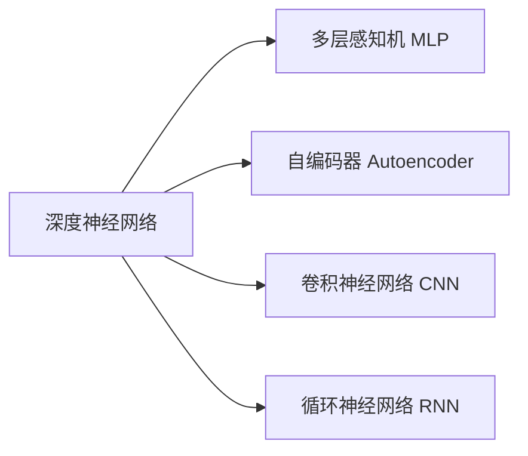
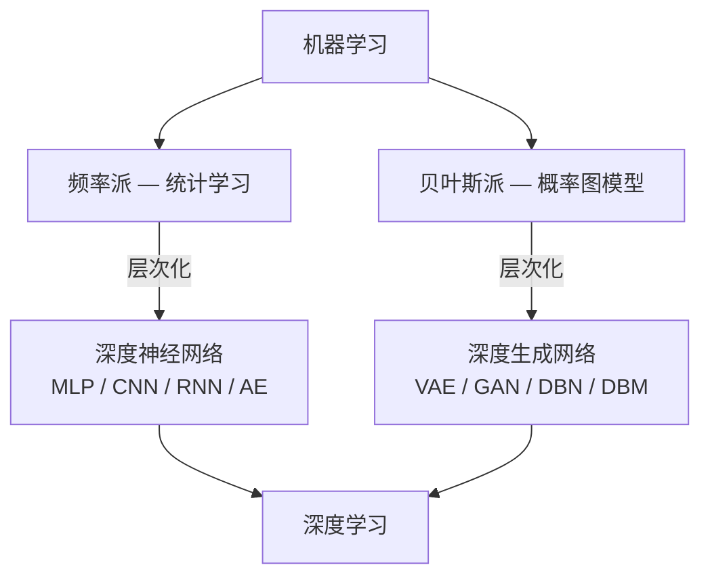
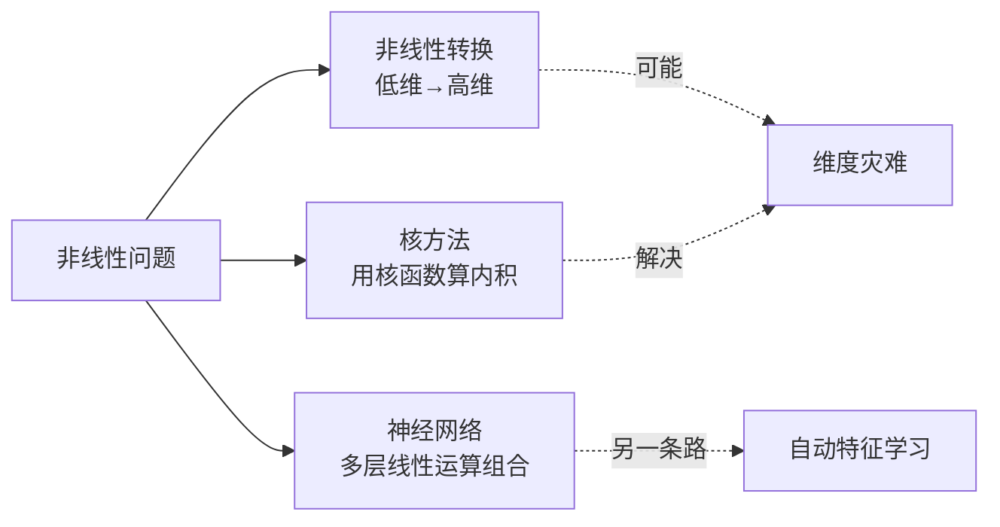

# 前馈神经网络

---

## 一、两派别的延伸

### 1. 频率派 → 统计学习

> [!tip] 通俗理解
> 频率派认为：**数据本身会说话**。参数是固定的未知量，我们通过大量数据去"逼近"真实值。

频率派发展出了一系列经典方法，按照技巧可以分为四大方向：

| 方向      | 核心思想           | 代表方法                          |
| ------- | -------------- | ----------------------------- |
| **正则化** | 给模型加"惩罚"，防止过拟合 | L1（Lasso）、L2（Ridge）           |
| **核化**  | 用核函数把数据映射到高维空间 | 核支撑向量机（Kernel [[6_SVM\|SVM]]） |
| **集成化** | "三个臭皮匠顶个诸葛亮"   | AdaBoost、Random Forest        |
| **层次化** | 像搭积木一样堆叠计算层    | ==神经网络==（本笔记重点）               |

其中**层次化**方向催生了深度神经网络，包括以下代表模型：

### 2. 贝叶斯派 → 概率图模型

> [!tip] 通俗理解
> 贝叶斯派认为：**参数本身也是不确定的**，我们用概率分布来描述它，通过数据不断更新对它的"信念"。

概率图模型按照图的结构分为三种：

| 类型               | 说明            | 层次化后 → 深度生成网络                  |
| ---------------- | ------------- | ------------------------------ |
| **有向图** — 贝叶斯网络  | 节点之间有因果方向     | Sigmoid Belief Network、VAE、GAN |
| **无向图** — 马尔可夫网络 | 节点之间相互关联，没有方向 | 深度玻尔兹曼机                        |
| **混合图**          | 既有有向又有无向      | 深度信念网络                         |

### 3. 总结：深度学习的全景图

> [!important] 关键概念
> **深度学习 = 深度神经网络 + 深度生成网络**
>
> - 深度神经网络来自**频率派**（MLP、CNN、RNN…）
> - 深度生成网络来自**贝叶斯派**（VAE、GAN、DBN…）

---

## 二、从感知机到深度学习（发展简史）

> [!quote] 一句话总结
> 深度学习不是什么"新发明"，而是经过 60 多年起起落落后，在**大数据 + 大算力**的加持下重新崛起的老技术。
### 第一次浪潮：感知机的诞生与幻灭（1958–1969）

#### 1958 — 感知机 (PLA, Perceptron)

> [!info] 感知机
> 感知机是最简单的神经网络——**只有一层**。它接受若干输入，乘以权重后加总，再通过一个阈值函数判断输出是 0 还是 1。
#### 1969 — XOR 问题（第一次寒冬）

Minsky 和 Papert 证明：单层感知机**无法解决 XOR（异或）问题**。

> [!example] XOR 问题直觉
> 想象一个棋盘上有四个点：
> - (0,0) → 0，(1,1) → 0
> - (0,1) → 1，(1,0) → 1
>
> 你无法画出**一条直线**把 0 和 1 分开——这就是 XOR 问题的核心。

这一结论导致整个领域经费骤减，进入"AI 寒冬"。

---

### 第二次浪潮：多层网络与反向传播（1981–1989）

#### 1981 — 多层感知机 (MLP)

> [!success] 关键突破
> 在感知机之间加入**隐藏层**，就能解决 XOR 这类非线性问题了！
#### 1986 — 反向传播 (BP, Backpropagation)

> [!info] 这是什么？
> BP 算法告诉我们如何高效地**从输出误差反推每一层权重应该怎么调整**，让网络越来越准确。

同年，**RNN（循环神经网络）** 也被提出，专门处理序列数据（如文本、语音）。

#### 1989 — CNN + 万能近似定理

- **CNN（卷积神经网络）**：LeCun 提出，专门处理图像，利用局部感受野和参数共享大幅减少参数量。
- **万能近似定理 (Universal Approximation Theorem)**：证明了只要隐藏层足够宽，神经网络可以**拟合任意连续函数**。

> [!warning] 但问题也来了
> - 深层网络训练时会出现**梯度消失**问题——越靠近输入层，梯度越小，权重几乎不更新。
> - 深度和宽度的相对效率还不清楚。

---

### 寒冬再临：传统机器学习的反击（1993–2005）

| 年份        | 方法                   | 为什么抢了 DL 的风头       |
| --------- | -------------------- | ------------------ |
| 1993–1995 | [[6_SVM\|SVM]] + 核方法 | 理论优美、泛化好、凸优化有全局最优解 |
| 1995      | AdaBoost             | 集成学习效果好，易实现        |
| 1995      | Random Forest        | 不容易过拟合，稳定性强        |

> [!note] 第二次寒冬
> 在这段时期，SVM 等方法在实际应用中表现更好，深度学习的研究几乎停滞。只有少数人（如 Hinton、LeCun、Bengio）仍在坚持。

---

### 第三次浪潮：深度学习的全面崛起（2006–至今）

### 2006 — 深度信念网络 (DBN)

> [!success] 复兴起点
> Hinton 提出用**受限玻尔兹曼机 (RBM)** 逐层预训练，再用 BP 微调，有效解决了深层网络的训练问题。

### 2009 — GPU 加速

GPU 的并行计算能力让大规模神经网络训练成为可能，训练速度提升 10–50 倍。

### 2011 — 语音识别突破

深度学习在语音识别领域大幅超越传统方法。

### 2012 — ImageNet 大赛

> [!important] 里程碑事件
> AlexNet（深度 CNN）在 ImageNet 图像分类比赛中把错误率从 26% 降到 ==16%==，震惊学术界和工业界。从此 DL 全面爆发。

### 2013–2018 — 百花齐放

| 年份 | 事件 | 意义 |
|------|------|------|
| 2013 | **VAE**（变分自编码器） | 概率生成模型的新突破 |
| 2014 | **GAN**（生成对抗网络） | 用"对抗博弈"生成逼真数据 |
| 2016 | **AlphaGo** | AI 击败围棋世界冠军李世石 |
| 2018 | **GNN**（图神经网络） | 将 DL 扩展到图结构数据 |

---

### 关键里程碑速览：

| 年份      | 事件                     | 意义                          |
| ------- | ---------------------- | --------------------------- |
| 1958    | PLA 感知机                | 神经网络的"开山之作"                 |
| 1969    | XOR 问题                 | 单层感知机被证明无法解决非线性问题，NN 第一次寒冬  |
| 1981    | MLP 多层感知机              | 多层结构终于能处理非线性                |
| 1986    | BP 反向传播算法              | 让多层网络终于可以训练了                |
| 1989    | CNN + 万能近似定理           | 理论上 NN 能拟合任意函数，但梯度消失问题严重    |
| 1993–95 | SVM / AdaBoost / RF 崛起 | 深度学习进入第二次寒冬                 |
| 2006    | 深度信念网络 (DBN)           | Hinton 用 RBM 预训练破局，DL 复兴的起点 |
| 2012    | ImageNet 竞赛            | AlexNet 大获全胜，DL 全面爆发        |
| 2014    | GAN                    | 生成对抗网络开创全新范式                |
| 2016    | AlphaGo                | AI 击败围棋世界冠军，举世瞩目            |

> [!success] 深度学习近年爆发的三大原因
> 1. 📊 **数据量变大** — 互联网产生的海量数据
> 2. 🖥️ **分布式计算** — 集群和云计算的发展
> 3. ⚡ **硬件算力** — GPU / TPU 的飞速进步

---

## 三、非线性问题的三种解法

> [!question] 什么是非线性问题？
> 简单来说，如果数据不能用一条直线（或超平面）分开，就是非线性问题。比如经典的 XOR 问题。

### 解法一：非线性转换（升维打击）

> [!info] 核心思想
> 把数据从**低维空间**映射到**高维空间**，在高维中线性可分。

#### Cover 定理

> 将复杂的模式分类问题非线性地映射到高维空间，比在低维空间中更可能是线性可分的。

**通俗比喻**：在平面上分不开的两类点，如果我们给每个点"抬起"一个高度（比如 $z = x^2 + y^2$），在三维空间里可能就能用一张平面切开了。

$$
\phi: \mathbb{R}^d \rightarrow \mathbb{R}^D \quad (D \gg d)
$$

> [!warning] 缺点
> 1. **维度灾难**：维度太高，计算量指数增长
> 2. **变换函数难找**：不知道该用什么函数 $\phi$ 来做变换

---

### 解法二：核方法（曲线救国）

> [!info] 核心思想
> 不直接做高维变换，而是用一个**核函数**直接计算两个点在高维空间中的"相似度"（内积），绕过了显式变换。

$$
K(x_i, x_j) = \langle \phi(x_i), \phi(x_j) \rangle
$$

> [!example] 常见核函数
> | 核函数 | 公式 | 适用场景 |
> |--------|------|----------|
> | 线性核 | $K(x,y) = x^T y$ | 线性可分数据 |
> | 多项式核 | $K(x,y) = (x^T y + c)^d$ | 中等复杂度 |
> | RBF/高斯核 | $K(x,y) = e^{-\frac{\|x-y\|^2}{2\sigma^2}}$ | 最常用，万能核 |

> [!success] 优势
> - 回避了维度灾难
> - 不需要知道 $\phi$ 长什么样

> [!warning] 局限
> - 核函数的选择本身也是个难题
> - 大数据集上计算核矩阵代价大（$O(n^2)$）

详见 → [[6_SVM|支撑向量机 SVM]]

---

### 解法三：神经网络（分而治之）

> [!info] 核心思想
> 把一个复杂的非线性运算**拆解**为多层简单的**线性变换 + 非线性激活函数**的组合。

$$
y = f(W_3 \cdot \sigma(W_2 \cdot \sigma(W_1 \cdot x + b_1) + b_2) + b_3)
$$

其中 $\sigma$ 是激活函数（如 ReLU、Sigmoid）。

### 为什么神经网络行得通？

1. **万能近似定理**（1989）：一个足够宽的单隐层网络可以拟合任意连续函数
2. **自动特征学习**：不需要人工设计 $\phi$，网络自己学会怎么变换
3. **端到端训练**：从输入到输出一气呵成，用 BP 算法反向调整每一层

> [!warning] 代价
> - 需要**大量数据**来训练
> - 需要**强大算力**（GPU/TPU）
> - 模型是"黑箱"，可解释性差

| 方法        | 核心思想                               | 优缺点                       |     |
| --------- | ---------------------------------- | ------------------------- | --- |
| **非线性转换** | 把数据从低维"升"到高维（Cover 定理），在高维空间中用直线切开 | ✅ 直观 / ❌ 可能遇到维度灾难，变换函数难找  |     |
| **核方法**   | 不直接做变换，而是用"核函数"计算高维空间的内积           | ✅ 回避维度灾难 / ❌ 计算量大，核函数选择困难 |     |
| **神经网络**  | 把复杂运算**拆解**为多层简单线性运算 + 激活函数的组合     | ✅ 自动学习特征 / ❌ 需要大量数据和算力    |     |

---

