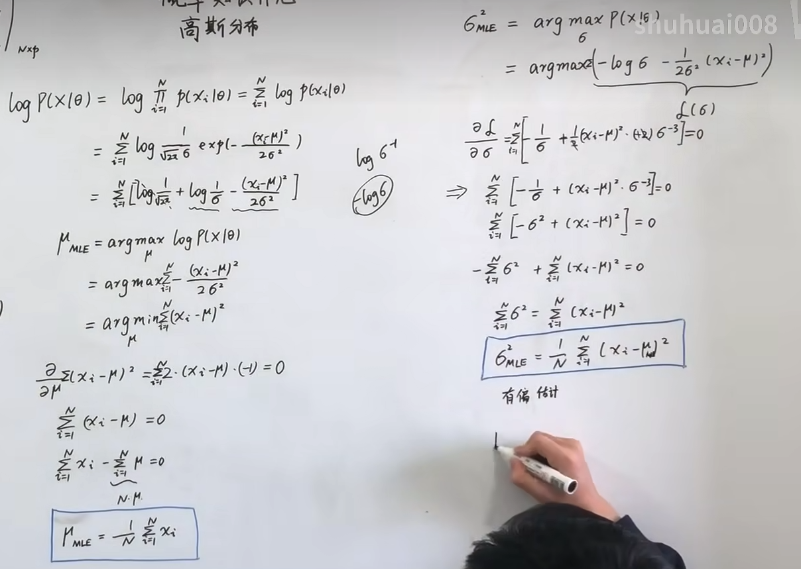
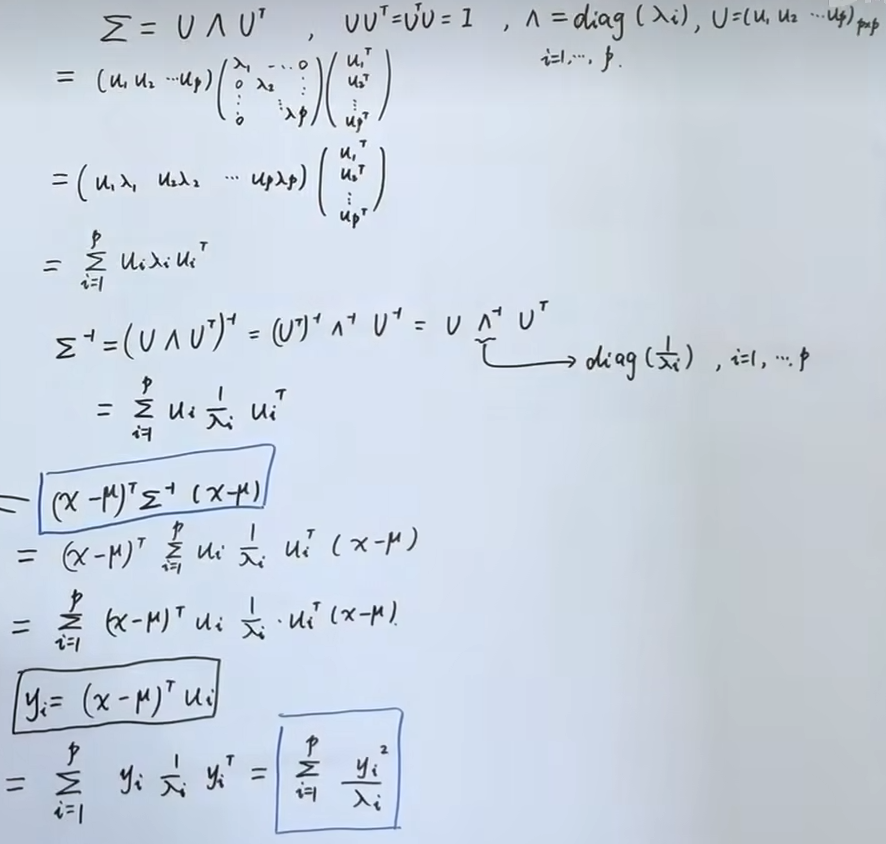

# 高斯分布

高斯分布（正态分布）在机器学习中占有举足轻重的地位。后续的很多模型（线性回归、高斯判别分析、高斯混合模型、高斯过程等）都以高斯分布为基础。选择高斯分布的原因在于：

1. 中心极限定理保证了大量独立随机变量之和趋近于高斯分布
2. 在给定均值和方差的条件下，高斯分布是熵最大的分布（最大熵原理，详见 [[EFD|EFD]]）
3. 数学性质良好，便于解析求解

## 一维情况

### 概率密度函数

一维高斯分布的概率密度函数（PDF）为：

$$
p(x|\mu,\sigma^{2})=\frac{1}{\sqrt{2\pi}\sigma}\exp\left(-\frac{(x-\mu)^{2}}{2\sigma^{2}}\right)
$$

其中参数 $\theta=(\mu,\sigma^{2})$，$\mu$ 为均值，$\sigma^{2}$ 为方差。记为 $x\sim\mathcal{N}(\mu,\sigma^{2})$。

### MLE 参数估计

在 $N$ 个一维样本 $X=\{x_1,x_2,\cdots,x_N\}$ 的情况下，用最大似然估计（MLE）进行参数推导。

对数似然函数为：

$$
\log p(X|\theta)=\sum\limits_{i=1}^{N}\log p(x_i|\theta)=\sum\limits_{i=1}^{N}\left[-\frac{1}{2}\log 2\pi-\frac{1}{2}\log\sigma^{2}-\frac{(x_i-\mu)^{2}}{2\sigma^{2}}\right]
$$

**求 $\mu_{MLE}$**：对 $\mu$ 求导并令其为零：

$$
\frac{\partial}{\partial\mu}\log p(X|\theta)=\sum\limits_{i=1}^{N}\frac{x_i-\mu}{\sigma^{2}}=0
$$

得到：

$$
\mu_{MLE}=\frac{1}{N}\sum\limits _{i=1}^{N}x_{i}
$$

**求 $\sigma^{2}_{MLE}$**：对 $\sigma^{2}$ 求导并令其为零：

$$
\frac{\partial}{\partial\sigma^{2}}\log p(X|\theta)=\sum\limits_{i=1}^{N}\left[-\frac{1}{2\sigma^{2}}+\frac{(x_i-\mu)^{2}}{2\sigma^{4}}\right]=0
$$

得到：

$$
\sigma_{MLE}^{2}=\frac{1}{N}\sum\limits _{i=1}^{N}(x_{i}-\mu_{MLE})^{2}
$$

推导过程见白板：

### 无偏性与有偏性分析

> [!important] 核心结论
> $\mu_{MLE}$ 是**无偏估计**，$\sigma^{2}_{MLE}$ 是**有偏估计**（偏小）。

**均值的无偏性**：

$$
\mathbb{E}[\mu_{MLE}]=\mathbb{E}\left[\frac{1}{N}\sum\limits_{i=1}^{N}x_i\right]=\frac{1}{N}\sum\limits_{i=1}^{N}\mathbb{E}[x_i]=\frac{1}{N}\cdot N\mu=\mu
$$

所以 $\mu_{MLE}$ 是无偏估计。

**方差的有偏性**：

$$
\begin{aligned}
\mathbb{E}[\sigma_{MLE}^{2}]&=\mathbb{E}\left[\frac{1}{N}\sum\limits_{i=1}^{N}(x_i-\mu_{MLE})^{2}\right]\\
&=\mathbb{E}\left[\frac{1}{N}\sum\limits_{i=1}^{N}\left((x_i-\mu)-(\mu_{MLE}-\mu)\right)^{2}\right]\\
&=\mathbb{E}\left[\frac{1}{N}\sum\limits_{i=1}^{N}(x_i-\mu)^{2}-2(\mu_{MLE}-\mu)\frac{1}{N}\sum\limits_{i=1}^{N}(x_i-\mu)+(\mu_{MLE}-\mu)^{2}\right]\\
&=\mathbb{E}\left[\frac{1}{N}\sum\limits_{i=1}^{N}(x_i-\mu)^{2}-(\mu_{MLE}-\mu)^{2}\right]\\
&=\sigma^{2}-\frac{\sigma^{2}}{N}=\frac{N-1}{N}\sigma^{2}
\end{aligned}
$$

> [!tip] 直觉理解
> $\sigma^{2}_{MLE}$ 偏小的原因是：它使用的是**样本均值** $\mu_{MLE}$ 而非**真实均值** $\mu$ 来计算方差。样本均值本身就是使数据离差平方和最小的点，因此用它算出的方差天然偏小。无偏修正为 $\hat{\sigma}^{2}=\frac{1}{N-1}\sum_{i=1}^{N}(x_i-\mu_{MLE})^{2}$。

## 多维情况

多维指的是将原先研究的单个变量扩展为多个变量（$p$ 维）。需要注意的是，多维高斯分布并不是简单地将几个一维高斯分布拼接，因为变量之间可能存在**相关性**。

### 概率密度函数

$$
p(x|\mu,\Sigma)=\frac{1}{(2\pi)^{p/2}|\Sigma|^{1/2}}\exp\left(-\frac{1}{2}(x-\mu)^{T}\Sigma^{-1}(x-\mu)\right)
$$

其中：
- $x\in\mathbb{R}^{p}$：$p$ 维随机向量
- $\mu\in\mathbb{R}^{p}$：均值向量，各分量的均值
- $\Sigma\in\mathbb{R}^{p\times p}$：协方差矩阵（对称正定），描述各分量之间的相关性及各自的方差

### 马氏距离与几何解释

指数部分 $(x-\mu)^{T}\Sigma^{-1}(x-\mu)$ 是一个**二次型**（标量），定义了 $x$ 和 $\mu$ 之间的**马氏距离**（Mahalanobis Distance）。

> [!note] 马氏距离 vs 欧氏距离
> 欧氏距离对各分量等权处理，而马氏距离通过 $\Sigma^{-1}$ 考虑了变量之间的相关性和各变量的尺度差异。当 $\Sigma=\mathbb{I}$ 时，马氏距离退化为欧氏距离。

协方差矩阵是对称正定的，可进行**特征值分解**：

$$
\Sigma=U\Lambda U^T=\sum\limits _{i=1}^{p}u_{i}\lambda_{i}u_{i}^{T}
$$

其中 $U=(u_1,u_2,\cdots,u_p)$ 为正交矩阵，$\lambda_i>0$ 为特征值。对应地：

$$
\Sigma^{-1}=\sum\limits _{i=1}^{p}u_{i}\frac{1}{\lambda_{i}}u_{i}^{T}
$$

将其代入马氏距离：

$$
\Delta=(x-\mu)^{T}\Sigma^{-1}(x-\mu)=\sum\limits _{i=1}^{p}(x-\mu)^{T}u_{i}\frac{1}{\lambda_{i}}u_{i}^{T}(x-\mu)=\sum\limits _{i=1}^{p}\frac{y_{i}^{2}}{\lambda_{i}}
$$

其中 $y_i=u_i^T(x-\mu)$ 是 $x-\mu$ 在特征向量 $u_i$ 上的**投影长度**。

求解过程见白板：

因此 $\Delta=C$（常数）定义了以 $\mu$ 为中心的**同心椭圆**（椭球），椭圆的主轴方向由特征向量 $u_i$ 确定，轴长与 $\sqrt{\lambda_i}$ 成正比。

### 局限性

1. **参数过多**：$\Sigma$ 的自由参数数量为 $\frac{p(p+1)}{2}=O(p^{2})$，维度高时参数量过大。
   - 解决方案一：假设 $\Sigma$ 为**对角矩阵**（各分量独立），对应算法如 **Factor Analysis**
   - 解决方案二：假设 $\Sigma=\sigma^{2}\mathbb{I}$（各向同性），对应算法如 **概率 PCA（p-PCA）**
2. **单峰性**：单个高斯分布是单峰的，无法拟合多峰数据分布。
   - 解决方案：**高斯混合模型（GMM）**，详见 [[../9_GMM/9_GMM|GMM]]

## 已知联合概率分布求边缘概率分布与条件概率分布

将 $p$ 维变量 $x$ 分为两个子集：

$$
x=\begin{pmatrix}x_a\\x_b\end{pmatrix},\quad
\mu=\begin{pmatrix}\mu_a\\\mu_b\end{pmatrix},\quad
\Sigma=\begin{pmatrix}\Sigma_{aa}&\Sigma_{ab}\\\Sigma_{ba}&\Sigma_{bb}\end{pmatrix}
$$

其中 $x_a\in\mathbb{R}^m,\ x_b\in\mathbb{R}^n,\ m+n=p$。已知 $x\sim\mathcal{N}(\mu,\Sigma)$。

**目标**：求边缘概率 $p(x_a),p(x_b)$ 和条件概率 $p(x_a|x_b),p(x_b|x_a)$。

### 高斯线性变换定理

> [!abstract] 定理
> 已知 $x\sim\mathcal{N}(\mu,\Sigma)$，$y=Ax+b$，那么 $y\sim\mathcal{N}(A\mu+b,\ A\Sigma A^T)$。
>
> **证明**：$\mathbb{E}[y]=\mathbb{E}[Ax+b]=A\mathbb{E}[x]+b=A\mu+b$
>
> $Var[y]=Var[Ax+b]=Var[Ax]=A\cdot Var[x]\cdot A^T=A\Sigma A^T$

### 1. 边缘概率分布

$x_a$ 可以表示为 $x$ 的线性变换：

$$
x_a=\begin{pmatrix}\mathbb{I}_{m\times m}&\mathbb{O}_{m\times n}\end{pmatrix}\begin{pmatrix}x_a\\x_b\end{pmatrix}
$$

代入定理得到：

$$
\mathbb{E}[x_a]=\begin{pmatrix}\mathbb{I}&\mathbb{O}\end{pmatrix}\begin{pmatrix}\mu_a\\\mu_b\end{pmatrix}=\mu_a
$$

$$
Var[x_a]=\begin{pmatrix}\mathbb{I}&\mathbb{O}\end{pmatrix}\begin{pmatrix}\Sigma_{aa}&\Sigma_{ab}\\\Sigma_{ba}&\Sigma_{bb}\end{pmatrix}\begin{pmatrix}\mathbb{I}\\\mathbb{O}\end{pmatrix}=\Sigma_{aa}
$$

> [!success] 结论
> $$x_a\sim\mathcal{N}(\mu_a,\Sigma_{aa}),\quad x_b\sim\mathcal{N}(\mu_b,\Sigma_{bb})$$

### 2. 条件概率分布

为求条件概率，我们引入三个辅助量（构造性求解）：

$$
x_{b\cdot a}=x_b-\Sigma_{ba}\Sigma_{aa}^{-1}x_a
$$

$$
\mu_{b\cdot a}=\mu_b-\Sigma_{ba}\Sigma_{aa}^{-1}\mu_a
$$

$$
\Sigma_{bb\cdot a}=\Sigma_{bb}-\Sigma_{ba}\Sigma_{aa}^{-1}\Sigma_{ab}
$$

> [!info] Schur 补
> $\Sigma_{bb\cdot a}=\Sigma_{bb}-\Sigma_{ba}\Sigma_{aa}^{-1}\Sigma_{ab}$ 称为 $\Sigma_{bb}$ 关于 $\Sigma_{aa}$ 的 **Schur Complementary（舒尔补）**。它在矩阵分块求逆中有重要作用。

将 $x_{b\cdot a}$ 写成线性变换形式：

$$
x_{b\cdot a}=\begin{pmatrix}-\Sigma_{ba}\Sigma_{aa}^{-1}&\mathbb{I}_{n\times n}\end{pmatrix}\begin{pmatrix}x_a\\x_b\end{pmatrix}
$$

代入定理：

$$
\mathbb{E}[x_{b\cdot a}]=\begin{pmatrix}-\Sigma_{ba}\Sigma_{aa}^{-1}&\mathbb{I}\end{pmatrix}\begin{pmatrix}\mu_a\\\mu_b\end{pmatrix}=\mu_{b\cdot a}
$$

$$
Var[x_{b\cdot a}]=\begin{pmatrix}-\Sigma_{ba}\Sigma_{aa}^{-1}&\mathbb{I}\end{pmatrix}\begin{pmatrix}\Sigma_{aa}&\Sigma_{ab}\\\Sigma_{ba}&\Sigma_{bb}\end{pmatrix}\begin{pmatrix}-\Sigma_{aa}^{-1}\Sigma_{ba}^T\\\mathbb{I}\end{pmatrix}=\Sigma_{bb\cdot a}
$$

因此 $x_{b\cdot a}\sim\mathcal{N}(\mu_{b\cdot a},\ \Sigma_{bb\cdot a})$。

由定义可知 $x_b=x_{b\cdot a}+\Sigma_{ba}\Sigma_{aa}^{-1}x_a$。

> [!note] 关键：$x_{b\cdot a}$ 与 $x_a$ 的独立性
> 可以验证 $Cov(x_{b\cdot a},x_a)=0$：
>
> $$Cov(x_{b\cdot a},x_a)=Cov(x_b-\Sigma_{ba}\Sigma_{aa}^{-1}x_a,\ x_a)=\Sigma_{ba}-\Sigma_{ba}\Sigma_{aa}^{-1}\Sigma_{aa}=0$$
>
> 由于 $x_{b\cdot a}$ 和 $x_a$ 联合高斯且协方差为零，所以它们**相互独立**。这是后续推导条件分布的关键。

因此，给定 $x_a$ 后，$x_b=x_{b\cdot a}+\Sigma_{ba}\Sigma_{aa}^{-1}x_a$ 中只有 $x_{b\cdot a}$ 是随机的，再由定理可得：

> [!success] 结论
> $$\mathbb{E}[x_b|x_a]=\mu_{b\cdot a}+\Sigma_{ba}\Sigma_{aa}^{-1}x_a=\mu_b+\Sigma_{ba}\Sigma_{aa}^{-1}(x_a-\mu_a)$$
>
> $$Var[x_b|x_a]=\Sigma_{bb\cdot a}=\Sigma_{bb}-\Sigma_{ba}\Sigma_{aa}^{-1}\Sigma_{ab}$$
>
> 即 $x_b|x_a\sim\mathcal{N}\left(\mu_b+\Sigma_{ba}\Sigma_{aa}^{-1}(x_a-\mu_a),\ \Sigma_{bb}-\Sigma_{ba}\Sigma_{aa}^{-1}\Sigma_{ab}\right)$

> [!tip] 观察
> - 条件均值 $\mathbb{E}[x_b|x_a]$ 是 $x_a$ 的**线性函数**
> - 条件方差 $Var[x_b|x_a]$ 与 $x_a$ 的取值**无关**，仅取决于协方差结构

同理可得 $x_a|x_b\sim\mathcal{N}\left(\mu_a+\Sigma_{ab}\Sigma_{bb}^{-1}(x_b-\mu_b),\ \Sigma_{aa}-\Sigma_{ab}\Sigma_{bb}^{-1}\Sigma_{ba}\right)$。

## 求解线性高斯模型

**问题**：已知 $p(x)=\mathcal{N}(\mu,\Lambda^{-1})$，$p(y|x)=\mathcal{N}(Ax+b,L^{-1})$，求解 $p(y)$ 和 $p(x|y)$。

> [!note] 说明
> 这里使用**精度矩阵**（precision matrix）$\Lambda=\Sigma^{-1}$ 和 $L$ 来参数化，这在贝叶斯推断中更为自然。$y$ 是 $x$ 的含噪声线性变换。

### 求 $p(y)$

令 $y=Ax+b+\epsilon$，其中 $\epsilon\sim\mathcal{N}(0,L^{-1})$ 且 $\epsilon$ 与 $x$ 独立。

由定理可得 $Ax+b\sim\mathcal{N}(A\mu+b,\ A\Lambda^{-1}A^T)$，再加上独立噪声：

$$
y\sim\mathcal{N}(A\mu+b,\ L^{-1}+A\Lambda^{-1}A^T)
$$

### 求 $p(x|y)$

引入联合变量 $z=\begin{pmatrix}x\\y\end{pmatrix}$，需要确定 $z$ 的联合分布。

均值为 $\mathbb{E}[z]=\begin{pmatrix}\mu\\A\mu+b\end{pmatrix}$，方差的对角块已知，需要计算交叉协方差：

$$
Cov(x,y)=\mathbb{E}[(x-\mu)(y-\mathbb{E}[y])^T]=\mathbb{E}[(x-\mu)(Ax-A\mu+\epsilon)^T]
$$

由于 $x$ 与 $\epsilon$ 独立，$\mathbb{E}[(x-\mu)\epsilon^T]=0$，所以：

$$
Cov(x,y)=\mathbb{E}[(x-\mu)(x-\mu)^T]A^T=\Lambda^{-1}A^T
$$

由协方差矩阵的对称性 $Cov(y,x)=Cov(x,y)^T=A\Lambda^{-1}$，联合分布为：

$$
z\sim\mathcal{N}\left(\begin{pmatrix}\mu\\A\mu+b\end{pmatrix},\begin{pmatrix}\Lambda^{-1}&\Lambda^{-1}A^T\\A\Lambda^{-1}&L^{-1}+A\Lambda^{-1}A^T\end{pmatrix}\right)
$$

根据前一节条件概率的公式，代入可得：

> [!success] 结论
> $$\mathbb{E}[x|y]=\mu+\Lambda^{-1}A^T(L^{-1}+A\Lambda^{-1}A^T)^{-1}(y-A\mu-b)$$
>
> $$Var[x|y]=\Lambda^{-1}-\Lambda^{-1}A^T(L^{-1}+A\Lambda^{-1}A^T)^{-1}A\Lambda^{-1}$$

白板推导过程：

![[2.3.png]]

## 小结

| 问题                 | 结论                                                                                                                                                   |
| ------------------ | ---------------------------------------------------------------------------------------------------------------------------------------------------- |
| 边缘概率 $p(x_a)$      | $\mathcal{N}(\mu_a,\Sigma_{aa})$                                                                                                                     |
| 条件概率 $p(x_b\|x_a)$ | $\mathcal{N}(\mu_b+\Sigma_{ba}\Sigma_{aa}^{-1}(x_a-\mu_a),\ \Sigma_{bb}-\Sigma_{ba}\Sigma_{aa}^{-1}\Sigma_{ab})$                                     |
| 边缘概率 $p(y)$        | $\mathcal{N}(A\mu+b,\ L^{-1}+A\Lambda^{-1}A^T)$                                                                                                      |
| 后验概率 $p(x\|y)$     | $\mathcal{N}(\mu+\Lambda^{-1}A^T(L^{-1}+A\Lambda^{-1}A^T)^{-1}(y-A\mu-b),\ \Lambda^{-1}-\Lambda^{-1}A^T(L^{-1}+A\Lambda^{-1}A^T)^{-1}A\Lambda^{-1})$ |

> [!abstract] 本章核心思路
> 整章的关键工具是**高斯线性变换定理**：**高斯分布经线性变换后仍为高斯分布**。利用这一性质，边缘分布和条件分布的推导都化为构造合适的线性变换。这些结论将在后续的 [[贝叶斯线性回归]]、 [[高斯过程回归笔记]] 和 [[高斯网络]]  中反复使用。
********