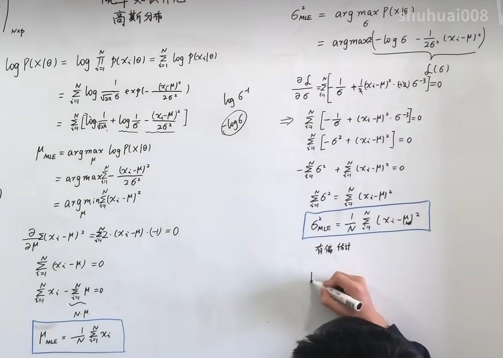
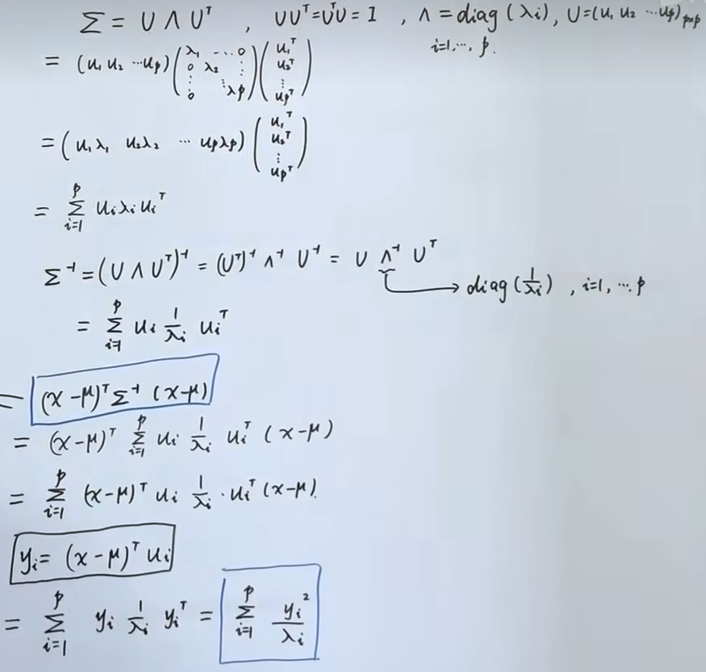
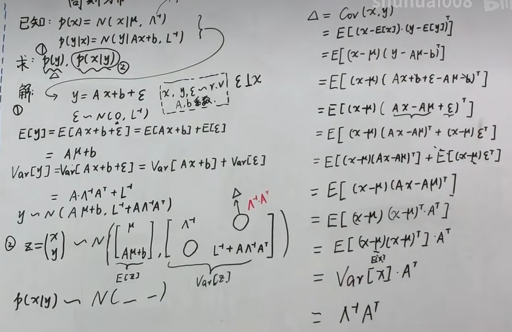

# Introduction

机器学习的目的是学习描述数据的模型，那么很自然的就可以将概率引入到机器学习中，因为可以认为$X$是符合一种概率模型，这个模型可以参数化为$\theta$,对于一组数据$X$:

$$
X_{N\times p}=(x_{1},x_{2},\cdots,x_{N})^{T},x_{i}=(x_{i1},x_{i2},\cdots,x_{ip})
$$

表示这组数据有$N$个样本，每个样本都是$p$维向量。其中每个观测都是由 $p(x|\theta)$ 生成的。那么怎么根据这组样本去求概率模型$p(x|\theta)$，也就是去解$\theta$就是机器学习的主要任务。

而关于怎么求解，可以分为**频率派**和**贝叶斯派**两个主要观点

## 频率派的观点

$\theta$：未知的常量

$X$：随机变量

有随机变量，估计概率模型的常量，就用概率论必考一个大题的那个方法**最大似然（MLE）**

$$
\theta_{MLE}=\mathop{argmax}\limits _{\theta}\log p(X|\theta)\mathop{=}\limits _{iid}\mathop{argmax}\limits _{\theta}\sum\limits _{i=1}^{N}\log p(x_{i}|\theta)
$$

**本质：是一个优化问题**

## 贝叶斯派的观点

$\theta$：也是随机变量，服从概率分布 $\theta\sim p(\theta)$（先验）

那么先通过贝叶斯定理（后验$\sim$似然$\times$先验）将各概率联系起来：

$$
p(\theta|X)=\frac{p(X|\theta)\cdot p(\theta)}{p(X)}=\frac{p(X|\theta)\cdot p(\theta)}{\int\limits _{\theta}p(X|\theta)\cdot p(\theta)d\theta}
$$

我们要最大化这个参数后验，也就是取最能描述样本特点的$\theta$，使用后验概率最大MAP：

$$
\theta_{MAP}=\mathop{argmax}\limits _{\theta}p(\theta|X)=\mathop{argmax}\limits _{\theta}p(X|\theta)\cdot p(\theta)
$$

求解这个$\theta$，也就得到了参数的后验概率$p(\theta|X)$。

那么解了有什么用呢，可以求新数据属于原数据的概率，也就是做预测贝叶斯预测：

$$
p(x_{new}|X)=\int\limits _{\theta}p(x_{new}|\theta)\cdot p(\theta|X)d\theta
$$

**本质：关键是求后验，本质是求积分，延伸出概率图模型**

# 高斯分布

这里要将高斯分布（正态）是因为后面有很多数据处理是参照高斯分布的。

## 一维情况

首先在$N$个一维样本情况下，对于参数 $\theta=(\mu,\sigma^{2})$,可以用 MLE 方法中进行推导，得到：

$$
\mu_{MLE}=\frac{1}{N}\sum\limits _{i=1}^{N}x_{i}
$$

$$
\sigma_{MLE}^{2}=\frac{1}{N}\sum\limits _{i=1}^{N}(x_{i}-\mu)^{2}
$$

这里推导过程如下：

注意：这里值得注意的是均值是无偏的，而方差是有偏（对方差求均值得到的是$\frac{N-1}{N}\sigma$）,估计小了，因为他是依据样本均值求得方差

## 多维情况

多维指的是原先研究单个变量变成了多个，但并不是简单几个一维高斯分布拼接在一起就能符合多维高斯分布的，这多个变量是符合一个表达式：

$$
p(x|\mu,\Sigma)=\frac{1}{(2\pi)^{p/2}|\Sigma|^{1/2}}e^{-\frac{1}{2}(x-\mu)^{T}\Sigma^{-1}(x-\mu)}
$$

其中 $\mu\in\mathbb{R}^{p}$为各分量的均值

$\Sigma\in\mathbb{R}^{p\times p}$ ，为协方差矩阵，描述各分量之间的相关性及各自的方差

首先我们看指数部分，这是一个二次型，是一个数，可以记为 $x$ 和 $\mu$ 之间的马氏距离。

而协方差矩阵是对称的，所以可进行特征值分解，有：

$$
\Sigma=\sum\limits _{i=1}^{p}u_{i}\lambda_{i}u_{i}^{T}
$$

$$
\Sigma^{-1}=\sum\limits _{i=1}^{p}u_{i}\frac{1}{\lambda_{i}}u_{i}^{T}
$$

对应可以求得

$$
\Delta=(x-\mu)^{T}\Sigma^{-1}(x-\mu)=\sum\limits _{i=1}^{p}(x-\mu)^{T}u_{i}\frac{1}{\lambda_{i}}u_{i}^{T}(x-\mu)=\sum\limits _{i=1}^{p}\frac{y_{i}^{2}}{\lambda_{i}}
$$

求解过程见：

我们注意到 $y_{i}$ 是 $x-\mu$ 在特征向量 $u_{i}$ 上的投影长度，因此上式子就是 $\Delta$ 取不同值时的同心椭圆。

## 局限性

1. 参数 $\Sigma$ 的数量为 $O(p^{2})$ 太多了。
   解决方案：假设其是对角矩阵，甚至可以假设对角值相等。
2. 第二个问题是单个高斯分布是单峰的，对有多个峰的数据分布不能得到好的结果。
   解决方案：高斯混合GMM模型。

## 已知联合概率分布求边缘概率分布与条件概率分布

我们将多维变量分为两个子集

$x=(x_1, x_2,\cdots,x_p)^T=(x_{a,m\times 1}, x_{b,n\times1})^T,\mu=(\mu_{a,m\times1}, \mu_{b,n\times1}),\Sigma=\begin{pmatrix}\Sigma_{aa}&\Sigma_{ab}\\\Sigma_{ba}&\Sigma_{bb}\end{pmatrix}$，已知 $x\sim\mathcal{N}(\mu,\Sigma)$

那么怎么求 边缘概率分布$p(x_a),p(x_b)$ 和条件概率分布 $p(x_a|x_b),p(x_b|x_a)$

首先引入一个定理：

> 定理：已知 $x\sim\mathcal{N}(\mu,\Sigma), y\sim Ax+b$，那么 $y\sim\mathcal{N}(A\mu+b, A\Sigma A^T)$。
> 
> 证明：$\mathbb{E}[y]=\mathbb{E}[Ax+b]=A\mathbb{E}[x]+b=A\mu+b$，$Var[y]=Var[Ax+b]=Var[Ax]=A\cdot Var[x]\cdot A^T$。

1. **对于边缘概率**，$x_a=\begin{pmatrix}\mathbb{I}_{m\times m}&\mathbb{O}_{m\times n})\end{pmatrix}\begin{pmatrix}x_a\\x_b\end{pmatrix}$，代入定理中得到：
   
   $$
   \mathbb{E}[x_a]=\begin{pmatrix}\mathbb{I}&\mathbb{O}\end{pmatrix}\begin{pmatrix}\mu_a\\\mu_b\end{pmatrix}=\mu_a\\
   Var[x_a]=\begin{pmatrix}\mathbb{I}&\mathbb{O}\end{pmatrix}\begin{pmatrix}\Sigma_{aa}&\Sigma_{ab}\\\Sigma_{ba}&\Sigma_{bb}\end{pmatrix}\begin{pmatrix}\mathbb{I}\\\mathbb{O}\end{pmatrix}=\Sigma_{aa}
   $$
   
   所以 $x_a\sim\mathcal{N}(\mu_a,\Sigma_{aa})$。同样的，$x_b\sim\mathcal{N}(\mu_b,\Sigma_{bb})$
2. **对于条件概率**，我们引入三个量（构造性求解：先别管为什么，引入了确实能推出来）：
   
   $$
   x_{b\cdot a}=x_b-\Sigma_{ba}\Sigma_{aa}^{-1}x_a\\
   \mu_{b\cdot a}=\mu_b-\Sigma_{ba}\Sigma_{aa}^{-1}\mu_a\\
   \Sigma_{bb\cdot a}=\Sigma_{bb}-\Sigma_{ba}\Sigma_{aa}^{-1}\Sigma_{ab}
   $$
   
   特别的，最后一个式子叫做 $\Sigma_{bb}$ 的 Schur Complementary。可以看到：
   
   $$
   x_{b\cdot a}=\begin{pmatrix}-\Sigma_{ba}\Sigma_{aa}^{-1}&\mathbb{I}_{n\times n}\end{pmatrix}\begin{pmatrix}x_a\\x_b\end{pmatrix}
   $$
   
   所以：
   
   $$
   \mathbb{E}[x_{b\cdot a}]=\begin{pmatrix}-\Sigma_{ba}\Sigma_{aa}^{-1}&\mathbb{I}_{n\times n}\end{pmatrix}\begin{pmatrix}\mu_a\\\mu_b\end{pmatrix}=\mu_{b\cdot a}\\
   Var[x_{b\cdot a}]=\begin{pmatrix}-\Sigma_{ba}\Sigma_{aa}^{-1}&\mathbb{I}_{n\times n}\end{pmatrix}\begin{pmatrix}\Sigma_{aa}&\Sigma_{ab}\\\Sigma_{ba}&\Sigma_{bb}\end{pmatrix}\begin{pmatrix}-\Sigma_{aa}^{-1}\Sigma_{ba}^T\\\mathbb{I}_{n\times n}\end{pmatrix}=\Sigma_{bb\cdot a}
   $$
   
   这样得到了$x_{b\cdot a} \sim N(\mu_{b \cdot a}, \Sigma_{bb\cdot a})$,那么怎么求$x_{b\cdot a}$可以发现，通过定义的第一个量可以得到 $x_b=x_{b\cdot a}+\Sigma_{ba}\Sigma_{aa}^{-1}x_a$，那么再带入定理就有(这里$x_b$到后面要证明一个相互独立，这里略过了)
   
   $$
   \mathbb{E}[x_b|x_a]=\mu_{b\cdot a}+\Sigma_{ba}\Sigma_{aa}^{-1}x_a
   $$
   
   $$
   Var[x_b|x_a]=\Sigma_{bb\cdot a}
   $$

## 联合概率分布

**问题 已知：$p(x)=\mathcal{N}(\mu,\Lambda^{-1}),p(y | x)=\mathcal{N}(Ax+b,L^{-1})$，求解：$p(y),p(x∣y)$。其中$y$为$x$的线性变换**

令 $y=Ax+b+\epsilon,\epsilon\sim\mathcal{N}(0,L^{-1})$,带入之前那个定理，就有

$$
y \sim N(Aμ+b,L−1+AΛ−1AT)
$$

对于$p(x∣y)$，引入 $z=\begin{pmatrix}x\\y\end{pmatrix}$，那么根据联合概率分布，这个$z$就是符合$p(z)=(\mathcal{N}\begin{pmatrix}\mu\\A\mu+b\end{pmatrix},\begin{pmatrix}\Lambda^{-1}&?\\?&L^{-1}+A\Lambda^{-1}A^T\end{pmatrix})$

$?$就是协方差吗，我们可以计算

$Cov[x,y]=\mathbb{E}[(x-\mathbb{E}[x])(y-\mathbb{E}[y])^T]$

$Cov(x,y)=\mathbb{E}[(x-\mu)(Ax-A\mu+\epsilon)^T]=\mathbb{E}[(x-\mu)(x-\mu)^TA^T]=Var[x]A^T=\Lambda^{-1}A^T$

注意到协方差矩阵的对称性，所以 $p(z)=\mathcal{N}\begin{pmatrix}\mu\\A\mu+b\end{pmatrix},\begin{pmatrix}\Lambda^{-1}&\Lambda^{-1}A^T\\A\Lambda^{-1}&L^{-1}+A\Lambda^{-1}A^T\end{pmatrix})$。

根据之前的公式，我们可以得到：

$$
\mathbb{E}[x|y]=\mu+\Lambda^{-1}A^T(L^{-1}+A\Lambda^{-1}A^T)^{-1}(y-A\mu-b)
$$

$$
Var[x|y]=\Lambda^{-1}-\Lambda^{-1}A^T(L^{-1}+A\Lambda^{-1}A^T)^{-1}A\Lambda^{-1}
$$

