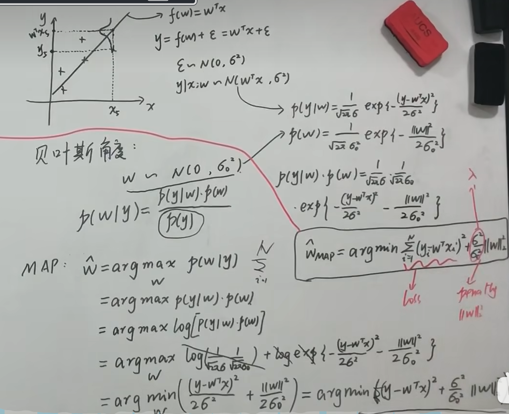

# 线性回归

假设数据集为：

$$
\mathcal{D}=\{(x_1, y_1),(x_2, y_2),\cdots,(x_N, y_N)\}
$$

后面我们记：

$$
X=(x_1,x_2,\cdots,x_N)^T,Y=(y_1,y_2,\cdots,y_N)^T
$$

其中，$X$是$N$个$P$维，也就是$N$行$P$列，$Y$则是$N$行列线性回归假设：

$$
f(w)=w^Tx
$$

## 最小二乘法

对这个问题，采用二范数定义的平方误差来定义损失函数：

$$
L(w)=\sum\limits_{i=1}^N||w^Tx_i-y_i||^2_2
$$

展开有$L(w)=w^TX^TXw-2w^TX^TY+Y^TY$

最小化这个值的 $ \hat{w}$ ：

$$
\hat{w}=\mathop{argmin}\limits_wL(w)\longrightarrow\frac{\partial}{\partial w}L(w)=0 \longrightarrow2X^TX\hat{w}-2X^TY=0 \longrightarrow \hat{w}=(X^TX)^{-1}X^TY=X^+Y
$$

这个式子中 $(X^TX)^{-1}X^T$ 又被称为伪逆(满足四个Moore-Penrose条件)。

## 噪声为高斯分布的 MLE

对于一维的情况，记 $y=w^Tx+\epsilon,\epsilon\sim\mathcal{N}(0,\sigma^2)$，那么 $y\sim\mathcal{N}(w^Tx,\sigma^2)$。

这样可以认为$y$是服从$w$为参数的概率模型,代入极大似然估计中：

$$
L(w)=\log p(Y|X,w)=\log\prod\limits_{i=1}^Np(y_i|x_i,w)
=\sum\limits_{i=1}^N\log(\frac{1}{\sqrt{2\pi\sigma}}e^{-\frac{(y_i-w^Tx_i)^2}{2\sigma^2}})
=\sum\limits_{i=1}^N(\log\frac{1}{\sqrt{2\pi\sigma}}-\frac{(y_i-w^Tx_i)^2}{2\sigma^2})
$$

$\mathop{argmax}\limits_wL(w)=\mathop{argmin}\limits_w\sum\limits_{i=1^N}(y_i-w^Tx_i)^2$

这个表达式和最小二乘估计得到的结果一样，也就是说LSM等价于MLE,noise是高斯分布。

## 正则化

**存在问题**：对于$(X^TX)^{-1}X^T$，如果$X$不可逆怎么办，也就是样本没那么多，或者维度太大，导致不满秩，很可能造成过拟合

**解决方案：**

1. 加数据
2. 特征选择，降低特征维度（如 PCA 算法）。
3. 正则化（相当于对$w$加个约束）

正则化一般是在损失函数（如上面介绍的最小二乘损失）上加入正则化项（表示模型的复杂度对模型的惩罚），下面我们介绍一般情况下的两种正则化框架。

$$
L1:\mathop{argmin}\limits_wL(w)+\lambda||w||_1,\lambda\gt0
$$

$$
L2:\mathop{argmin}\limits_wL(w)+\lambda||w||^2_2,\lambda \gt 0
$$

下面对最小二乘误差分别分析这两者的区别。

### L1 Lasso

L1正则化可以引起稀疏解。

从最小化损失的角度看，由于 L1 项求导在0附近的左右导数都不是0，因此更容易取到0解。

从另一个方面看，L1 正则化相当于：

$$
\mathop{argmin}\limits_wL(w)\\
s.t. ||w||_1\lt C
$$

我们已经看到平方误差损失函数在 $w$ 空间是一个椭球，因此上式求解就是椭球和 $||w||_1=C$的切点，因此更容易相切在坐标轴上。

### L2 Ridge

$$
w = \mathop {argmin}\limits_w L(w) + \lambda {w^T}w \rightarrow {\frac{\partial }{{\partial w}}(L(w) + \lambda w^T w = 0)}
$$

$$
\frac{\partial }{{\partial w}}(w^TX^TXw-2w^TX^TY+Y^TY+\lambda  w^T w)= 0 \rightarrow \frac{\partial }{{\partial w}}(w^T(X^TX+\lambda I)w-2w^TX^TY+Y^TY)= 0
$$

$$
2(X^TX+\lambda I)-2X^TY=0 \rightarrow \hat w = {{({X^T}X + \lambda I)}^{ - 1}}{X^T}Y
$$

这样加上一个单位矩阵就正定了正定了，利用2范数进行正则化不仅可以是模型选择 $w$ 较小的参数，同时也避免 $ X^TX$不可逆的问题。

### 贝叶斯角度的正则化

从概率角度，我们知道$y\sim\mathcal{N}(w^Tx,\sigma^2)$，这里认为这是y在w已知下的一个似然，那么取取先验分布 $w\sim\mathcal{N}(0,\sigma_0^2)$。于是有贝叶斯：

$$
p(w|y)=\frac{p(y|x)p(w)}{p(y)}
$$

$$
\hat{w}=\mathop{argmax}\limits_wp(w|Y)=\mathop{argmax}\limits_wp(Y|w)p(w)
=\mathop{argmax}\limits_w\log p(Y|w)p(w)
$$

$$
=\mathop{argmax}\limits_w(\log p(Y|w)+\log p(w))=\mathop{argmin}\limits_w[(y-w^Tx)^2+\frac{\sigma^2}{\sigma_0^2}w^Tw]
$$

这里省略了 $X$，$p(Y)$和 $w$ 没有关系，同时也利用了上面高斯分布的 MLE的结果。这跟上一部分的推导是一样的

## 小结

线性回归有三个特点：

1.线性

2.全局性

3.数据未加工

那么如果这三个特性中的某一个特点变了，就不符合线性回归了，那么随之就会引出一种新的机器学习模型

**属性非线性**：及回归模型不能用线性描述了，需要$wx^2$之类多项式及逆行拟合$\longrightarrow$**多项式回归**

**全局非线性**：先计算线性回归，以此为基础，整体输入到新的激活函数中变成新的非线性模型$\longrightarrow$**线性分类**

**系数非线性**：根据不同的初始值或者相关设置，系数$w$是不固定的，或者进行多次变换，每次系数都不会相同$\longrightarrow$**感知机，前馈神经网络**

**非全局性**：在不同区域引入不同的线性或非线性$\longrightarrow$**线性样条回归和决策树模型**

**数据预加工**：降维处理$\longrightarrow$**PCA**

$$

$$

