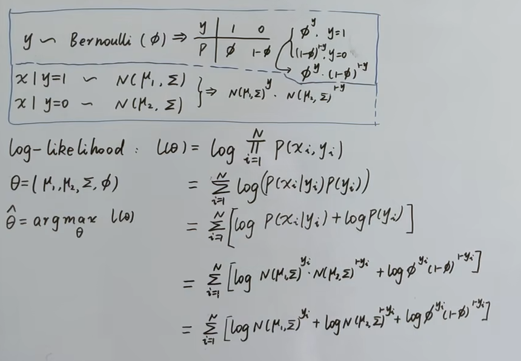
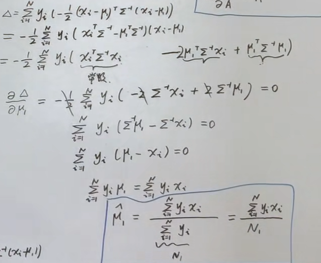

# 线性分类

## 概述

对于分类任务，线性回归模型就无能为力了，但是我们可以在线性模型的函数进行后再加入一层激活函数，这个函数是非线性的，激活函数的反函数叫做链接函数：

$$
y=f(w^Tx+b),\quad y \in \{0,1\} \text{ or } [0,1]
$$

这里的 $f$ 就是激活函数，一般 $f^{-1}$ 被称为**链接函数**。根据对 $y$ 输出需求可以分为硬分类和软分类：

**硬分类**：$y$ 输出为 0 或者 1，即直接需要输出观测对应的分类

1. 感知机（Perceptron）
2. 线性判别分析（Fisher 判别，LDA）

**软分类**：$y$ 输出为 $[0,1]$ 区间，即产生不同类别的概率

1. 判别式（直接对条件概率进行建模）：Logistic 回归
2. 生成式（根据贝叶斯定理先计算参数后验，再进行推断）：
   - 高斯判别分析（GDA）
   - 朴素贝叶斯（Naive Bayes）

---

## 感知机算法（Perceptron）

### 模型

我们选取符号函数（sign）作为激活函数，这样就可以将线性回归的结果映射到两分类的结果上：

$$
f(x) = \text{sign}(w^Tx)
$$

$$
\text{sign}(a)=\left\{\begin{matrix}+1, & a\ge0 \\ -1, & a\lt0\end{matrix}\right.
$$

### 策略：错误驱动

先画一条线，然后找到分类错的样本，一点点调整。

![[4.1.png]]

定义损失函数为错误分类的点数目，比较直观的方式是使用指示函数：

$$
L(w)=\sum\limits_{x_i\in\mathcal{D}_{wrong}}I\{y_iw^Tx_i<0\}
$$

这里 $I$ 是指示函数，里面内容为 True 时为 1，反之为 0。

但是指示函数不可导，因此可以定义：

$$
L(w)=\sum\limits_{x_i\in\mathcal{D}_{wrong}}-y_iw^Tx_i
$$

> [!tip] 为什么这个损失函数是合理的？
> 当 $x_i$ 被错误分类时，$y_i$ 与 $w^Tx_i$ 符号相反，因此 $-y_iw^Tx_i > 0$，损失为正值。分类正确的样本不在 $\mathcal{D}_{wrong}$ 中，所以不计入损失。

### 算法：随机梯度下降（SGD）

损失函数对 $w$ 的偏导为：

$$
\frac{\partial L}{\partial w}=\sum\limits_{x_i\in\mathcal{D}_{wrong}}-y_ix_i
$$

采用梯度下降更新：

$$
w^{t+1}=w^t-\lambda\nabla_wL
$$

但是如果样本非常多的情况下，计算复杂度较高。实际上我们并不需要绝对的损失函数下降的方向，只需要损失函数的**期望值下降**。我们只能根据训练数据抽样来估算概率分布（经验风险），样本量 $N$ 越大，近似越准确，但对于标准差为 $\sigma$ 的数据，可以确定的标准差仅和 $\sqrt{N}$ 成反比，而计算速度却和 $N$ 成正比。

因此可以每次使用较少样本，在数学期望的意义上损失降低的同时，又可以提高计算速度。如果每次只使用**一个错误样本**，我们有下面的更新策略：

$$
w^{t+1}=w^t+\lambda y_ix_i
$$

> [!note] 收敛性说明
> 这个更新策略是可以收敛的（对于线性可分数据）。同时使用单个观测更新也可以在一定程度上增加不确定度，从而**减轻陷入局部最小**的可能。在更大规模的数据上，常用的是**小批量随机梯度下降法（Mini-batch SGD）**。

---

## 线性判别分析（Fisher 判别）（LDA）

### 求解思想：类内小，类间大

在 LDA 中，我们的基本想法是选定一个方向，将试验样本顺着这个方向投影（降到一维），让投影后的数据：

1. 相同类内部的试验样本距离接近（**类内小**）
2. 不同类别之间的距离较大（**类间大**）

而这个投影方向实际上就是要求的 $w^Tx$ 中的 $w$。

![[4.2.png]]
### 模型

首先是投影，我们假定原来的数据是向量 $x$，那么顺着 $w$ 方向的投影就是标量（取 $w$ 模为 1 时，$z = |w|\cdot|x|\cos\theta$）：

$$
z=w^T\cdot x
$$

那么这个投影的均值和方差可以分别表示为：

$$
\bar z = \frac{1}{N}\sum\limits_{i = 1}^{N}w^Tx_i
$$

$$
S_z=\frac{1}{N}\sum\limits_{i = 1}^{N}(w^Tx_i-\bar z)(w^Tx_i-\bar z)^T
$$

那么对于两类输出 $C_1$ 和 $C_2$ 来说，分别可以表示为：

$$
C_1:\quad\bar {z_1} = \frac{1}{N_1}\sum\limits_{i = 1}^{N_1}w^Tx_i,\quad S_{z_1}=\frac{1}{N_1}\sum\limits_{i = 1}^{N_1}(w^Tx_i-\bar {z_1})(w^Tx_i-\bar {z_1})^T
$$

$$
C_2:\quad\bar {z_2} = \frac{1}{N_2}\sum\limits_{i = 1}^{N_2}w^Tx_i,\quad S_{z_2}=\frac{1}{N_2}\sum\limits_{i = 1}^{N_2}(w^Tx_i-\bar {z_2})(w^Tx_i-\bar {z_2})^T
$$

- **类内距离**用方差之和表示：$S_{z_1}+S_{z_2}$
- **类间距离**用均值差的平方表示：$(\bar {z_1}-\bar {z_2})^2$

### 策略

以类内小类间大可以定义目标函数（最大化）：

$$
J(w)=\frac{(\bar {z_1}-\bar {z_2})^2}{S_{z_1}+S_{z_2}}
$$

$$
\hat w = \arg\max_w J(w)
$$

### 求解推导

经推导，将投影后的量用原数据表示：

![[4.3.png]]
$$
J(w)=\frac{w^T(\bar {x_{c_1}}-\bar {x_{c_2}})(\bar {x_{c_1}}-\bar {x_{c_2}})^Tw}{w^T(S_{c_1}+S_{c_2})w}
$$

其中：
- 分子部分：$S_b = (\bar {x_{c_1}}-\bar {x_{c_2}})(\bar {x_{c_1}}-\bar {x_{c_2}})^T$ 称为**类间散度矩阵**（Between-class scatter matrix）
- 分母部分：$S_w = S_{c_1}+S_{c_2}$ 称为**类内散度矩阵**（Within-class scatter matrix），其中 $S_{c_k}$ 为原数据各类的协方差矩阵

基于这个目标函数，我们做以下推导：
![[4.4.png]]

> [!important] 关键推导
> 对 $J(w)$ 求偏导，注意我们只对 $w$ 的**方向**有要求，对其绝对值没有任何要求，因此只要一个方程就可以求解。最终得到：
>
> $$w \propto S_w^{-1}(\bar {x_{c_1}}-\bar {x_{c_2}})$$
>
> 即 $w$ 的方向等同于 $S_w^{-1}(\bar {x_{c_1}}-\bar {x_{c_2}})$ 的方向。推导中很多中间值是标量，而我们求 $w$ 基本只在乎其方向，所以标量可以直接忽略。最后可以归一化求得单位的 $w$ 值。

---

## Logistic 回归

### 思想

上面的两种方法相当于直接输出两类的值（硬分类），但有时候我们需要得到一个类别的概率，那么我们需要一种能输出区间为 $[0,1]$ 的函数。考虑两分类模型，我们利用判别模型，希望对 $p(C|x)$ 建模，利用贝叶斯定理：

$$
p(C_1|x)=\frac{p(x|C_1)p(C_1)}{p(x|C_1)p(C_1)+p(x|C_2)p(C_2)}
$$

取 $a=\ln\frac{p(x|C_1)p(C_1)}{p(x|C_2)p(C_2)}$，于是：

$$
p(C_1|x)=\frac{1}{1+\exp(-a)} = \sigma(a)
$$

上面的式子叫 **Logistic Sigmoid 函数**，其参数 $a$ 表示了两类联合概率比值的对数（log-odds）。在判别式中，不关心这个参数的具体值，模型假设直接对 $a$ 进行建模。
![[4.5.png]]

### 模型

$$
a=w^Tx
$$

通过寻找 $w$ 的最佳值可以得到在这个模型假设下的最佳模型。概率判别模型常用**最大似然估计（MLE）** 的方式来确定参数。

对于一次二分类观测，获得分类 $y$ 的概率为（假定 $C_1=1, C_2=0$）：

$$
p(y|x)=p_1^y \cdot p_0^{1-y}
$$

$$
p_1 = \sigma(w^Tx) = \frac{1}{1+e^{-w^Tx}}
$$

$$
p_0 = 1-p_1 = \frac{e^{-w^Tx}}{1+e^{-w^Tx}}
$$

### 策略：最大似然估计（交叉熵损失）

那么对于 $N$ 次独立全同的观测，MLE 为：

$$
\hat{w}=\mathop{\arg\max}_w J(w)=\mathop{\arg\max}_w\sum\limits_{i=1}^N\left(y_i\log p_1+(1-y_i)\log p_0\right)
$$

> [!note] 交叉熵
> 注意到这个表达式就是二分类的**交叉熵**（Cross-Entropy）的相反数乘 $N$。MLE 中的对数也保证了可以和指数函数相匹配，从而在大的区间中获取稳定的梯度。

**求导推导**：

对这个函数求导数，注意 Sigmoid 函数的导数性质：

$$
\sigma'(a) = \left(\frac{1}{1+\exp(-a)}\right)' = \sigma(a)(1-\sigma(a)) = p_1(1-p_1)
$$

则：

$$
\frac{\partial J}{\partial w}=\sum\limits_{i=1}^N\left[y_i(1-p_1)x_i - (1-y_i)p_1 x_i\right]=\sum\limits_{i=1}^N(y_i-p_1)x_i
$$

由于概率值的非线性，放在求和符号中时，这个式子无法直接求解（没有闭式解）。

### 算法：SGD

于是在实际训练的时候，和感知机类似，也可以使用不同大小的**批量随机梯度上升**（对于最小化就是梯度下降）来获得这个函数的极大值：

$$
w^{t+1} = w^t + \lambda \sum\limits_{i=1}^N(y_i - p_1)x_i
$$

---

## 高斯判别分析（GDA）

### 思想

上一节的**判别模型**实际上是直接求 $P(Y|X)$，根据概率值判断其属于哪一类。

而**生成模型**则不直接求解，而是对比两类的 $P(Y|X)$ 谁大。借助贝叶斯定理又可以转化为对比 $P(X|Y)P(Y)$（也就是联合概率 $P(X,Y)$）。生成模型中，我们对联合概率分布进行建模，然后采用 MAP 来获得参数的最佳值。

### 模型

对于两分类问题，我们可以认为 $y$ 是一个伯努利分布；在此基础上，我们假设似然是服从高斯分布的，具体假设为：

1. $y \sim \text{Bernoulli}(\phi)$
2. $x|(y=1) \sim \mathcal{N}(\mu_1, \Sigma)$
3. $x|(y=0) \sim \mathcal{N}(\mu_0, \Sigma)$

> [!note] 注意
> 两个类别共享相同的协方差矩阵 $\Sigma$，但有不同的均值 $\mu_0, \mu_1$。

那么对于独立全同的数据集，其整体的对数似然就可以写成：

$$
L(\theta) = \sum\limits_{i=1}^N \left( \log \mathcal{N}(\mu_0, \Sigma)^{1-y_i} + \log \mathcal{N}(\mu_1, \Sigma)^{y_i} + \log \phi^{y_i} + \log (1-\phi)^{(1-y_i)} \right)
$$

参数包括 $\theta = (\mu_0, \mu_1, \Sigma, \phi)$，下面分别对这些参数进行最大似然估计。

### 参数估计

**1. 求解 $\phi$**

将式子对 $\phi$ 求偏导（其中 $N_1$ 表示 $y=1$ 的样本数，$N_0$ 表示 $y=0$ 的样本数，$N=N_1+N_0$）：

$$
\sum\limits_{i=1}^N\left(\frac{y_i}{\phi}+\frac{y_i-1}{1-\phi}\right)=0 \Longrightarrow \phi=\frac{\sum\limits_{i=1}^Ny_i}{N}=\frac{N_1}{N}
$$

> 直觉上，$\phi$ 就是正类样本在总样本中的占比。

**2. 求解 $\mu_1$**

$$
\hat{\mu_1}=\mathop{\arg\max}_{\mu_1}\sum\limits_{i=1}^N y_i\log\mathcal{N}(\mu_1,\Sigma) = \mathop{\arg\min}_{\mu_1}\sum\limits_{i=1}^N y_i(x_i-\mu_1)^T\Sigma^{-1}(x_i-\mu_1)
$$

经推导：

$$
\mu_1=\frac{\sum\limits_{i=1}^N y_i x_i}{N_1}
$$

> 即正类样本的均值。

**3. 求解 $\mu_0$**

由于正反例是对称的：

$$
\mu_0=\frac{\sum\limits_{i=1}^N(1-y_i)x_i}{N_0}
$$

> 即负类样本的均值。

**4. 求解 $\Sigma$（最困难的部分）**

我们的模型假设对正反例采用相同的协方差矩阵（即使采用不同的矩阵也不会影响之前三个参数的求解）。由于 $y_i$ 取值为 0 或 1，前两部分总会有一部分为 0，所以求解时可以写成类别 1 和类别 2 两部分：

$$
\sum\limits_{x_i \in C_1}\log\mathcal{N}(\mu_1,\Sigma)+\sum\limits_{x_i \in C_2}\log\mathcal{N}(\mu_0,\Sigma)
$$

那么重点分析 $\sum\limits_{i=1}^N\log\mathcal{N}(\mu,\Sigma)$：

$$
\sum\limits_{i=1}^N\log\mathcal{N}(\mu,\Sigma)=\sum\limits_{i=1}^N\left(\log\frac{1}{(2\pi)^{p/2}|\Sigma|^{1/2}} - \frac{1}{2}(x_i-\mu)^T\Sigma^{-1}(x_i-\mu)\right)
$$

$$
= \text{Const} - \frac{N}{2}\log|\Sigma| - \frac{1}{2}\sum\limits_{i=1}^N \text{Tr}\left((x_i-\mu)^T\Sigma^{-1}(x_i-\mu)\right)
$$

> [!tip] 迹的技巧
> 在标量上加入迹（Trace，即对角线元素之和），因为标量的迹等于其本身，从而可以利用迹的循环性质交换矩阵顺序：$\text{Tr}(ABC) = \text{Tr}(CAB)$。

$$
= \text{Const} - \frac{N}{2}\log|\Sigma| - \frac{1}{2}\sum\limits_{i=1}^N \text{Tr}\left((x_i-\mu)(x_i-\mu)^T\Sigma^{-1}\right)
$$

$$
= \text{Const} - \frac{N}{2}\log|\Sigma| - \frac{N}{2}\text{Tr}(S\Sigma^{-1})
$$

其中 $S = \frac{1}{N}\sum_{i=1}^N(x_i-\mu)(x_i-\mu)^T$ 为样本协方差矩阵。代入两类后：

$$
\text{Const} - \frac{N}{2}\log|\Sigma| - \frac{N_1}{2}\text{Tr}(S_1\Sigma^{-1}) - \frac{N_2}{2}\text{Tr}(S_2\Sigma^{-1})
$$

利用矩阵求导公式：

$$
\frac{\partial}{\partial A}|A| = |A| \cdot A^{-1}, \quad \frac{\partial}{\partial A}\text{Tr}(AB) = B^T
$$

因此：

$$
N\Sigma^{-1} - N_1 S_1^T \Sigma^{-2} - N_2 S_2^T \Sigma^{-2} = 0 \Longrightarrow \Sigma = \frac{N_1 S_1 + N_2 S_2}{N}
$$

其中，$S_1, S_2$ 分别为两个类数据内部的协方差矩阵（利用了协方差矩阵的对称性 $S^T = S$）。
![[4.8.png]]

于是我们就利用最大似然的方法求得了所有参数，根据模型可以得到联合分布，也就可以得到用于推断的条件分布了。

---

## 概率生成模型 - 朴素贝叶斯

### 思想：条件独立性假设

GDA 对数据集的分布作出了高斯分布的假设，同时引入伯努利分布作为类先验。而**朴素贝叶斯**则是对数据属性之间的关系作出假设。

一般地，我们需要得到 $p(x|y)$ 这个概率值，由于 $x$ 有 $p$ 个维度，因此需要对这么多维度的联合概率进行采样。但我们知道在高维空间中采样需要的样本数量非常大才能获得较为准确的概率近似。

**朴素贝叶斯假设**：当类别确定之后，数据的每一维特征是相互独立的。

> 例如判别一个人的性别，对于体重、身高、体脂等特征认为是相互独立的。这当然在现实世界中不太可能，所以称之为"朴素"。

依据假设有：

$$
p(x|y)=\prod\limits_{i=1}^p p(x_i|y)
$$

即：

$$
x_i \perp x_j \mid y, \quad \forall\ i \ne j
$$

### 模型

于是利用贝叶斯定理，对于单次观测：

$$
p(y|x)=\frac{p(x|y)p(y)}{p(x)}=\frac{\prod\limits_{i=1}^p p(x_i|y) \cdot p(y)}{p(x)}
$$

跟 GDA 类似，分类时只需对比 $\prod\limits_{i=1}^p p(x_i|y) \cdot p(y)$ 的大小即可。

对于单个维度的条件概率以及类先验作出进一步的假设：

1. $x_i$ 为**连续变量**：$p(x_i|y) = \mathcal{N}(\mu_i, \sigma_i^2)$
2. $x_i$ 为**离散变量**：类别分布（Categorical）：$p(x_i=k|y)=\theta_k,\quad \sum\limits_{k=1}^K\theta_k=1$
3. 类先验：$p(y)=\phi^y(1-\phi)^{1-y}$

对这些参数的估计，常用 MLE 的方法直接在数据集上估计。

> [!tip] 朴素贝叶斯的优势
> 由于条件独立性假设，不需要知道各个维度之间的关系，因此所需数据量**大大减少**。估算完这些参数后，再代入贝叶斯定理中就可以得到类别的后验分布。

---

## 小结

| 类别 | 方法 | 核心思想 | 损失/目标函数 | 求解方式 |
|------|------|---------|-------------|---------|
| 硬分类 | 感知机 | 线性模型 + sign 激活函数 | $L=\sum -y_iw^Tx_i$ | SGD |
| 硬分类 | LDA (Fisher) | 投影，类内小，类间大 | $J=\frac{w^TS_bw}{w^TS_ww}$ | 闭式解：$w \propto S_w^{-1}(\bar x_1 - \bar x_2)$ |
| 软分类（判别） | Logistic 回归 | Sigmoid 激活函数 | 交叉熵（MLE） | SGD |
| 软分类（生成） | GDA | 高斯似然 + 伯努利先验 | MAP | 闭式解 |
| 软分类（生成） | 朴素贝叶斯 | 条件独立性假设 | MLE | 闭式解 |

- **判别模型**（Logistic 回归）：直接对类别的条件概率 $P(Y|X)$ 建模，将线性模型套入 Sigmoid 函数，损失函数是交叉熵（等价于 MLE），梯度为 $\sum(y_i - p_1)x_i$，利用 SGD 优化。
- **生成模型**（GDA、朴素贝叶斯）：引入类别先验，对联合概率 $P(X,Y)$ 建模。GDA 假设数据服从高斯分布；朴素贝叶斯进一步假设各维度条件独立，大大减少了数据量需求。
