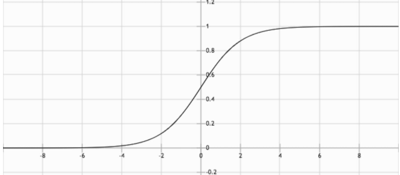

# 线性分类

## 目的

给定一组数据，在线性模型的函数进行后再加入一层激活函数或降维，到一维01空间中

$$
激活函数（线性回归）\longrightarrow 分类\{0,1\}
$$

$$
y=f(w^Tx+b),y \in \{0,1\}or[0,1]
$$

这里的$f$就是激活函数，一般$f^{-1}$被称为链接函数，根据对$y$输出需求 可以分为硬分类和软分类

**硬分类**：$y$输出为0或者1，即直接需要输出观测对应的分类

1. 线性判别分析（Fisher 判别）
2. 感知机

**软分类**：$y$输出为0到1的区间，即产生不同类别的概率

1.生成式（根据贝叶斯定理先计算参数后验，再进行推断）：高斯判别分析GDA）和朴素贝叶斯等为代表
2.判别式（直接对条件概率进行建模）：Logistic 回归

## 感知机算法(Perceptron)

**模型：** 这里要想清楚，我们要求$w^T$ 作用是与$x$相乘能分为正负两部分

$$
f(x) = sign(w^Tx)
$$

$$
sign(a)=\left\{\begin{matrix}+1,a\ge0\\-1,a\lt0\end{matrix}\right.
$$

**求解思想：错误驱动** 现画一条线，然后找到分类错的样本，一点点调整

**策略**

可以定义损失函数为错误分类的点数目:

$$
L(w)=\sum\limits_{x_i\in\mathcal{D}_{wrong}}I\{y_iw^Tx_i<0\}
$$

这里$I$是指示函数，里面内容为Ture，为1，反之为0。

但是指示函数不可导，因此可以定义：

$$
L(w)=\sum\limits_{x_i\in\mathcal{D}_{wrong}}-y_iw^Tx_i
$$

**算法**：随机梯度下降

$$
w^{t+1}=w^t-\lambda\nabla_wL
$$

$$
w^{t+1}=w^t+\lambda y_ix_i
$$

## 线性判别分析（Fisher判别）（LDA）

**求解思想：** **类内小，类间大**

在LDA中，我们的基本想法是选定一个方向，将试验样本顺着这个方向投影（降到一维），让投影后的数据：

1. 相同类内部的试验样本距离接近。
2. 不同类别之间的距离较大。

而这个投影方向实际上就是要求的$w^Tx$的法向量$w$

**模型**：

首先是投影，我们假定原来的数据是向量$x$，那么顺着$w$方向的投影就是标量：$(|w|\cdot|x|\cos\theta,取w模为1)$

$$
z=w^T\cdot x
$$

那么这个投影的均值和协方差可以分别表示为：

$$
\bar z = \frac{1}{{{N}}}\sum\limits_{i = 1}^{{N}}w^Tx_i
$$

$$
S_z=\frac{1}{{{N}}}\sum\limits_{i = 1}^{{N}}(z_i-\bar z)(z_i-\bar z)^T=\frac{1}{{{N}}}\sum\limits_{i = 1}^{{N}}(w^Tx_i-\bar z)(w^Tx_i-\bar z)^T
$$

那么对于两类输出$c_1$和$c_2$来说可以表示为

$$
C_1:\bar {z_1} = \frac{1}{{{N_1}}}\sum\limits_{i = 1}^{{N_1}}w^Tx_i,S_{z_1}=\frac{1}{{{N_1}}}\sum\limits_{i = 1}^{{N_1}}(w^Tx_i-\bar z)(w^Tx_i-\bar z)^T
$$

$$
C_2:\bar {z_2} = \frac{1}{{{N_2}}}\sum\limits_{i = 1}^{{N_2}}w^Tx_i,S_{z_2}=\frac{1}{{{N_1}}}\sum\limits_{i = 1}^{{N_2}}(w^Tx_i-\bar z)(w^Tx_i-\bar z)^T
$$

这样类内就可以表示为$S_{z_1}+S_{z_2}$,而类间可以表示为$(\bar {z_1}-\bar {z_2})^2$

**策略**

以类内小类间大可以定义目标函数：

$$
J(w)=\frac{(\bar {z_1}-\bar {z_2})^2}{S_{z_1}+S_{z_2}}
$$

$$
\hat w =argmaxJ(w)
$$

经推导，就可的：

$$
J(w)=\frac{w^T(\bar {x_{c_1}}-\bar {x_{c_2}})(\bar {x_{c_1}}-\bar {x_{c_2}})^Tw}{w^T(S_{c_1}+S_{c_2})w}
$$

基于这个目标函数，我们做以下推导

得到$w$的方向等同于$S_w^{-1}(\bar {x_{c_1}}-\bar {x_{c_2}})$的方向（推导中很多值是标量，而我们求w基本只在乎其方向，所以这里可以直接忽略）

## Logistic 回归

**思想：**
上面的两种方法相当于直接输出两类的值，但有时候我们一组数据要得到一个类别的概率，那么我们需要一种能输出区间为$[0,1]$的函数。考虑两分类模型，我们利用判别模型，希望对 $p(C|x)$ 建模，利用贝叶斯定理：

$$
p(C_1|x)=\frac{p(x|C_1)p(C_1)}{p(x|C_1)p(C_1)+p(x|C_2)p(C_2)}
$$

取 $a=\ln\frac{p(x|C_1)p(C_1)}{p(x|C_2)p(C_2)}$，于是：

$$
p(C_1|x)=\frac{1}{1+\exp(-a)}
$$

$$

$$

上面的式子叫 Logistic Sigmoid 函数，其参数表示了两类联合概率比值的对数。在判别式中，不关心这个参数的具体值，模型假设直接对 $a$ 进行。

**模型**：

$$
a=w^Tx
$$

通过寻找 $  w$ 的最佳值可以得到在这个模型假设下的最佳模型。

概率判别模型常用最大似然估计的方式来确定参数。

对于一次二分类观测，获得分类 $y$ 的概率为（假定$C_1=1,C_2=0$）：

$$
p(y|x)=p_1^yp_0^{1-y}
$$

$$
p_1 = \frac{1}{1+e^{-w^Tx}}
$$

$$
p_0 = 1-p_1 = \frac{e^{-w^Tx}}{1+e^{-w^Tx}}
$$

那么对于 $N$ 次独立全同的观测 MLE为：

$$
\hat{w}=\mathop{argmax}_wJ(w)=\mathop{argmax}_w\sum\limits_{i=1}^N(y_i\log p_1+(1-y_i)\log p_0)
$$

这里其实就是二分类的一个交叉熵

> 对这个函数求导数，注意到：
> 
> $$
> p_1'=(\frac{1}{1+\exp(-a)})'=p_1(1-p_1)
> $$
> 
> 则：
> 
> $$
> J'(w)=\sum\limits_{i=1}^Ny_i(1-p_1)x_i-p_1x_i+y_ip_1x_i=\sum\limits_{i=1}^N(y_i-p_1)x_i
> $$
> 
> 由于概率值的非线性，放在求和符号中时，这个式子无法直接求解

**算法：SDG**于是在实际训练的时候，和感知机类似，也可以使用不同大小的批量随机梯度上升（对于最小化就是梯度下降）来获得这个函数的极大值。

## 高斯判别分析 GDA

**思想**

上一节的**判别模型**实际上是直接求$P(Y|X)$，根据概率值判断其属于哪一类

而**生成模型**则不直接求解，而是对比两类的$P(Y|X)$谁大，那么借助贝叶斯定理又可以转化为对比$P(X|Y)P(Y)$(也就是联合概率$P(X,Y)$)生成模型中，我们对联合概率分布进行建模，然后采用 MAP 来获得参数的最佳值。

**模型：**

对于两分类问题，我们可以认为$y$是一个伯努利分布；在此基础上，我们假设似然是服从高斯分布的，我们采用的假设：

1. $y\sim Bernoulli(\phi)$
2. $x|(y=1)\sim\mathcal{N}(\mu_1,\Sigma)$
3. $x|(y=0)\sim\mathcal{N}(\mu_0,\Sigma)$

那么对于独立全同的数据集，其整体的似然就可以写成：

$$
L(\theta ) = \sum\limits_{i = 1}^N ( \log {\mathcal N}{({\mu _0},\Sigma )^{1 - {y_i}}} + \log {\mathcal N}{({\mu _1},\Sigma )^{{y_i}}} + \log {\phi ^{{y_i}}} + \log {(1 - \phi )^{(1 - {y_i})}})
$$

这里就可以看到参数包括$(\mu_0, \mu_1, \Sigma, \phi )$,那么对这些参数最大似然估

**参数估计**

* 首先对 $\phi$ 进行求解，将式子对 $\phi$ 求偏导(其中$N_1$表示$y=1$的样本数，$N_0$表示$y=0$的样本数，$N=N_1+N_0$)：
  
  $$
  \sum\limits_{i=1}^N(\frac{y_i}{\phi}+\frac{y_i-1}{1-\phi})=0\Longrightarrow\phi=\frac{\sum\limits_{i=1}^Ny_i}{N}=\frac{N_1}{N}
  $$
* 然后求解 $\mu_1$：

$$
\hat{\mu_1}=\mathop{argmax}_{\mu_1}\sum\limits_{i=1}^Ny_i\log\mathcal{N}(\mu_1,\Sigma)=\mathop{argmin}_{\mu_1}\sum\limits_{i=1}^Ny_i(x_i-\mu_1)^T\Sigma^{-1}(x_i-\mu_1)
$$

经推导：

$$
\mu_1=\frac{\sum\limits_{i=1}^Ny_ix_i}{N_1}
$$

* 求解 $\mu_0$，由于正反例是对称的，所以：

$$
\mu_0=\frac{\sum\limits_{i=1}^N(1-y_i)x_i}{N_0}
$$

* 最为困难的是求解 $\Sigma$，我们的模型假设对正反例采用相同的协方差矩阵，又因为前两部分总会有一部分为0，所以求解时可以写成类别1和类别2两部分：
  $$
  \sum\limits_{x_i \in c_1}^N\log\mathcal{N}(\mu,\Sigma)+\sum\limits_{x_i \in c_2}^N\log\mathcal{N}(\mu,\Sigma)
  $$

那么这样就可以重点分析求解$\sum\limits_{i=1}^N\log\mathcal{N}(\mu,\Sigma)$

$$
\sum\limits_{i=1}^N\log\mathcal{N}(\mu,\Sigma)=\sum\limits_{i=1}^N(\log(\frac{1}{(2\pi)^{p/2}|\Sigma|^{1/2}})+(-\frac{1}{2}(x_i-\mu)^T\Sigma^{-1}(x_i-\mu)))
$$

$$
=Const-\frac{1}{2}\sum\limits_{i=1}^N\log|\Sigma|-\frac{1}{2}\sum\limits_{i=1}^NTrace((x_i-\mu)^T\Sigma^{-1}(x_i-\mu))
$$

$$
=Const-\frac{1}{2}N\log|\Sigma|-\frac{1}{2}\sum\limits_{i=1}^NTrace((x_i-\mu)(x_i-\mu)^T\Sigma^{-1})
$$

$$
=Const-\frac{1}{2}N\log|\Sigma|-\frac{1}{2}NTrace(S\Sigma^{-1})
$$

在这个表达式中，我们在标量上加入迹(迹就是对角线元素之和，因为这里分析后面那一部分是个实数可以这么转变)从而可以交换矩阵的顺序。那么带入类别一类别二要最大似然估计的式子就变成了：

$$
Const-\frac{1}{2}N\log|\Sigma|-\frac{1}{2}N_1Trace(S_1\Sigma^{-1})-\frac{1}{2}N_2Trace(S_2\Sigma^{-1})
$$

对于包含绝对值和迹的表达式的导数，我们有：

$$
\frac{\partial}{\partial A}(|A|)=|A|A^{-1}\\\frac{\partial}{\partial A}Trace(AB)=B^T
$$

因此：

$$
N\Sigma^{-1}-N_1S_1^T\Sigma^{-2}-N_2S_2^T\Sigma^{-2}=0 \Longrightarrow\Sigma=\frac{N_1S_1+N_2S_2}{N}
$$

其中，$S_1,S_2$ 分别为两个类数据内部的协方差矩阵.

于是我们就利用最大后验的方法求得了我们模型假设里面的所有参数，根据模型，可以得到联合分布，也就可以得到用于推断的条件分布了。

## 概率生成模型-朴素贝叶斯

**思想：朴素贝叶斯假设**
其实就是条件独立型假设，我们认为当种类确定之后，决定这个种类的数据的每一维特征是相互独立的（例如判别一个人的性别，然后对于数据的体重、身高、体脂等特征认为是相互独立，这当然在现实世界中不太可能，所以为朴素）
依据假设有

$$
p(x|y)=\prod\limits_{i=1}^pp(x_i|y)
$$

即：

$$
x_i\perp x_j|y,\forall\  i\ne j
$$

**模型**

于是利用贝叶斯定理，对于单次观测：

$$
p(y|x)=\frac{p(x|y)p(y)}{p(x)}=\frac{\prod\limits_{i=1}^pp(x_i|y)p(y)}{p(x)}
$$

跟GDA类似，其实对比$\prod\limits_{i=1}^pp(x_i|y)p(y)$的大小就可以

对于单个维度的条件概率以及类先验作出进一步的假设：

1. $x_i$ 为连续变量：$p(x_i|y)=\mathcal{N}(\mu_i,\sigma_i^2)$
2. $x_i$ 为离散变量：类别分布（Categorical）：$p(x_i=i|y)=\theta_i,\sum\limits_{i=1}^K\theta_i=1$
3. $p(y)=\phi^y(1-\phi)^{1-y}$

对这些参数的估计，常用 MLE 的方法直接在数据集上估计。

