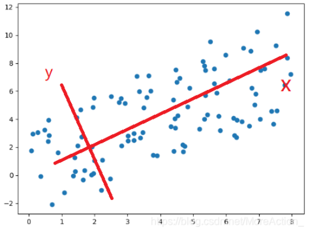
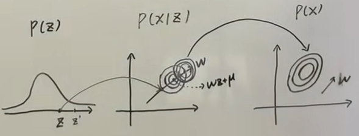

# 降维

我们知道，解决过拟合的问题除了正则化和添加数据之外，降维就是最好的方法。

降维的算法分为：

1. 直接降维，特征选择
2. 线性降维，PCA，MDS等
3. 分线性，流形包括 Isomap，LLE 等

为了方便，我们首先将均值和协方差矩阵（数据集）写成能用矩阵表示的形式：

$$
\overline{x}=\frac{1}{N}\sum\limits_{i=1}^Nx_i=\frac{1}{N}X^T1_N
$$

$$
S=\frac{1}{N}\sum\limits_{i=1}^N(x_i-\overline{x})(x_i-\overline{x})^T=\frac{1}{N}(x_1-\overline{x},x_2-\overline{x},\cdots,x_N-\overline{x})(x_1-\overline{x},x_2-\overline{x},\cdots,x_N-\overline{x})^T
$$

$$
=\frac{1}{N}(X^T-\frac{1}{N}X^T\mathbb{1}_{N}\mathbb{1}_{N}^T)(X^T-\frac{1}{N}X^T\mathbb{1}_{N}\mathbb{1}_{N}^T)^T=\frac{1}{N}X^T(I_N-\frac{1}{N}\mathbb{1}_{N}\mathbb{1}_{N})(I_N-\frac{1}{N}\mathbb{1}_{N}\mathbb{1}_{N})^TX
$$

$$
=\frac{1}{N}X^TH_NH_N^TX=\frac{1}{N}X^TH_NH_NX=\frac{1}{N}X^THX
$$

个式子利用了中心矩阵 $ H$的对称性，这也是一个投影矩阵。

## 线性降维-主成分分析 PCA

### 思想

**核心目的：原始特征空间的重构（相关变无关）**

（如图重构前可能两个特征成一个线性关系，重构后x无论怎么变化,y基本保持在一个范围内，就变成线性无关了，这时候X很能表现样本特点，我们就可以将二维特性降维到X一维上，这个X就是主成分）

**实现核心目的的方法：
1.最大投影方差
2.最小重构距离**

### 损失函数

**最大化投影方差：**
对于数据集来说，我们首先将其中心化$x_i-\overline{x}$，这样好计算方差。那么其在$u_1$方向上的投影就可以表示为$(x_i-\overline{x})^Tu_1$(详见LDA)，因为均值为0，那么投影的方差就可以直接表示为

$$
J=\frac{1}{N}\sum\limits_{i=1}^N((x_i-\overline{x})^Tu_1)^2=u_1^T \sum\limits_{i=1}^N\frac{1}{N}(x_i-\overline{x})^T(x_i-\overline{x})u_1=u_1^TSu_1
$$

其中

$$
s.t.\ u_1^Tu_1=1
$$

这里只是以二维为例，多维是一样的，就有多个重构方向$u$，降维的时候想降到几维就取几个重构方向即可。

**最小重构距离：**
原来的数据很有可能各个维度之间是相关的，于是我们希望找到一组 $p$ 个新的线性无关的单位基 $u_i$，降维就是取其中的 $q$ 个基。于是对于一个样本 $x_i$，经过这个坐标变换后(对应方向上的投影乘以单位基)：

$$
{x_i}=\sum\limits_{i=1}^p(x_i^Tu_i)u_i
$$

之后我们进行降维，取其中的 $q$ 个基，扔掉其他的，得到真正的

$$
\hat{x_i}=\sum\limits_{i=1}^q(x_i^Tu_i)u_i
$$

而最小重构代价，其实就是让扔掉的那一部分最小：

$$
J = \frac{1}{N}\sum\limits_{i=1}^N||x_i-\hat{x_i}||^2
$$

然后再考虑上去中心化：

$$
J=\frac{1}{N}\sum\limits_{i=1}^N\sum\limits_{j=q+1}^p((x_i-\overline{x})^Tu_j)^2=\sum\limits_{j=q+1}^pu_j^TSu_j\ ,\ s.t.\ u_j^Tu_j=1
$$

这跟上面那个理解推导出的是一样的，无非这种是多维，又因为重构后空间正交，所以一维跟多维也没啥大区别。

### 求解

这是一个带约束的优化并问题，直接进行拉格朗日乘子法，由于每个基都是线性无关的，于是每一个 $u_j$ 的求解可以分别进行，使用拉格朗日乘子法：

$$
\mathop{argmax}_{u_j}L(u_j,\lambda)=\mathop{argmax}_{u_j}u_j^TSu_j+\lambda(1-u_j^Tu_j)
$$

求导，导数等于零得：

$$
Su_j=\lambda u_j
$$

可见，我们需要的基就是协方差矩阵的特征向量。损失函数最大取在本特征值前 $q$ 个最大值。这样实际上对向量的协方差矩阵特征值分解得$S=GKG^T$，要降为$q$维,取对角矩阵前$q$个值，以及$G$对应的前$q$个向量就行。

### 数据的SVD

一般来说任何矩阵都可以进行奇异值分解，下面使用实际训练时常常使用的 SVD 直接求得这个$q$个特征向量。

对中心化后的数据集进行奇异值分解：

$$
HX=U\Sigma V^T,U^TU=E_N,V^TV=E_p,\Sigma:N\times p
$$

于是：

$$
S=\frac{1}{N}X^THX=\frac{1}{N}X^TH^THX=\frac{1}{N}V\Sigma^T\Sigma V^T=\frac{1}{N}V\Sigma^2 V^T
$$

这里我们发现自然而然的$S$完成了特征值分解，因此我们直接对中心化后的数据集进行 SVD，就可以得到特征值和特征向量 $V$

### PCOA

由上面的推导，我们也可以得到另一种方法 PCoA 主坐标分析，定义并进行特征值分解：

$$
T=HXX^TH=U\Sigma^2U^T
$$

这时我们发现$S$和$T$有相同的特征值,用S特征值分解完得到的是主成分,也就是投影方向，而T得到的就直接是主坐标，这是因为:

从S来看，主坐标是$HXV=U\Sigma V^TV=U\Sigma$

从T来看，$TU\Sigma=U\Sigma(\Sigma^T\Sigma)$，$U\Sigma$就是特征向量

$$

$$

于是可以直接得到坐标。这两种方法都可以得到主成分，但是由于方差矩阵是 $p\times p$ 的，而 $T$ 是 $N\times N$ 的，所以对样本量较少的时候可以采用 PCoA的方法。

### p-PCA

**模型**

对原数据 $x\in\mathbb{R}^p$（观测数据） ，降维后的数据为 $z\in\mathbb{R}^q,q<p$（隐变量）。降维通过一个矩阵变换（投影）进行，而这里其实表示了根据隐变量生成数据的过程：

$$
z\sim\mathcal{N}(\mathbb{O}_{q1},\mathbb{I}_{qq})\\x=Wz+\mu+\varepsilon\\\varepsilon\sim\mathcal{N}(0,\sigma^2\mathbb{I}_{pp})
$$

我们的目的就是，在已知隐变量分布$p(z)$，已知线性变化过程$p(x|z)$,求数据$p(x)$的分布，求后验$p(z|x)$,这几者关系如下

**学习策略**

对于这个模型，我么可以使用期望-最大（EM）的算法进行学习，在进行推断的时候需要求得 $p(z|x)$，推断的求解过程和线性高斯模型类似，详见第二章最后。

$$
(z|x)=\frac{p(x|z)p(z)}{p(x)}\\\mathbb{E}[x]=\mathbb{E}[Wz+\mu+\varepsilon]=\mu\\Var[x]=WW^T+\sigma^2\mathbb{I}_{pp}\\\Longrightarrow p(z|x)=\mathcal{N}(W^T(WW^T+\sigma^2\mathbb{I})^{-1}(x-\mu),\mathbb{I}-W^T(WW^T+\sigma^2\mathbb{I})^{-1}W)
$$

