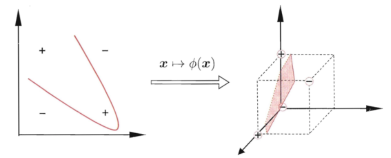

## Kernel Method

**核心思想：**
**(1)非线性带来高维转换**

很多分类问题是非线性的，比如很著名的异或问题，这样传统的分类算法就失效了，这是该如何处理

| 线性可分     | 允许部分错误 | 线性不可分 |
| ----------- | ----------- | ----------- |
| 感知机      |  pocket算法  |多层感知机（神经网络）|
| 硬间隔SVM   | 软间隔SVM    |非线性转换+SVM     |

核方法的思想基础就是能否做一个显性的非线性转换处理（一般会转换到高维，因为高维是比低维更容易线性可分的）

$$
x=(x_1,x_2,...,x_p)\rightarrow\phi(x)\rightarrow z=(z_1,x,z_2,...,z_q)
$$

**(2)对偶表示带来内积**

我们观察上面的 SVM 对偶问题：

$$
\max_{\lambda}-\frac{1}{2}\sum\limits_{i=1}^N\sum\limits_{j=1}^N\lambda_i\lambda_jy_iy_jx_i^Tx_j+\sum\limits_{i=1}^N\lambda_i,\ s.t.\ \lambda_i\ge0
$$

其中是要求一个内积$x_i^Tx_j$，而对于非线性可分是要先转换后再求内积$\phi(x_i)\phi(x_j)^T$的，本身$\phi(x_i)$是高维的就很难求了，而其内积可能就更加难求，那么我们就想有没有一种更好的方法把这个内积求出来呢，核方法就针对这个问题而产生，通过定义核函数，尝试直接获得这个内积：

$$
K(x,x')=\phi(x)^T\phi(x')
$$

**定义**

核函数：$\forall x,x'\in\mathcal{X}\ k(x,x')$，$k(x,x')$就是一个核函数
正定核函数：

$$
\forall x,x'\in\mathcal{X},\exist\phi\in\mathcal{H}:x\rightarrow z\ s.t.\ k(x,x')=\phi(x)^T\phi(x')
$$

称 $k(x,x')$ 为一个正定核函数，其中$\mathcal{H}$ 是 Hilbert 空间【完备的（序列的极限操作后也在空间里），可能无限维的，赋予内积的线性空间】，如果去掉内积这个条件我们简单地称为核函数。

正定核函数有下面的等价定义：

如果核函数满足：

1. 对称性 $\Leftrightarrow$ $k(x,z)=k(z,x)$，显然满足内积的定义>
2. 正定性 $\Leftrightarrow$ $\forall N,x_1,x_2,\cdots,x_N\in\mathcal{X}$，对应的 Gram Matrix $K=[k(x_i,x_j)]$ 是半正定的。

那么这个核函数时正定核函数。

> 证明：对称性是显然的，那么证明正定性就行
> 
> 要证：$k(x,z)=\phi(x)^T\phi(z)\Leftrightarrow K$ Gram Matrix半正定。
> 
> 1. 必要性 $\Rightarrow$：对于正定性：
>    
>    $$
>    K=\begin{pmatrix}k(x_1,x_2)&\cdots&k(x_1,x_N)\\\vdots&\vdots&\vdots\\k(x_N,x_1)&\cdots&k(x_N,x_N)\end{pmatrix}
>    $$
>    
>    任意取 $\alpha\in\mathbb{R}^N$，即需要证明 $\alpha^TK\alpha\ge0$：
>    
>    $$
>    \alpha^TK\alpha=\sum\limits_{i,j}\alpha_i\alpha_jK_{ij}=\sum\limits_{i,j}\alpha_i\phi^T(x_i)\phi(x_j)\alpha_j=\sum\limits_{i}\alpha_i\phi^T(x_i)\sum\limits_{j}\alpha_j\phi(x_j)
>    $$
>    
>    这个式子就是内积的形式，Hilbert 空间满足线性性，于是正定性的证。
> 2. $\Leftarrow$：对于 $K$ 进行分解，对于对称矩阵 $K=V\Lambda V^T$，那么令 $\phi(x_i)=\sqrt{\lambda_i}V_i$，其中 $V_i$是特征向量，于是就构造了 $k(x,z)=\sqrt{\lambda_i\lambda_j}V_i^TV_j$

**常用核函数**

* **线性核函数 (Linear Kernel)**
  公式：$K(x,y)=x^Ty $
  特点：适用于线性可分的数据，计算简单，就是最基础的。
* **多项式核函数 (Polynomial Kernel)**
  公式：$K(x, y) = (x^T y + c)^d$
  其中，$c$是常数，$d$是多项式的次数。
  特点：能处理非线性关系，适合数据具有多项式特征的情况。
* **高斯核函数 (Gaussian Kernel, RBF Kernel)**
  公式：$K(x, y) = \exp(-\gamma \|x - y\|^2)$
  其中，$\gamma$.
  特点：非常灵活，能适应复杂的非线性关系，广泛应用于各种数据集。
* **Sigmoid核函数 (Sigmoid Kernel)**
  公式：$K(x, y) = \tanh(\alpha x^T y + c)$
  其中，$\alpha$ ＆ $c$ 是参数。
  特点：类似于神经网络的激活函数，适用于特定非线性问题，但使用较少。

SVM在实际应用中就可以用不同的核函数处理不同分类数据

