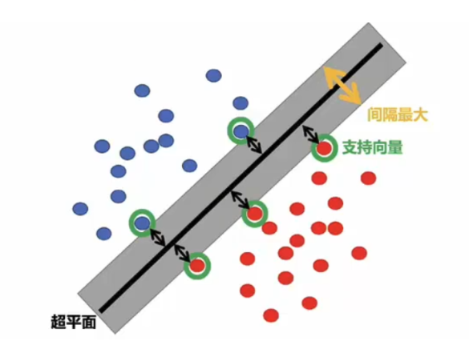
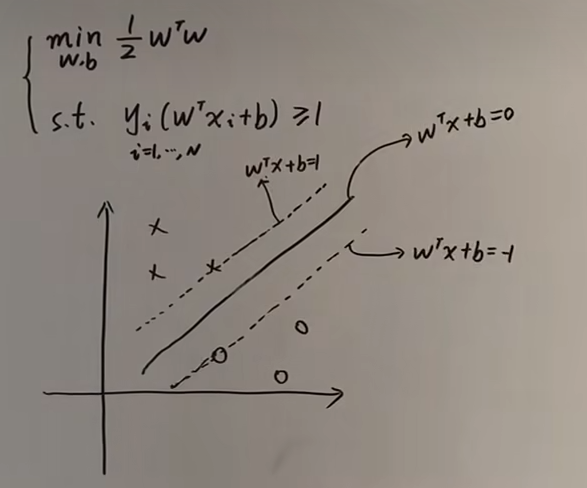
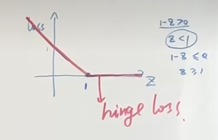

# 支撑向量机

SVM有三宝：**间隔、对偶、核技巧**

**核心思想：**
对于数据空间里的一组数据，找到一个超平面，实现两类数据的分类，并使找到的这个超平面最好。（不同于感知机，感知机只是找到一种就行，其找到的那条跟初始解有很大的关系，这个问题其实是有很多个的，SVM关键在于哪个最好）

对于怎么定义超平面好不好，这里具体分为三种手段：

1. hard-margin SVM
2. soft-margin SVM
3. kernel Method

## 硬间隔SVM（Hard-margin SVM）

**模型**

对于一组数据$\{x_i,y_i\}_{i=1}^N,x_i\in\mathbb{R}^p,y_i\in\{1,-1\}$,硬间隔的目的就是找到一个最大的间隔函数$margin(w,b)$实现对数据的分割

$$
max\ margin(w,b)\\
s.t.\ y_i(w^Tx+b)>0
$$

这里最大的间隔函数$margin(w,b)$定义为离直线$w^Tx+b$最近的那个点的距离，也就是

$$
\min_{x_i}\frac{|w^Tx_i+b|}{||w||}
$$

那么最大化间隔这个约束问题就可以表示为（约束为分类任务的要求）：

$$
arg\max_{w,b}[\min_{x_i}\frac{|w^Tx_i+b|}{||w||}]\\ s.t.\ y_i(w^Tx_i+b)>0
$$

因为$y_i$只能取1或-1,其相当于代替了绝对值的作用，那么原式就可以表示为：

$$
arg\max_{w,b}\min_{x_i}\frac{y_i(w^Tx_i+b)}{||w||}\\ s.t.\ y_i(w^Tx_i+b)>0
$$

对于这个约束 $y_i(w^Tx_i+b)>0$，不妨固定 $\min y_i(w^Tx_i+b)=1>0$

> 首先对于$y_i(w^Tx_i+b)$来说，它是等于大于零的一个数$r$的
> 对于超平面$w^Tx_i+b$来说，这里$w^T$和$b$是变量，所以超平面等于几是无所谓的，对应的$w^T$和$b$除以这个数就好了，所以这里做了一个这样的简化运算
> 从几何意义讲，去掉$y_i=\pm 1$，这里的$w^Tx_i+b=r$是一个离要求的超平面很近的一个超平面，它的目的就是约束那些离目标超平面最近的点用于参数求解，后面还会提到，这个超平面叫支持向量

$$
arg\max_{w,b}\frac{1}{||w||}\\ s.t.\ y_i(w^Tx_i+b) \ge 1
$$

这就是一个包含 $N$ 个约束的凸优化问题，写成标准形式（优化问题里最大化$\frac{1}{||w||}$和最小化$\frac{1}{2}||w||^2$等价）：

$$
\min_{w,b}\frac{1}{2}w^Tw\\ s.t.\ y_i(w^Tx_i+b) \ge 1
$$

**求解算法**

如果样本数量或维度非常高，直接求解困难甚至不可解，于是需要对这个问题进一步处理。
这里我们用拉格朗日对偶性分析这个问题，引入 Lagrange 函数：

$$
L(w,b,\lambda)=\frac{1}{2}w^Tw+\sum\limits_{i=1}^N\lambda_i(1-y_i(w^Tx_i+b))
$$

我们有原问题就等价于：

$$
\min_{w,b}\max_{\lambda}L(w,b,\lambda_i)\\
 s.t.\ \lambda_i\ge0
$$

我们交换最小和最大值的符号得到对偶问题：

$$
\max_{\lambda_i}\min_{w,b}L(w,b,\lambda_i)\ s.t.\ \lambda_i\ge0
$$

由于这个约束问题是个凸优化，对偶问题和原问题等价，这里就可以直接写出KKT条件：

> $$
> \frac{\partial L}{\partial w}=0,\frac{\partial L}{\partial b}=0
> \\\lambda_k(1-y_k(w^Tx_k+b))=0(slackness\ complementary)\\
> \lambda_i\ge0\\
> 1-y_i(w^Tx_i+b)\le0
> $$

* $b$：$\frac{\partial}{\partial b}L=0\Rightarrow\sum\limits_{i=1}^N\lambda_iy_i=0$
* $w$：首先将 $b$ 代入：

  $$
  L(w,b,\lambda_i)=\frac{1}{2}w^Tw+\sum\limits_{i=1}^N\lambda_i(1-y_iw^Tx_i-y_ib)=\frac{1}{2}w^Tw+\sum\limits_{i=1}^N\lambda_i-\sum\limits_{i=1}^N\lambda_iy_iw^Tx_i
  $$

  $$
  \frac{\partial}{\partial w}L=0\Rightarrow w=\sum\limits_{i=1}^N\lambda_iy_ix_i
  $$
* 将上面两个参数代入：

  $$
  L(w,b,\lambda_i)=-\frac{1}{2}\sum\limits_{i=1}^N\sum\limits_{j=1}^N\lambda_i\lambda_jy_iy_jx_i^Tx_j+\sum\limits_{i=1}^N\lambda_i
  $$

根据KKT条件就得到了对应的最佳参数($\lambda$求解下面那个优化问题就可以得到)：

$$
\hat{w}=\sum\limits_{i=1}^N\lambda_iy_ix_i\\
\hat{b}=y_k-w^Tx_k=y_k-\sum\limits_{i=1}^N\lambda_iy_ix_i^Tx_k,\exist k,1-y_k(w^Tx_k+b)=0 \\
\max_{\lambda}-\frac{1}{2}\sum\limits_{i=1}^N\sum\limits_{j=1}^N\lambda_i\lambda_jy_iy_jx_i^Tx_j+\sum\limits_{i=1}^N\lambda_i,\ s.t.\ \lambda_i\ge0
$$

这里对$b$解释一下，他是求解$\lambda_k(1-y_k(w^Tx_k+b))=0$得到的
前面有奖$1-y_k(w^Tx_k+b)=0$这项向量是那些支持向量，当点落在支持向量上$\lambda_k$才会有值
而对于非支持向量，是通过$\lambda_k=0$去除掉的，可以这么理解$\lambda_k$起到了筛选支持向量的作用
那么实际求解时，在求解得到$\lambda_k$后我们发现很多对应的样本点是等于0的，而对于不等于0的那些就是支持向量上的点，对这些点分析求解就可以得到支持向量和最终的目标超平面

## 软间隔 （Soft-margin SVM）

Hard-margin 的 SVM 只对可分数据可解，如果不可分的情况，或者有噪声的情况，其会把噪声当成支持向量。于是我们引入软间隔。

**核心思想**：加一个损失函数，允许其有一定的失误

我们的基本想法是在损失函数中加入错误分类的可能性。错误分类的个数可以写成：

$$
error=\sum\limits_{i=1}^N\mathbb{I}\{y_i(w^Tx_i+b)\lt1\}
$$

这个函数不连续，可以将其改写为

$$
y_i(w^Tx_i+b)\ge1 \  \ \ loss=0\\
y_i(w^Tx_i+b)<1 \  \ \ loss=1-y_i(w^Tx_i+b)
$$

也就是

$$
\max\{0,1-y_i(w^Tx_i+b)\}
$$

这个式子又叫做 Hinge Function。

将这个损失函数加入 Hard-margin SVM 中，于是：

$$
\min\frac{1}{2}w^Tw+C\sum\limits_{i=1}^N\max\{0,1-y_i(w^Tx_i+b)\}\\
 s.t.\ y_i(w^Tx_i+b)\ge1,i=1,2,\cdots,N
$$

这个式子中，常数 $C$ 可以看作允许的错误水平
为了进一步消除 $\max$ 符号，对数据集中的每一个观测，我们令$\xi_i=1-y_i(w^Tx+b)$,则$\xi_i \ge 0$

对于$\xi$的含义我们发现，其实就是我们把误差点距离放宽到$w^Tx+b=1-\xi_i$，让部分样本点可以违反，但是会对目标值产生影响，因此这部分约束变成 $y_i(w^Tx+b)\ge1-\xi_i$进一步的化简：

$$
\min\frac{1}{2}w^Tw+C\sum\limits_{i=1}^N\xi_i\\ s.t.\ y_i(w^Tx_i+b)\ge1-\xi_i
$$

后面就跟硬间隔的求解思路一样了
