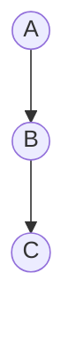
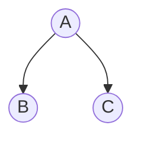
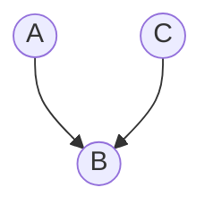
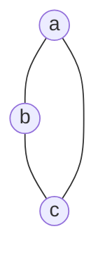
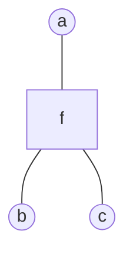

# 概率图模型

(这一部分还有点懵，后面再整理以下)

## 引言

**动机**

前面几章的内容多为频率派，也就是认为$\theta$是确定的，那么写出模型后直接用最大似然求解就行。

而这章是从贝叶斯的角度出发，也就是说不直接求模型，而是利用贝叶斯定理先求$p(X|\theta)\cdot p(\theta)$,那么这会面临一个问题，当$X$为高维变量时，这里的概率就不是简单的概率，而是变成了联合概率$p(x_1,x_2,\cdots,x_p)$，因为各个维度信息不一定是独立的，那么这似乎是非常难求的。

而本章所有的工作都是为了让这个


**计算规则**
给定一组高维随机变量$P(x_1,x_2,...,x_p)$,其边缘概率$p(x_i)$和条件概率$p(x_j|x_i)$都是可以求出来的，那么对于这两类概率其符合以下几类规则：

$$
Sum\ Rule:p(x_1)=\int p(x_1,x_2)dx_2\\Product\ Rule:p(x_1,x_2)=p(x_1|x_2)p(x_2)=p(x_2|x_1)p(x_1)\\Chain\ Rule:p(x_1,x_2,\cdots,x_p)=p(x_1)p(x_2|x_1)p(x_3|x_2,x_1)\\=\prod\limits_{i=1}^pp(x_i|x_{i-1},...,x_1)\\Bayesian\ Rule:p(x_1|x_2)=\frac{p(x_2|x_1)p(x_1)}{p(x_2)}
$$

**高维困境**
在链式法则其实具体表示为：

$$
p(x_1,x_2,\cdots,x_p)=\prod\limits_{i=1}^pp(x_i|x_{i-1},...,x_1)
$$

如果数据维度特别高，那么的采样和计算非常困难

**简化**

1.朴素贝叶斯：在朴素贝叶斯中，作出了条件独立性假设，各维度相互独立的（太naive了）。
2.Markov性质：在给定当前时刻的情况下，将来和过去是独立的$x_j\perp x_{i+1}|x_i$（有时过去一个动作是影响未来好几步的，因此算不上完全独立）。
3.**条件独立性假设(核心性质)**：对维度划分不相交的集合 $A,B,C$，使得 $X_A\perp X_B|X_C$。

**表示：**

1. 有向图（一般为离散）：贝叶斯网络
2. 无向图（一般为离散）：马尔可夫网络
3. 高斯图（连续）：高斯贝叶斯和高斯马尔可夫网路
   **推断：**
4. 精确推断
5. 近似推断：确定性近似（如变分推断）和 随机近似（如 MCMC）

**学习**
1.参数学习：完备数据和隐变量（E-M 算法）
2.结构学习(还把图结构学习出来)

## 有向图-贝叶斯网络

#### **概率图表示**

图是一种常见的数据结构，那么对于高维的随机变量来讲，我们可以利用节点表示一维度数据，便就可以表示该维度与其他维度的条件概率，如果已知联合分布中，各个随机变量之间的依赖关系，那么可以通过拓扑排序（根据依赖关系）可以获得一个有向图。而如果已知一个图，也可以直接得到联合概率分布的因子分解：

$$
p(x_1,x_2,\cdots,x_p)=\prod\limits_{i=1}^pp(x_i|x_{parent(i)})
$$

那么实际的图中条件独立性是如何体现的呢（通过推导我们会发现，这种图会实际蕴含这一定理）？在局部任何三个节点，可以有三种结构：

**1.head to tail型**



$$
p(A,B,C)=p(A)p(B|A)p(C|B)=p(A)p(B|A)p(C|B,A)
$$

这里左式是看图看出来的，右式是链式法则，那么就有$p(C|B)=p(C|B,A)$
上式说明了，A发布发生是不影响,A与C是独立的,那么$A\perp C|B$，正常情况下AC不独立，b被观测（图中去除掉）后AC独立

**2.tail to tail型**



$$
A,B,C)=p(A)p(B|A)p(C|A)=p(A)p(B|A)p(C|A,B)\\
$$

这里左式是看图看出来的，右式是链式法则，那么就有$p(C|A)=p(C|A,B)$
上式说明了，B发布发生是不影响因此有$C\perp B|A$

**3.head to head型**



$$
p(A,B,C)=p(A)p(C)p(B|C,A)=p(A)p(C|A)p(B|C,A)\\
\Longrightarrow p(C)=p(C|A)\\
\Leftrightarrow C\perp A\\
$$

对这种结构默认情况下AC就是独立的，$A,C$ 不与 $B$ 条件独立。

#### **D划分**

那么具体的，给定一个概率图，怎么划分条件独立型假设中的三个集合呢或者怎么判断给出的三个集合是否满足，这里引入了D划分：

1.对于类似上面图 1和图 2的关系，，A集合任一点到B集合任一点路径上的点都应在$C$集合中
2.满足图3 ，A集合任一点到B集合任一点路径上的点都不能在C集合中。

如果给定一个网络，依照以上两个原则进行检查，发现不违反关系，那么给出的三个集合就是满足条件独立性的（也叫有全局马尔可夫性）

> 在一个全局马尔可夫性的贝叶斯网络中，我们针对一个几点进行分析：

> $$
> p(x_i|x_{-i})=\frac{p(x_i,x_{-i})}{p(x_{-i})}=\frac{p(x)}{\int p(x)dx_{i}}=\frac{\prod\limits_{j=1}^pp(x_j|x_{parents(j)})}{\int\prod\limits_{j=1}^pp(x_j|x_{parents(j)})dx_i}
> $$

> 可以发现，上下部分可以分为两部分，一部分是和 $x_i$ 相关的，另一部分是和 $x_i$ 无关的，而这个无关的部分可以相互约掉。于是计算只涉及和 $x_i$ 相关的部分。
> 与 $x_i$ 相关的部分可以写成：
>
> $$
> p(x_i|x_{parents(i)})p(x_{child(i)}|x_i)
> $$
>
> 也就是说,对于节点i，只有其双亲，孩子，孩子另一个双亲这几部分相关，这些相关的部分又叫做 Markov 毯

实际应用的模型中，对这些条件独立性作出了假设，从单一到混合，从有限到无限（时间，空间）可以分为：

1. 朴素贝叶斯，单一的条件独立性假设 $p(x|y)=\prod\limits_{i=1}^pp(x_i|y)$，在 D 划分后，所有条件依赖的集合就是单个元素。
2. 高斯混合模型：混合的条件独立。引入多类别的隐变量 $z_1, z_2,\cdots,z_k$， $p(x|z)=\mathcal{N}(\mu,\Sigma)$，条件依赖集合为多个元素。
3. 与时间相关的条件依赖
   1. Markov 链
   2. 高斯过程（无限维高斯分布）
4. 连续：高斯贝叶斯网络
5. 组合上面的分类
   * GMM 与时序结合：动态模型
     * HMM（离散）
     * 线性动态系统 LDS（Kalman 滤波）
     * 粒子滤波（非高斯，非线性）

## 无向图-马尔可夫网络（马尔可夫随机场）

无向图没有了类似有向图的局部不同结构，在马尔可夫网络中，也存在 D 划分的概念。直接将条件独立的集合 $x_A\perp x_B|x_C$ 划分为三个集合。这个也叫全局 Markov。对局部的节点，$x\perp (X-Neighbour(\mathcal{x}))|Neighbour(x)$。这也叫局部 Markov。对于成对的节点：$x_i\perp x_j|x_{-i-j}$，其中 $i,j$ 不能相邻。这也叫成对 Markov。事实上上面三个点局部全局成对是相互等价的。

有了这个条件独立性的划分，还需要因子分解来实际计算。引入团的概念：

> 团，最大团：图中节点的集合，集合中的节点之间相互都是连接的叫做团，如果不能再添加节点，那么叫最大团。

利用这个定义进行的 $x$ 所有维度的联合概率分布的因子分解为，假设有 $K$ 个团，$Z$ 就是对所有可能取值求和：

$$
p(x)=\frac{1}{Z}\prod\limits_{i=1}^{K}\phi(x_{ci})\\
Z=\sum\limits_{x\in\mathcal{X}}\prod\limits_{i=1}^{K}\phi(x_{ci})
$$

其中 $\phi(x_{ci})$ 叫做势函数，它必须是一个正值，可以记为：

$$
\phi(x_{ci})=\exp(-E(x_{ci}))
$$

这个分布叫做 Gibbs 分布（玻尔兹曼分布）。于是也可以记为：$p(x)=\frac{1}{Z}\exp(-\sum\limits_{i=1}^KE(x_{ci}))$。这个分解和条件独立性等价（Hammesley-Clifford 定理），这个分布的形式也和指数族分布形式上相同，于是满足最大熵原理。

## 两种图的转换-道德图

我们常常想将有向图转为无向图，从而应用更一般的表达式。

1. 链式：

   ```mermaid
   graph TB;
   	A((A))-->B((B));
   	B-->C((C));
   ```

   直接去掉箭头，$p(a,b,c)=p(a)p(b|a)p(c|b)=\phi(a,b)\phi(b,c)$：

   ```mermaid
   graph TB;
   	A((A))---B((B));
   	B---C((C));
   ```
2. V 形：

   ```mermaid
   graph TB;
   	B((B))-->A((A));
   	B-->C((C));
   ```

   由于 $p(a,b,c)=p(b)p(a|b)p(c|b)=\phi(a,b)\phi(b,c)$，直接去掉箭头：

   ```mermaid
   graph TB;
   	B((B))---A((A));
   	B---C((C));
   ```
3. 倒 V 形：

   ```mermaid
   graph TB;
   	A((A))-->B((B));
   	C((C))-->B
   ```

   由于 $p(a,b,c)=p(a)p(c)p(b|a,c)=\phi(a,b,c)$，于是在 $a,c$ 之间添加线：

   ```mermaid
   graph TD;
   	a((a))---b((b));
   	b---c((c));
   	a---c;
   ```

   观察着三种情况可以概括为：

   1. 将每个节点的父节点两两相连
   2. 将有向边替换为无向边

## 更精细的分解-因子图

对于一个有向图，可以通过引入环的方式，可以将其转换为无向图（Tree-like graph），这个图就叫做道德图。但是我们上面的 BP 算法只对无环图有效，通过因子图可以变为无环图。

考虑一个无向图：



可以将其转为：



其中 $f=f(a,b,c)$。因子图不是唯一的，这是由于因式分解本身就对应一个特殊的因子图，将因式分解：$p(x)=\prod\limits_{s}f_s(x_s)$ 可以进一步分解得到因子图。
