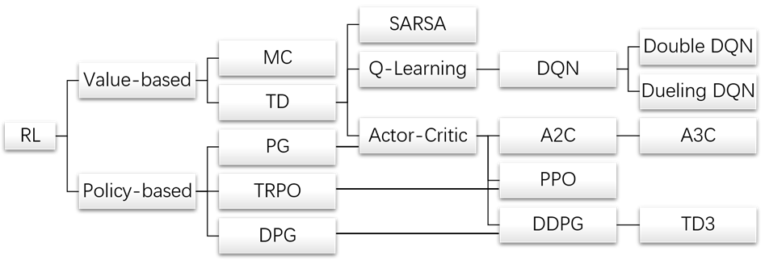
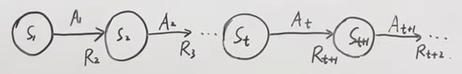
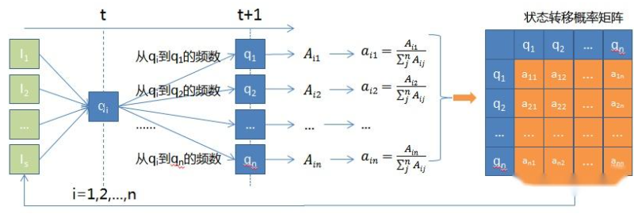
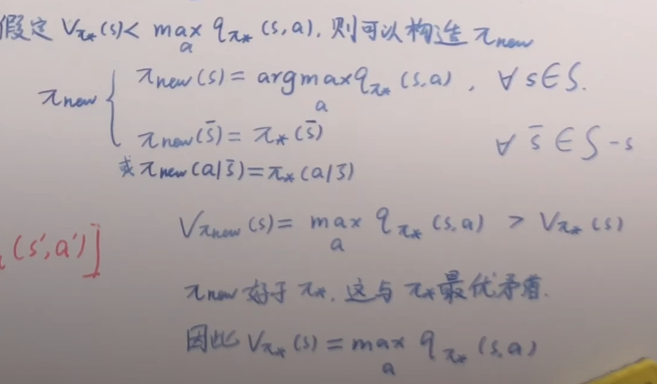

## 前言

强化学习是机器学习的一种范式，不同于传统的监督学习或者非监督学习对数据特征进行处理和分析，参考sutton的描述，其目的是”做什么才能使数值化的收益信号最大化“

其特别依赖MDP过程

## MDP

#### 马尔可夫过程

1.随机变量：随机变量是一个函数 $X: \Omega \rightarrow\mathbb{R}$，它将样本空间 $\Omega$（随机实验的所有可能结果集合）中的每个结果映射到一个实数值。

2.随机过程：对于时序上有一定关系的一组随机变量，我们定义其为随机过程$\{s_t\}^{\infty}_{t=1}$

3.马尔可夫链：具有马尔可夫性质的随机过程（马尔可夫性质：下一时刻的随机变量发生的概率只跟当前时刻相关，跟过去的都是没有关系的）

$$
P（s_{t+1}|s_t,s_{t-1},...,s_1）=P（s_{t+1}|s_t）
$$

#### 马尔可夫决策过程

1.状态空间模型（马尔科夫链+状态）：简单说就是将马尔可夫过程进一步进行特征提取，通过一组状态变量来表示系统的内部状态，并用数学方程描述状态如何随时间演变以及如何与观测数据相关联。如**隐马尔可夫过程、卡尔曼滤波、粒子滤波**

2.马尔科夫奖励过程（马尔可夫链+奖励）

3.马尔可夫决策过程（马尔可夫链+奖励+动作）：必要的几个元素：

* 状态:$s_t$
* 动作:$a_t$
* 奖励:$r_t$

4.动态特性（状态转移函数）

对于马尔科夫链，需要状态转移矩阵进行动态转移：

而对于马尔科夫决策过程，需要一个函数来表示，这个函数就是状态转移函数，也就是MDP的动态特性
(这里注意两点，严格来说动态特性不等于状态转移函数，动态特性是状态转移函数+奖励函数；此外跟我们常认知的不一样，其实$r$也是个随机变量，也有动态性，也就是奖励函数给出的是不同奖励的概率)：

$$
p(s',r|s,a)=P_r(S_{t+1}=s',R_{t+1}=r|S_{t}=s,A_{t}=a)
$$

5.策略 $\pi$

* 确定性策略 $a = \pi(s)$,给定的是确定的一个动作
* 随机性策略 $\pi(s|a)$,给定的是一个概率

6.回报 $G_t$
当你在$s_t$下选择$a_t$，会有一个对应的回报$G_t$来衡量你做的这个动作的好坏,又因为你做的这个$a_t$不只是影响当前的一个$r_{t+1}$的，对后续的都会有影响，因此回报定义为,$\gamma$则是对应的时间折扣：

$$
G_t = r_{t+1}+\gamma r_{t+2}+ \gamma^2 r_{t+3}+...+\gamma^{T-1} r_{T} = \sum^{\infty}_{i=0} \gamma^{i} r_{t+i+1}
$$

回报的局限性：回报只是描述的一条马尔科夫决策过程上的奖励积累，但真正的马尔可夫过程是一个网状的，因此我们无法用回报来衡量策略好坏

7.价值函数 $V_{\pi}(s)$ 和 $Q_{\pi}(s,a)$

为解决回报的缺陷性，提出价值函数，相当于对下面多个马尔科夫决策线路的回报进行了一个均值:

$$
V_{\pi}(s) = \mathbb E_{\pi}[G_t|S_t=s]
$$

$$
Q_{\pi}(s,a) = \mathbb E_{\pi}[G_t|S_t=s,A_t = a]
$$

从回溯图中可以看到，二者的关系是(其中$V_{\pi}(s)$相当于三个分支的加权平均值，$Q_{\pi}(s,a)$则是针对特定一个分支的值)

$$
V_{\pi}(s) = \sum_{a\in \mathcal A} \pi(a|s)Q_{\pi}(s,a)
$$

从回溯图中可以看到，$Q_{\pi}(s,a)$与$V_{\pi}(s')$也是存在关系的，(其相当于下面所有通过不同奖励到不同状态的路线的加和)

$$
Q_{\pi}(s,a) = \sum_{r,s'} p(s',r|s,a) [r + \gamma V_{\pi}(s')]
$$

8.贝尔曼期望方程

那么相对应的$V_{\pi}(s)$和$V_{\pi}(s')$以及$Q_{\pi}(s,a)$和$Q_{\pi}(s',a')$的关系也就能得到：

$$
V_{\pi}(s) = \sum_{a\in \mathcal A} \pi(a|s) \sum_{r,s'} p(s',r|s,a) [r + \gamma V_{\pi}(s')]
$$

$$
Q_{\pi}(s,a) = \sum_{r,s'} p(s',r|s,a) [r + \gamma \sum_{a' \in \mathcal A} \pi(s'|a')Q_{\pi}(s',a')]
$$

9.最优价值函数

记最好的策略$\pi_*$,使得$\pi_* = \argmax_{\pi} V_{\pi}(s) = \argmax_{\pi} Q_{\pi}(s,a)$

那么最优策略下的价值函数就是最优价值函数：

$$
V_*(s) \triangleq \max_{\pi}V_{\pi}(s)
$$

$$
Q_*(s,a) \triangleq \max_{\pi}Q_{\pi}(s,a)
$$

值得注意的是

$$
V_*(s) = \max_{\pi}V_{\pi}(s) = V_{\pi_*}(s) \\
Q_*(s,a) = \max_{\pi}Q_{\pi}(s,a) = Q_{\pi_*}(s,a)
$$

由均值和最大值之间的关系，显然有

$$
V_{\pi_*}(s) = \max_{a}Q_{\pi_*}(s,a)
$$

(如果不相等，说明有一个更好的策略能使其相等，现在的策略就不是最好的，下面有个简单证明)

那么跟贝尔曼期望方程一样，结合上面这一关系，下面就有了贝尔最优方程：

10.贝尔曼最优方程

$$
V_{*}(s) = \max_{a}Q_{*}(s,a)
$$

$$
Q_{*}(s,a) = \sum_{r,s'} p(s',r|s,a) [r + \gamma V_{*}(s')]
$$

$$
V_{*}(s) = \max_{a} \sum_{r,s'} p(s',r|s,a) [r + \gamma V_{*}(s')]
$$

$$
Q_{\pi}(s,a) = \sum_{r,s'} p(s',r|s,a) [r + \gamma \max_{a} Q_{\pi}(s',a')]
$$
