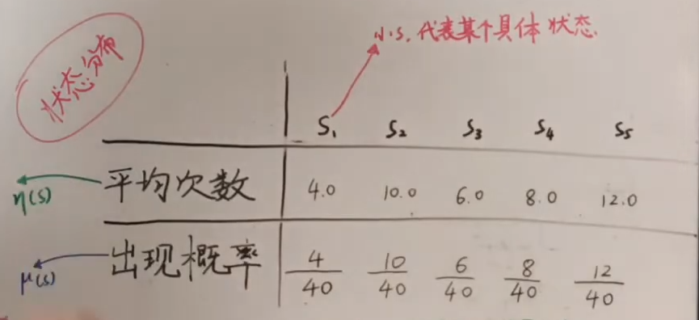
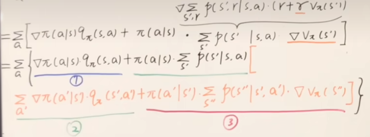
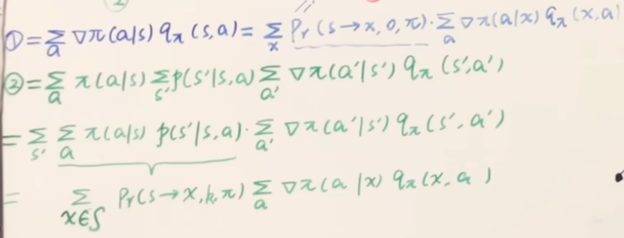

## 基于策略的方法

对于基于价值的方法，其本质是求Q值，根据Q值选择最优的动作，因此一般来说，其策略是确定的，动作是离散的，那么对于随机性策略或者动作连续的问题就需要进行特殊的处理。
而基于策略的方法就是针对这一问题，其更适用于：

1. 随机性策略
2. 动作空间可连续

#### 基本原理

我们的目的是求$\pi(a|s)$，这个本质上是一个概率分布，也就是当前状态下不同动作的概率，那么我们就可以先将其拟合成一个分布$\pi(a|s;\theta)$，再去估计参数$\theta$就好了。

常用拟合分布：指数族（softmax 离散）；高斯分布（连续）

目标函数：

$$
J(\theta) = V_{\pi}(s_0)
$$

这里其实看不出$J(\theta)$与$\theta$的关系，而实质上，$\theta$会有两方面的影响
一是$\theta$不同，$\pi(a|s;\theta)$不同，带来的动作和奖励必然也不同，进而会有一个直接影响
另一方面，$\pi(a|s;\theta)$不同，不同状态出现的概率也会不同，这样会间接地影响。

对于不同状态出现的概率，我们可以记为：

$$
\eta(s) = h(s)+\sum_s\eta(\bar s)\sum_{} \pi(a|\bar s) \sum_{} p(s|\bar s,a) =\sum_{k=0}^{T-1}P_r(s_0 \rightarrow s,k,\pi)
$$

其中$h(s)$表示s出现在第一个格子上的概率，后面的部分表示除了第一个格子，其他格子上出现的总概率$\bar s$表示前一个概率,也就是从初始状态走一步到当前状态的可能+走两步到+走三步到+...

$$
\mu(s) = \frac{\eta(s)}{\sum_{s'}\eta(s')}
$$

这里就相当于是一个归一化

#### 策略梯度定理

$$
\nabla V_{\pi}(s) = \nabla \sum_{a} \pi(a|s) q_{\pi}(s,a) \\
=\sum_{a}[\nabla \pi(a|s) q_{\pi}(s,a) + \pi(a|s) \nabla q_{\pi}(s,a)]\\
$$

利用贝尔曼返程进一步推导得到，这里多推导一步到s''：

这里重点观察第二部分

这里会发现前面那一部分可以被状态的出现频次给代替，同时第一部分和第三部分都可以整理成类似的形式，因此最终推导就可以整合为：

$$
\nabla J(\theta) =  \sum_{s \in S} \sum^{\infty}_{k=0} P_r(s_0 \rightarrow s,k,\pi)\sum_a \nabla \pi(a|s) q_{\pi}(s,a)\\
= \sum_{s \in S} \eta(s) \sum_a \nabla \pi(a|s) q_{\pi}(s,a) \\
= \sum_{s'} \eta(s')\sum_{s \in S} \mu(s) \sum_a \nabla \pi(a|s) q_{\pi}(s,a)
$$

因为前面这一部分$\sum_{s'} \eta(s')$对梯度方向没影响，因此这里只需要对后面这一部分分析即可。

#### REINFORCE

前一部分推到知道

$$
\nabla J(\theta) \propto \sum_{s \in S} \mu(s) \sum_a \nabla \pi(a|s) q_{\pi}(s,a)
$$

这里涉及到每种状态的一个概率称后面那一部分然后求和，为了方便采用MC的方式，我们将其写成期望的形式就是

$$
E_{\pi}[\sum_a \nabla \pi(a|s_t) q_{\pi}(s_t,a)]
$$

然后有关$a$这一部分也可以处理后写道期望里面, $q_\pi$本身也是$G_t$的均值也可也替换掉，因此经推导可以得到

$$
E_{\pi}[\sum_a \pi(a|s_t) \frac{\nabla \pi(a|s_t)}{\pi(a|s_t)}  q_{\pi}(s_t,a)]\\
=E_{\pi}[\frac{\nabla \pi(a_t|s_t)}{\pi(a_t|s_t)}  q_{\pi}(s_t,a_t)]\\
=E_{\pi}[\nabla log \pi(a_t|s_t)  q_{\pi}(s_t,a_t)]\\
=E_{\pi}[G_t \nabla log \pi(a_t|s_t;\theta)]
$$

那么就得到了梯度上升的公式,这里就可以采样地去求后面这个东西：

$$
\theta_{t+1} = \theta_t + \alpha G_t \nabla log \pi(a_t|s_t;\theta)
$$

#### REINFORCE with baseline

怎么加Baseline：$\nabla J(\theta) \propto \sum_{s \in S} \mu(s) \sum_a \nabla \pi(a|s) (q_{\pi}(s,a)-b(s))$
为什么加：MC方法，方差太大
加入为什么没影响：$b(s)$与$a$无关，这里本质是求均值，你加入一个偏移量是没有影响的
取值是什么：0（基础的reinforce）$V_{\pi}(s_t；w)$(这里可以用机器学习方式拟合)

#### AC方法

在下式的基础上，用TD的思路，替换掉$G_t$

$$
\theta_{t+1} = \theta_t + \alpha (G_t-V_{\pi}(s_t；w)) \nabla log \pi(a_t|s_t;\theta)\\
=\theta_t + \alpha (R_t+\gamma V_{\pi}(s_{t+1}；w)-V_{\pi}(s_t；w)) \nabla log \pi(a_t|s_t;\theta)\\
$$

这样的话就是有两个参数，分开估计就好

