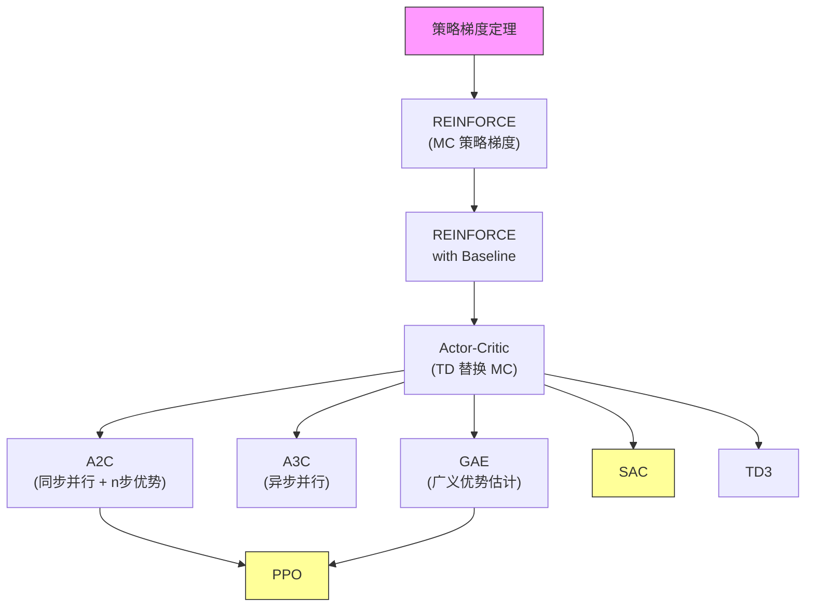

# 基于策略的方法

本节介绍 **Model-Free** 下的基于策略（Policy-Based）方法。前置知识见 [[1.introduction（RL）]]、[[TD]] 和 [[MC]]。

> [!info] 为什么需要基于策略的方法？
> 对于基于价值的方法（如 [[TD#Q-learning（离轨策略 TD 控制）|Q-learning]]），其本质是求 Q 值，再根据 Q 值选择最优动作。因此一般来说，策略是**确定性**的、动作空间是**离散**的。对于**随机性策略**或**连续动作空间**的问题，基于价值的方法就需要特殊处理。基于策略的方法直接对策略本身进行参数化和优化，天然适用于以下场景：
>
> 1. **随机性策略**：策略本身输出动作的概率分布，而非确定的动作
> 2. **连续动作空间**：动作可以是连续值（如机器人关节角度、油门大小等）
> 3. **高维动作空间**：避免了对所有动作遍历求 $\max$ 的开销

---

## 基本原理

### 策略参数化

我们的目的是求 $\pi(a|s)$——本质上是一个**条件概率分布**，即在状态 $s$ 下各动作的概率。基于策略方法的核心思路是：将策略用一个**参数化的函数** $\pi(a|s;\theta)$ 来近似，然后通过优化参数 $\theta$ 来找到最优策略。

> [!tip] 常用的参数化形式
> | 动作空间 | 参数化方式 | 说明 |
> |---------|-----------|------|
> | **离散** | Softmax 策略 | $\pi(a|s;\theta) = \frac{e^{h(s,a;\theta)}}{\sum_{a'} e^{h(s,a';\theta)}}$，其中 $h(s,a;\theta)$ 是偏好函数（如线性函数或神经网络） |
> | **连续** | 高斯策略 | $\pi(a|s;\theta) = \mathcal{N}(\mu(s;\theta),\, \sigma^2(s;\theta))$，均值和方差均为状态的函数 |

### 目标函数

定义目标函数为从初始状态出发的期望回报：

$$
J(\theta) = V_{\pi_\theta}(s_0)
$$

虽然表面上看不出 $J(\theta)$ 与 $\theta$ 的显式关系，但实际上 $\theta$ 通过**两条路径**影响 $J(\theta)$：

1. **直接影响**：$\theta$ 改变 $\rightarrow$ $\pi(a|s;\theta)$ 改变 $\rightarrow$ 选择的动作不同 $\rightarrow$ 获得的奖励不同
2. **间接影响**：$\theta$ 改变 $\rightarrow$ $\pi(a|s;\theta)$ 改变 $\rightarrow$ 状态转移路径不同 $\rightarrow$ 各状态的访问频率发生变化

### 状态分布

对于不同状态的出现频率，定义 $\eta(s)$ 为状态 $s$ 的**平均访问次数**：

> [!example] 状态分布示例（$s$ 代表某个具体状态）
>
> | | $s_1$ | $s_2$ | $s_3$ | $s_4$ | $s_5$ |
> |---|:---:|:---:|:---:|:---:|:---:|
> | $\eta(s)$　平均次数 | $4.0$ | $10.0$ | $6.0$ | $8.0$ | $12.0$ |
> | $\mu(s)$　出现概率 | $\frac{4}{40}$ | $\frac{10}{40}$ | $\frac{6}{40}$ | $\frac{8}{40}$ | $\frac{12}{40}$ |

$$
\eta(s) = h(s)+\sum_{\bar s}\eta(\bar s)\sum_{a} \pi(a|\bar s) \sum_{s'} p(s|\bar s,a) =\sum_{k=0}^{T-1} Pr(s_0 \rightarrow s,k,\pi)
$$

其中 $h(s)$ 表示 $s$ 作为初始状态的概率，后面的部分表示**从其他状态经一步转移到 $s$** 的累积概率。$\bar s$ 表示前一个状态，等式右侧的求和展开就是：从初始状态走 0 步到 $s$ 的概率 + 走 1 步到 $s$ 的概率 + $\cdots$ + 走 $T-1$ 步到 $s$ 的概率。

将 $\eta(s)$ 归一化，得到**状态分布**（on-policy distribution）：

$$
\mu(s) = \frac{\eta(s)}{\sum_{s'}\eta(s')}
$$

> [!note] 状态分布的意义
> $\mu(s)$ 表示在策略 $\pi$ 下，智能体处于状态 $s$ 的**长期平均比例**。这个分布在策略梯度定理中起关键作用——它使得我们可以通过采样来估计梯度。

---

## 策略梯度定理

### 推导过程

对 $V_{\pi}(s)$ 求关于 $\theta$ 的梯度：

$$
\nabla V_{\pi}(s) = \nabla \sum_{a} \pi(a|s) q_{\pi}(s,a) = \sum_{a}\left[\nabla \pi(a|s) \, q_{\pi}(s,a) + \pi(a|s) \, \nabla q_{\pi}(s,a)\right]
$$

利用贝尔曼方程 $q_\pi(s,a) = \sum_{s',r} p(s',r|s,a)\left[r + \gamma V_\pi(s')\right]$ 对 $\nabla q_{\pi}(s,a)$ 进一步展开：

$$
\nabla q_\pi(s,a) = \nabla \sum_{s',r} p(s',r|s,a)\left[r + \gamma V_\pi(s')\right] = \sum_{s'} p(s'|s,a) \cdot \gamma \nabla V_\pi(s')
$$

代入得：

$$
\nabla V_\pi(s) = \sum_a \left[\nabla\pi(a|s)\,q_\pi(s,a) + \pi(a|s)\sum_{s'}p(s'|s,a)\,\gamma\nabla V_\pi(s')\right]
$$

对 $\nabla V_\pi(s')$ 递归展开一步（推导到 $s''$）：

$$
= \sum_a \Bigg\{ \nabla\pi(a|s)\,q_\pi(s,a) + \pi(a|s)\sum_{s'}p(s'|s,a)\,\gamma\bigg[\underbrace{\sum_{a'}\nabla\pi(a'|s')\,q_\pi(s',a')}_{\large②} + \underbrace{\pi(a'|s')\sum_{s''}p(s''|s',a')\,\gamma\nabla V_\pi(s'')}_{\large③}\bigg]\Bigg\}
$$

将整个式子分为三部分 ①②③，分别分析：

**① 零步项**（当前状态 $s$ 的贡献）：

$$
①= \sum_a \nabla\pi(a|s)\,q_\pi(s,a) = \sum_{x \in S} Pr(s \rightarrow x,\,0,\,\pi) \sum_a \nabla\pi(a|x)\,q_\pi(x,a)
$$

这里 $Pr(s\to x,0,\pi)$ 表示从 $s$ 走 0 步到 $x$ 的概率，显然只有 $x=s$ 时为 1，其余为 0。

**② 一步项**（经一步转移到 $s'$ 的贡献）：

$$
②= \sum_a \pi(a|s)\sum_{s'}p(s'|s,a)\,\gamma\sum_{a'}\nabla\pi(a'|s')\,q_\pi(s',a')
$$

$$
= \sum_{s'}\left[\sum_a \pi(a|s)\,p(s'|s,a)\right]\gamma\sum_{a'}\nabla\pi(a'|s')\,q_\pi(s',a')
$$

$$
= \sum_{x \in S} Pr(s \rightarrow x,\,1,\,\pi)\,\gamma\sum_a \nabla\pi(a|x)\,q_\pi(x,a)
$$

其中方括号内恰好是从 $s$ 经一步到达 $s'$ 的概率 $Pr(s\to s',1,\pi)$。

**③ 两步项**（经两步转移到 $s''$ 的贡献）：类似地可整理为

$$
③ = \sum_{x \in S} Pr(s \rightarrow x,\,2,\,\pi)\,\gamma^2\sum_a \nabla\pi(a|x)\,q_\pi(x,a)
$$

> [!note] 递推模式
> 可以发现 ①②③ 具有**完全相同的结构**，区别仅在于步数 $k$ 和对应的折扣因子 $\gamma^k$。继续递归展开，就可以将所有步数的贡献合并。

因此最终可以整合为：

### 策略梯度定理（Policy Gradient Theorem）

$$
\nabla J(\theta) = \sum_{s \in S} \sum^{\infty}_{k=0} Pr(s_0 \rightarrow s,k,\pi)\sum_a \nabla \pi(a|s) \, q_{\pi}(s,a)
$$

$$
= \sum_{s \in S} \eta(s) \sum_a \nabla \pi(a|s) \, q_{\pi}(s,a)
$$

$$
= \sum_{s'} \eta(s') \cdot \sum_{s \in S} \mu(s) \sum_a \nabla \pi(a|s) \, q_{\pi}(s,a)
$$

因为常数因子 $\sum_{s'} \eta(s')$ 不影响梯度方向，所以：

$$
\boxed{\nabla J(\theta) \propto \sum_{s \in S} \mu(s) \sum_a \nabla \pi(a|s;\theta) \, q_{\pi}(s,a)}
$$

> [!important] 策略梯度定理的意义
> 该定理的关键贡献在于：梯度表达式**不涉及状态分布 $\mu(s)$ 对 $\theta$ 的导数**。尽管策略的改变会影响状态分布，但我们不需要计算这个间接影响——这使得基于采样的梯度估计成为可能。

---

## REINFORCE

### 从策略梯度到 REINFORCE

由策略梯度定理：

$$
\nabla J(\theta) \propto \sum_{s \in S} \mu(s) \sum_a \nabla \pi(a|s) \, q_{\pi}(s,a)
$$

这涉及对所有状态按分布 $\mu(s)$ 加权求和，天然地可以写成**期望**的形式（便于用 [[MC]] 采样估计）：

$$
\nabla J(\theta) \propto E_{\pi}\left[\sum_a \nabla \pi(a|s_t;\theta) \, q_{\pi}(s_t,a)\right]
$$

对于动作 $a$ 的求和，引入 $\pi(a|s_t)$ 以构造期望形式，同时 $q_\pi(s_t,a)$ 作为 $G_t$ 的期望值也可以用采样回报替代：

$$
E_{\pi}\left[\sum_a \pi(a|s_t) \frac{\nabla \pi(a|s_t)}{\pi(a|s_t)} q_{\pi}(s_t,a)\right]
$$

$$
= E_{\pi}\left[\frac{\nabla \pi(a_t|s_t)}{\pi(a_t|s_t)} q_{\pi}(s_t,a_t)\right]
$$

$$
= E_{\pi}\left[\nabla \ln \pi(a_t|s_t;\theta) \cdot q_{\pi}(s_t,a_t)\right]
$$

$$
= E_{\pi}\left[G_t \nabla \ln \pi(a_t|s_t;\theta)\right]
$$

> [!note] 对数技巧（Log-derivative Trick）
> 上面用到了恒等式 $\nabla \ln f(x) = \frac{\nabla f(x)}{f(x)}$，即 $\nabla f(x) = f(x) \nabla \ln f(x)$。这个技巧将对概率密度的梯度转换为对数概率的梯度，在实际计算中更加稳定。

### 梯度上升更新

由此得到 REINFORCE 的**参数更新公式**：

$$
\theta_{t+1} = \theta_t + \alpha \, G_t \, \nabla \ln \pi(a_t|s_t;\theta)
$$

> [!example]- 伪代码：REINFORCE
> **输入**：可微策略 $\pi(a|s;\theta)$，步长 $\alpha > 0$
> 1. 随机初始化策略参数 $\theta$
> 2. **For** 每个 Episode：
>    1. 按策略 $\pi(\cdot|s;\theta)$ 生成完整轨迹 $S_0, A_0, R_1, S_1, A_1, R_2, \ldots, S_T$
>    2. **For** $t = 0, 1, 2, \ldots, T-1$：
>       - 计算回报 $G_t = \sum_{k=0}^{T-t-1} \gamma^k R_{t+k+1}$
>       - $\theta \leftarrow \theta + \alpha \, \gamma^t \, G_t \, \nabla \ln \pi(A_t|S_t;\theta)$

> [!warning] REINFORCE 的局限性
> - **高方差**：使用完整回报 $G_t$（MC 估计），方差很大，导致训练不稳定
> - **仅支持 Episode 任务**：必须等到轨迹结束才能更新（与 MC 相同的限制）
> - **数据效率低**：On-policy 方法，每条轨迹只能使用一次

---

## REINFORCE with Baseline

### 动机

REINFORCE 直接使用 $G_t$ 作为权重，方差很大。引入**基线** $b(s)$ 可以有效降低方差，同时不引入偏差。

### 基线不影响梯度的证明

将基线引入策略梯度公式：

$$
\nabla J(\theta) \propto \sum_{s \in S} \mu(s) \sum_a \nabla \pi(a|s;\theta) \left(q_{\pi}(s,a) - b(s)\right)
$$

由于 $b(s)$ 与动作 $a$ 无关，而 $\sum_a \nabla \pi(a|s;\theta) = \nabla \sum_a \pi(a|s;\theta) = \nabla 1 = 0$，所以：

$$
\sum_a \nabla \pi(a|s;\theta) \cdot b(s) = b(s) \cdot \sum_a \nabla \pi(a|s;\theta) = 0
$$

> [!tip] 基线的直觉理解
> 基线的作用是：让回报 $G_t$ 减去一个"平均水平"，使得**好于平均的动作**被强化（正权重），**差于平均的动作**被抑制（负权重）。没有基线时，所有动作都有正的回报权重，只是"好坏程度不同"，导致更新方向噪声更大。

### 基线的选择

| 基线 $b(s)$ | 说明 |
|-------------|------|
| $b(s) = 0$ | 退化为基础 REINFORCE |
| $b(s) = V_{\pi}(s;w)$ | **最常用**，用参数 $w$ 拟合状态价值函数 |
| $b(s) = \bar{G}$ | 使用历史回报的均值，简单但有效 |

### 更新公式

使用 $V_{\pi}(s_t;w)$ 作为基线时：

$$
\theta_{t+1} = \theta_t + \alpha \left(G_t - V_{\pi}(s_t;w)\right) \nabla \ln \pi(a_t|s_t;\theta)
$$

其中 $V_{\pi}(s_t;w)$ 需要单独学习，更新方式为：

$$
w_{t+1} = w_t + \beta \left(G_t - V_{\pi}(s_t;w)\right) \nabla_w V_{\pi}(s_t;w)
$$

---

## Actor-Critic 方法

### 从 REINFORCE 到 Actor-Critic

在 REINFORCE with Baseline 的基础上，用 **TD 目标**替换掉蒙特卡洛回报 $G_t$，就得到了 Actor-Critic 方法：

$$
\theta_{t+1} = \theta_t + \alpha \underbrace{\left(G_t - V_{\pi}(s_t;w)\right)}_{\text{MC 优势估计}} \nabla \ln \pi(a_t|s_t;\theta)
$$

$$
\Downarrow \quad \text{用 TD 目标替换 } G_t
$$

$$
\theta_{t+1} = \theta_t + \alpha \underbrace{\left(R_{t+1} + \gamma V_{\pi}(s_{t+1};w) - V_{\pi}(s_t;w)\right)}_{\text{TD 误差 } \delta_t} \nabla \ln \pi(a_t|s_t;\theta)
$$

> [!important] Actor-Critic 的双网络架构
> Actor-Critic 包含两个组件，分别对应两组参数：
>
> | 组件 | 角色 | 参数 | 更新依据 |
> |------|------|------|---------|
> | **Actor**（演员） | 策略网络 $\pi(a\|s;\theta)$ | $\theta$ | 策略梯度，以 Critic 的评估为信号 |
> | **Critic**（评论家） | 价值网络 $V(s;w)$ | $w$ | TD 误差，评估当前策略的好坏 |
>
> - Actor 负责"做决策"——根据当前策略选择动作
> - Critic 负责"打分"——评估 Actor 的决策质量，提供低方差的梯度信号

### 优势函数（Advantage Function）

TD 误差 $\delta_t = R_{t+1} + \gamma V(s_{t+1}) - V(s_t)$ 实际上是**优势函数**（Advantage Function）的无偏估计：

$$
A_{\pi}(s,a) = Q_{\pi}(s,a) - V_{\pi}(s)
$$

> [!note] 优势函数的直觉
> 优势函数衡量的是：在状态 $s$ 下选择动作 $a$，相比于**该状态下的平均表现**好了多少。$A > 0$ 表示动作优于平均，$A < 0$ 表示动作劣于平均。

### Actor-Critic 更新公式

**Critic 更新**（TD 学习）：

$$
\delta_t = R_{t+1} + \gamma V(S_{t+1};w) - V(S_t;w)
$$

$$
w \leftarrow w + \beta \, \delta_t \, \nabla_w V(S_t;w)
$$

**Actor 更新**（策略梯度）：

$$
\theta \leftarrow \theta + \alpha \, \delta_t \, \nabla_\theta \ln \pi(A_t|S_t;\theta)
$$

> [!example]- 伪代码：Actor-Critic (TD(0))
> **输入**：可微策略 $\pi(a|s;\theta)$，可微价值函数 $V(s;w)$，步长 $\alpha, \beta > 0$
> 1. 随机初始化 $\theta$ 和 $w$
> 2. **For** 每个 Episode：
>    1. 初始化 $S_0$
>    2. **For** $t = 0, 1, 2, \ldots$（直到 $S_t$ 为终止状态）：
>       - 按策略选择 $A_t \sim \pi(\cdot|S_t;\theta)$
>       - 执行 $A_t$，观测 $R_{t+1}$, $S_{t+1}$
>       - 计算 TD 误差：$\delta_t = R_{t+1} + \gamma V(S_{t+1};w) - V(S_t;w)$
>       - 更新 Critic：$w \leftarrow w + \beta \, \delta_t \, \nabla_w V(S_t;w)$
>       - 更新 Actor：$\theta \leftarrow \theta + \alpha \, \delta_t \, \nabla_\theta \ln \pi(A_t|S_t;\theta)$

---

## Actor-Critic 的进阶变体

### A2C（Advantage Actor-Critic）

A2C 是 Actor-Critic 的**同步并行**版本，核心改进：

- 使用多个**并行环境**同时采样，增大 batch size，降低梯度估计方差
- 显式计算 $n$ 步优势估计（而非单步 TD 误差），平衡偏差与方差：

$$
\hat{A}_t = \sum_{i=0}^{n-1} \gamma^i R_{t+i+1} + \gamma^n V(S_{t+n};w) - V(S_t;w)
$$

- 通常加入**熵正则化**以鼓励探索：

$$
\mathcal{L}_{\text{actor}} = -E\left[\hat{A}_t \ln \pi(A_t|S_t;\theta)\right] - \lambda H(\pi(\cdot|S_t;\theta))
$$

### A3C（Asynchronous Advantage Actor-Critic）

A3C 的核心思想是**异步并行**：

- 多个 Worker 各自独立与环境交互，异步地更新**共享的全局参数**
- 每个 Worker 用本地梯度更新全局网络，然后从全局网络同步最新参数
- 无需经验回放（Experience Replay），靠异步的多样性天然打破数据相关性

> [!note] A2C vs A3C
> 实践中发现 A2C（同步版）在 GPU 上往往表现不逊于 A3C（异步版），因为同步更新可以更高效地利用 GPU 的批量计算能力，且梯度更新更稳定。因此现代实现中 **A2C 更为常用**。

### GAE（Generalized Advantage Estimation）

GAE 将不同步数的优势估计进行**指数加权平均**，类似于 [[TD#TD($\\lambda$)|TD($\lambda$)]] 的思想：

$$
\hat{A}_t^{\text{GAE}(\gamma,\lambda)} = \sum_{l=0}^{\infty} (\gamma\lambda)^l \delta_{t+l}
$$

其中 $\delta_t = R_{t+1} + \gamma V(S_{t+1}) - V(S_t)$ 为 TD 误差。

| 参数 $\lambda$ | 效果 |
|----------------|------|
| $\lambda = 0$ | 单步 TD 优势估计，偏差大、方差小 |
| $\lambda = 1$ | MC 优势估计，偏差小、方差大 |
| $0 < \lambda < 1$ | 平衡偏差与方差，实际中常取 $\lambda = 0.95$ |

> [!tip] GAE 广泛应用
> GAE 被 [[PPO]] 等现代算法作为标准组件使用，是目前最主流的优势估计方法。

---

## 方法总结与对比

### 基于策略方法的演进关系

```mermaid
graph TD
    PG["策略梯度定理"] --> RF["REINFORCE<br/>(MC 策略梯度)"]
    RF --> RFB["REINFORCE<br/>with Baseline"]
    RFB --> AC["Actor-Critic<br/>(TD 替换 MC)"]
    AC --> A2C["A2C<br/>(同步并行 + n步优势)"]
    AC --> A3C["A3C<br/>(异步并行)"]
    AC --> GAE["GAE<br/>(广义优势估计)"]
    A2C --> PPO["PPO"]
    GAE --> PPO
    AC --> SAC["SAC"]
    AC --> TD3["TD3"]

    style PG fill:#f9f,stroke:#333
    style PPO fill:#ff9,stroke:#333
    style SAC fill:#ff9,stroke:#333
```

### 方法对比

| 维度       | REINFORCE  | REINFORCE + Baseline | Actor-Critic       | A2C          |
| -------- | ---------- | -------------------- | ------------------ | ------------ |
| **梯度估计** | $G_t$      | $G_t - V(s_t)$       | $\delta_t$ (TD 误差) | $n$ 步优势      |
| **方差**   | 高          | 中                    | 低                  | 较低           |
| **偏差**   | 无          | 无                    | 有（自举）              | 有（自举）        |
| **更新时机** | Episode 结束 | Episode 结束           | **每步即更新**          | 每 $n$ 步      |
| **适用任务** | Episode 任务 | Episode 任务           | Episode + 连续       | Episode + 连续 |

### 与基于价值方法的对比

| 维度       | 基于价值（Value-Based）                             | 基于策略（Policy-Based） | Actor-Critic                          |
| -------- | --------------------------------------------- | ------------------ | ------------------------------------- |
| **学习目标** | $Q(s,a)$ 或 $V(s)$                             | $\pi(a\|s;\theta)$ | 同时学习 $\pi$ 和 $V$                      |
| **策略类型** | 隐式（$\epsilon$-贪心）                             | 显式参数化              | 显式参数化                                 |
| **动作空间** | 离散                                            | 离散 + **连续**        | 离散 + **连续**                           |
| **收敛性**  | 较好                                            | 可能振荡               | 较好                                    |
| **代表算法** | [[TD#Q-learning（离轨策略 TD 控制）\|Q-learning]]、DQN | REINFORCE          | A2C、[[PPO]]、[[SAC\|SAC]]、[[TD3\|TD3]] |

> [!abstract] 从方法论看统一框架
> 基于策略的方法和基于价值的方法并非对立的，而是可以统一在 **Actor-Critic** 框架下：
> - **纯 Critic**（无 Actor）$\rightarrow$ 基于价值的方法（如 Q-learning）
> - **纯 Actor**（无 Critic）$\rightarrow$ 策略梯度方法（如 REINFORCE）
> - **Actor + Critic** $\rightarrow$ 结合两者优势，是现代深度强化学习的主流范式
>
> 进一步的算法发展见：[[PPO]]（近端策略优化）、[[SAC|SAC]]（最大熵 Actor-Critic）、[[TD3|TD3]]（双延迟 DDPG）。
