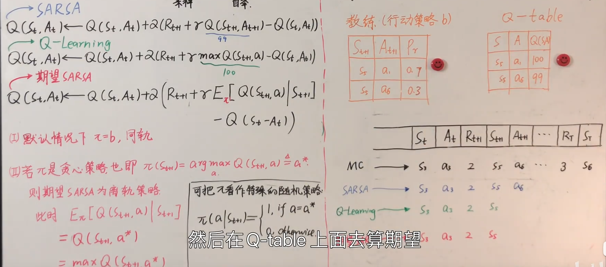

## TD算法

#### 基本原理

前面讲到的MC控制方法的核心更新是

$$
V_{\pi}(s_t) \leftarrow V_{\pi}(s_t) +\alpha(G_t -V_{\pi}(s_t))
$$

这里的 $G_t$  就是回报，要当前状态到结束时所有的数据才可以得到，也就是用MC采样方法的弊端：需要提前采样，有时需要很多数据。那么TD方法就提出我不要完全计算 $G_t$ 只计算后面的一步就可以，也就是变成了$R_t+\gamma V_\pi(s_{t+1})$，这个也叫TD target。

这样TD算法更新的就变成了：

$$
V_{\pi}(s_t) \leftarrow V_{\pi}(s_t) +\alpha(R_{t}+\gamma V_\pi(s_{t+1}) -V_{\pi}(s_t)) \\
Q_{\pi}(s_t,a_t) \leftarrow Q_{\pi}(s_t,a_t) +\alpha(R_{t}+\gamma Q_{\pi}(s_{t+1},a_{t+1}) -Q_{\pi}(s_t,a_t))
$$

#### SARSA算法（同轨策略下的TD控制）

1.观测$(s_t,a_t,r_t,s_{t+1})$
2.策略函数抽样（这里必定是软性策略）$a_{t+1}\sim \pi(s_{t+1})$
3.更新$Q_{\pi}(s_t,a_t) \leftarrow Q_{\pi}(s_t,a_t) +\alpha(r_{t}+\gamma Q_{\pi}(s_{t+1},a_{t+1}) -Q_{\pi}(s_t,a_t))$

#### 期望SARSA

1.观测$(s_t,a_t,r_t,s_{t+1})$
2.这里就不抽样了，直接求一个Q-table的期望来作为下一步更新的Q值
3.更新$Q_{\pi}(s_t,a_t) \leftarrow Q_{\pi}(s_t,a_t) +\alpha(r_{t}+\gamma E_b[Q_{\pi}(s_{t+1},a_{})] -Q_{\pi}(s_t,a_t))$

#### Q-learning(离轨策略下的TD控制)

1.观测$(s_t,a_t,r_t,s_{t+1})$
2.策略函数抽样（这里就是贪心的确定性策略）$a_{t+1}=argmax_a\pi(s_{t+1})$
3.更新$Q_{\pi}(s_t,a_t) \leftarrow Q_{\pi}(s_t,a_t) +\alpha(r_{t}+\gamma Q_{\pi}(s_{t+1},a_{t+1}) -Q_{\pi}(s_t,a_t))$
两步整合到一步就是$Q_{\pi}(s_t,a_t) \leftarrow Q_{\pi}(s_t,a_t) +\alpha(r_{t}+\gamma maxQ_{\pi}(s_{t+1},a_{}) -Q_{\pi}(s_t,a_t))$

相对来说SARSA较为保守，比较依赖其软性策略函数的设计，而Q-learning方法就比较激进

#### 多步TD算法

也就是$V_{\pi}(s_t) \leftarrow V_{\pi}(s_t) +\alpha(G_t -V_{\pi}(s_t))$计算$G_t$的时候不是单单走一步，而是走多部，更关注多步的一个奖励情况，上述算法更新也就对应的变成了

$$
Q_{\pi}(s_t,a_t) \leftarrow Q_{\pi}(s_t,a_t) +\alpha(\sum_{i=0}^{m-1} \gamma^i r_{t+i}+\gamma^m Q_{\pi}(s_{t+1},a_{t+1}) -Q_{\pi}(s_t,a_t))
$$

