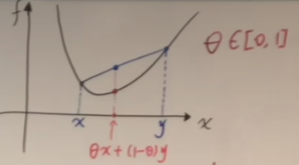

# 凸函数|严格凸|强凸

### 凸函数

**定义**

$$
\theta f(x)+(1-\theta)f(y)\geq f(\theta x+(1-\theta)y),for\forall x,y\in\mathbb{R}^n,\theta\in[0,1]
$$

**判定条件**

$$
g(t)=f(x+vt)
$$

$f$为高维函数，$g$为切出来任意的一个函数，$f$为凸与$g$为凸是等价的

**一阶条件**

如果$f$可微，$f$为凸等价于$f(y)>=f(x)+f'(x)(y-x)$，

如果$f$二阶可微，那么二阶导大于零即可

### 强凸

**定义**

两端距离不仅要大于等于0，还要大于等于一个正数，m强凸

$$
\theta f(x)+(1-\theta)f(y)\geq f(\theta x+(1-\theta)y)+\frac{m}{2}\theta(1-\theta)||x-y||^2,for\forall x,y\in\mathbb{R}^n,\theta\in[0,1]
$$

