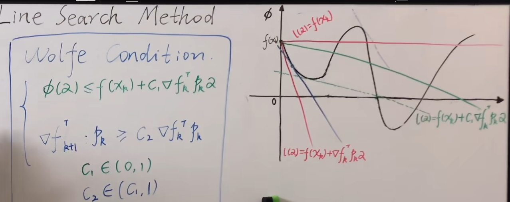

# 方向

假设
1.函数单调下降，$\{f(x_k)\}_{k=0}^\infty,f(x_{k+1})<f(x_{k})$
2.$\alpha_k$足够小
3.$||p_k||=1$

因为$x_{k+1}=x_k+\alpha_kp_k$,所以有$f(x_{k+1})=f(x_k+\alpha_kp_k)$,那么一阶泰勒展开就有

$$
f(x_{k})+\nabla f_k^T\alpha_kp_k+o(...)
$$

那么

$$
f(x_{k+1})-f(x_k) \approx \nabla f_k^Tp_k
$$

只考虑方向的话，让$f_k^Tp_k<0$就行，那么$p_k$与梯度夹角大于90就行，自然而然的,其为负梯度方向时也就是下降最快的方向。

# 步长

### 精确搜索

方向确定了，再把$f(x_k+\alpha_kp_k)$中的$\alpha_k$看作自变量求,函数最小值就能精确得到步长取多少了

$$
\alpha_k=\mathop{argmin}\limits_{\alpha>0}f(x_k+\alpha_kp_k)
$$

### 非精确搜索

有时候精确求解很难求，那么$\alpha_k$可以取一个近似值来代替

$\alpha_k$满足的必要条件：

$$
f(x_k+\alpha_kp_k)<f(x_{k+1})\rightarrow \phi(\alpha)<\phi(0)
$$

充分条件：

上限：水平线与切线间一条线：

$$
\phi(\alpha)<f(x_{k})+ c\nabla f_k^Tp_k\alpha ,c\in(0,0.5)
$$

下限：切线与上限线之间的一条线

$$
\phi(\alpha)>f(x_{k})+ (1-c)\nabla f_k^Tp_k\alpha
$$

另一种充要条件：

